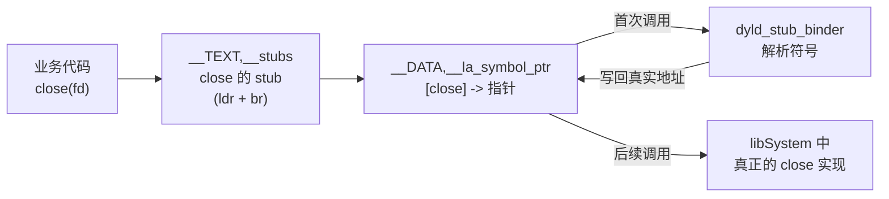
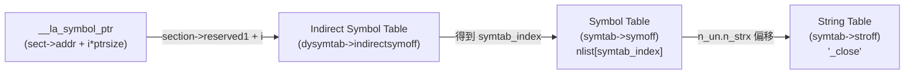
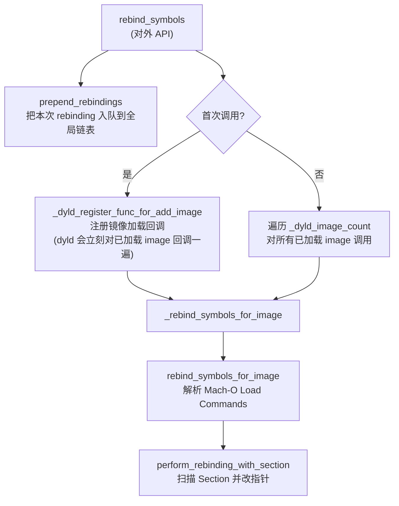
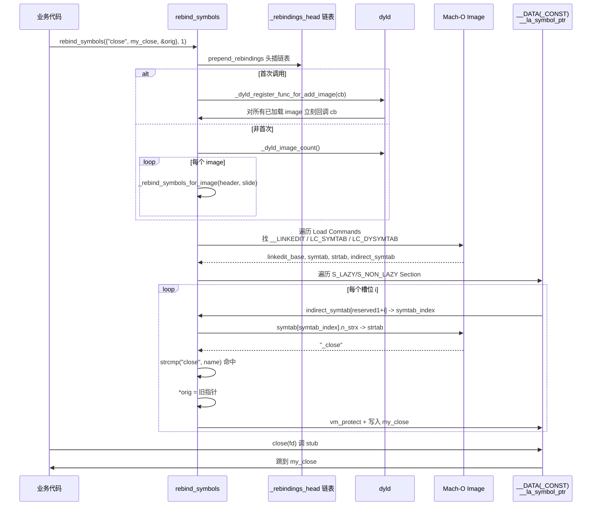

+++
title = "fishhook 源码导读"
date = '2026-05-02T22:32:27+08:00'
draft = false
weight = 10
tags = ["iOS", "源码分析"]
categories = ["iOS开发", "源码分析"]
+++
> fishhook 由 Facebook 于 2013 年开源，用于在运行时动态重绑定（rebind）Mach-O 中被 dyld 绑定的 C 符号，是 iOS/macOS 逆向与底层埋点（malloc 追踪、双 close 检测、网络 socket 拦截、NSLog 重定向等）领域的"瑞士军刀"。

---

## 一、fishhook 是什么

**一句话定义**：fishhook 通过修改 Mach-O 镜像中 `__DATA(_CONST)` 段里 `__la_symbol_ptr` / `__nl_symbol_ptr` 两个 Section 中的函数指针，把对外部 C 符号（如 `open`、`close`、`NSLog`）的调用重定向到自定义的替换函数，同时保留原函数指针供回调使用。

它提供的能力类似 macOS 上 `DYLD_INTERPOSE` 宏（编译期 interpose），但：

- **运行时生效**：不需要重新编译依赖库，随时可以在 App 启动后对系统库的 C 函数下钩子；
- **支持动态加载的 image**：注册后对后续 `dlopen` 加载的 image 同样生效；
- **对业务零侵入**：不改 App 本身的代码段，也不破坏符号表，只是重写 GOT/stub 里的一个指针。

但它也有非常明确的能力边界：

| 能力 | 是否支持 |
|------|----------|
| Hook 通过 `dyld` 动态绑定的外部 C 函数（libSystem、CoreFoundation 里的 C API、`objc_msgSend` 等） | 是 |
| Hook Objective-C 方法（`-[NSString length]`） | 否（要用 Method Swizzling） |
| Hook 当前 image 内部的 C 函数（静态链接、`static`、内联） | 否（它不走 `__la_symbol_ptr`，直接是段内相对寻址） |
| Hook Swift 方法（除非显式 `@_cdecl`） | 否 |
| Hook 已经解析并内联到寄存器里的符号（如 LTO 后消失的符号） | 否 |

记住这条原则：**fishhook 的作用域 = 被 dyld 绑定为"间接符号"（Indirect Symbol）的 C 符号**。

---

## 二、使用示例

头文件 `fishhook.h` 对外只暴露两个函数和一个结构体：

```c
struct rebinding {
    const char *name;       // 要 hook 的符号名，不带前导下划线（如 "close" 而不是 "_close"）
    void *replacement;      // 自定义替换函数
    void **replaced;        // 输出参数：原函数指针会写回这里，供你调用"真身"
};

FISHHOOK_VISIBILITY
int rebind_symbols(struct rebinding rebindings[], size_t rebindings_nel);

FISHHOOK_VISIBILITY
int rebind_symbols_image(void *header,
                         intptr_t slide,
                         struct rebinding rebindings[],
                         size_t rebindings_nel);
```

典型用例（README 里 Facebook 的示例，hook `open`/`close` 用于追踪 FD 泄漏）：

```objc
#import <dlfcn.h>
#import "fishhook.h"

static int  (*orig_close)(int);
static int  (*orig_open)(const char *, int, ...);

int my_close(int fd) {
    printf("Calling real close(%d)\n", fd);
    return orig_close(fd);
}

int my_open(const char *path, int oflag, ...) {
    va_list ap = {0};
    mode_t mode = 0;
    if ((oflag & O_CREAT) != 0) {
        va_start(ap, oflag);
        mode = va_arg(ap, int);
        va_end(ap);
        return orig_open(path, oflag, mode);
    }
    return orig_open(path, oflag);
}

- (BOOL)application:(UIApplication *)app
didFinishLaunchingWithOptions:(NSDictionary *)opts {
    rebind_symbols((struct rebinding[2]) {
        {"close", my_close, (void *)&orig_close},
        {"open",  my_open,  (void *)&orig_open},
    }, 2);
    return YES;
}
```

调用 `rebind_symbols` 之后，**当前进程中所有已加载的 image** 以及**之后通过 `dlopen` 加载的 image** 里，所有通过 `__la_symbol_ptr` 调用 `open`/`close` 的地方都会走到 `my_open`/`my_close`。

`rebind_symbols_image` 的区别只是限定作用域——只在指定的 image（通过 `mach_header` + `slide` 定位）里做重绑定，用于避免影响到框架自身、或对某个特定动态库做隔离 hook。

---

## 三、前置知识：Mach-O 里的间接符号绑定

要读懂 fishhook，必须先理解 dyld 是怎么绑定一个外部 C 函数的。以 arm64 iOS 上调用 `close(fd)` 为例：



1. 编译期，编译器把 `close(fd)` 编译成对 `__TEXT,__stubs` 中某个 stub 的 `bl`；
2. 该 stub 的汇编本质是"从 `__DATA,__la_symbol_ptr` 中对应槽位加载指针再跳过去"；
3. **首次调用**时，那个槽位指向 `dyld_stub_binder`，它会完成真正的符号解析，把 `close` 在 libSystem 中的真实地址写回槽位；
4. **之后的调用**就直接从槽位里取到真实地址，跳过绑定逻辑。

这意味着——**只要把 `__la_symbol_ptr` 里对应的指针改成我们自己的函数地址**，所有后续 `close(fd)` 的调用就会全部走到我们的替换函数。这就是 fishhook 的全部秘诀。

### 3.1 怎么找到"某个符号在 `__la_symbol_ptr` 里的哪个槽位"

Mach-O 为了减小体积，做了非常多的间接层。要从 `__la_symbol_ptr[i]` 反查到 `"close"` 这个字符串名，得穿过四张表：



其中：

- **`section->reserved1`**：`__la_symbol_ptr`、`__nl_symbol_ptr` 这类 Section 的 `reserved1` 字段存的是"本 Section 第 0 号槽位在 Indirect Symbol Table 中的起始下标"。所以 `indirect_symbol_table[reserved1 + i]` 就是第 `i` 个槽位对应的符号表下标；
- **Symbol Table (`nlist_64`)**：每个条目描述一个符号（类型、section、值），其中 `n_un.n_strx` 是该符号名在 String Table 中的偏移；
- **String Table**：一个大字符串池，所有符号名都以 C 字符串形式存放于此。Objective-C/C 的符号在这里带**前导下划线**，即 `_close` 而不是 `close`。这也是为什么 `fishhook` 在比较时用的是 `strcmp(&symbol_name[1], cur->rebindings[j].name)`——跳过前导下划线。

这三张表都位于 Mach-O 的 `__LINKEDIT` 段里，它们的偏移量由 `LC_SYMTAB`、`LC_DYSYMTAB` 这两个 Load Command 告诉我们。

### 3.2 两种绑定指针段

| Section | 含义 | 绑定时机 |
|---------|------|----------|
| `__la_symbol_ptr` | Lazy Symbol Pointers：外部**函数**指针 | 首次调用时由 `dyld_stub_binder` 绑定（可通过 `-bind_at_load` 改为加载时绑定） |
| `__nl_symbol_ptr` | Non-Lazy Symbol Pointers：外部**数据**指针以及需要立即绑定的函数指针 | image 加载时由 dyld 立即绑定 |

iOS 13.5+ 在 dyld3 里引入了 **chained fixups**（`LC_DYLD_CHAINED_FIXUPS`）：启动阶段 dyld 通过链表结构一次性完成 rebase/bind 并修正指针。但从 fishhook 的视角看这完全透明——**一旦绑定完成，这些 Section 里存的就是普通的函数指针**，fishhook 直接改指针的做法不受影响。

不过 iOS 15 把一部分绑定指针（主要是 `__got` 等）放到了**只读的 `__DATA_CONST`** 段里，这就是下面要讲的"VM_PROT_COPY"补丁的由来。

---

## 四、源码整体结构

fishhook 整个实现就是一个 `fishhook.c`，170 行不到。按调用关系自上而下可以拆成 5 个函数：



平台类型抽象只做了一件事——根据 `__LP64__` 选择 64 位还是 32 位的 Mach-O 结构体（iOS/macOS 现代设备全部走 64 位分支）：

```c
#ifdef __LP64__
typedef struct mach_header_64  mach_header_t;
typedef struct segment_command_64 segment_command_t;
typedef struct section_64      section_t;
typedef struct nlist_64        nlist_t;
#define LC_SEGMENT_ARCH_DEPENDENT LC_SEGMENT_64
#else
typedef struct mach_header     mach_header_t;
typedef struct segment_command segment_command_t;
typedef struct section         section_t;
typedef struct nlist           nlist_t;
#define LC_SEGMENT_ARCH_DEPENDENT LC_SEGMENT
#endif
```

全局只有一个变量：

```c
static struct rebindings_entry *_rebindings_head;
```

所有历次 `rebind_symbols` 调用的 rebinding 数组会被组织成一个**单向链表**（头插），每个节点就是一次调用传进来的 `rebinding[]`：

```c
struct rebindings_entry {
    struct rebinding      *rebindings;     // 深拷贝了用户传入的数组
    size_t                 rebindings_nel;
    struct rebindings_entry *next;
};
```

头插 + 内层 for j 先命中即 break（`goto symbol_loop`）的策略，保证"**后面注册的 rebinding 优先级更高**"——这正是 header 注释承诺的语义："if a given symbol is rebound more than once, the later rebinding will take precedence"。

---

## 五、入口：`rebind_symbols`

```c
int rebind_symbols(struct rebinding rebindings[], size_t rebindings_nel) {
    int retval = prepend_rebindings(&_rebindings_head, rebindings, rebindings_nel);
    if (retval < 0) {
        return retval;
    }
    // 首次调用：注册 dyld image 回调（dyld 会立刻对所有已加载 image 回调一遍）
    if (!_rebindings_head->next) {
        _dyld_register_func_for_add_image(_rebind_symbols_for_image);
    } else {
        uint32_t c = _dyld_image_count();
        for (uint32_t i = 0; i < c; i++) {
            _rebind_symbols_for_image(_dyld_get_image_header(i),
                                      _dyld_get_image_vmaddr_slide(i));
        }
    }
    return retval;
}
```

这里有一段非常精巧的设计，经常被误读。我们分两个场景看：

**场景 A：首次调用 `rebind_symbols`（链表里只有刚插入的这一项）**

`_rebindings_head->next == NULL`，走 `_dyld_register_func_for_add_image`。注意 dyld 这个函数的语义是：

> "Registers a callback function that is called each time an image is added. When the callback is first registered, it is called once for each image already loaded."

也就是说**注册回调时，dyld 会立刻对每一个已加载 image 回调一次**。所以一次性把"当前所有 image"和"未来所有 image"都覆盖了，一行代码搞定，优雅。

**场景 B：第二次及以后调用 `rebind_symbols`**

此时 `_rebindings_head->next != NULL`，说明回调已经注册过了。对于**未来**新加载的 image，老回调会被 dyld 调用，由于回调里用的是全局 `_rebindings_head`，新 rebinding 已经被头插进去，自动会被处理。

但是**对于当前已加载的所有 image**，老回调之前已经触发过一次（当时还没有本次新增的 rebinding），不会再被触发第二次。因此要手动遍历 `_dyld_image_count()` 把新增的 rebinding 补打一遍。

这也解释了为什么 `rebindings_entry` 要用链表而不是直接覆盖——**之前已经打过的 hook 必须保留**，因为那些 image 是靠 dyld 回调兜底新 image 的，如果覆盖掉，新 image 上就失去老 hook 了。

---

## 六、核心：`rebind_symbols_for_image`

这是 fishhook 干脏活的地方。对任意一个 image，它要做三件事：

1. 遍历 Load Commands，找到 `__LINKEDIT` 段、`LC_SYMTAB`、`LC_DYSYMTAB` 三个命令；
2. 计算出 symbol table、string table、indirect symbol table 在内存中的实际地址；
3. 再遍历一次 Load Commands，找到 `__DATA` / `__DATA_CONST` 下所有 `S_LAZY_SYMBOL_POINTERS` 和 `S_NON_LAZY_SYMBOL_POINTERS` 类型的 Section，逐个交给 `perform_rebinding_with_section` 处理。

```c
static void rebind_symbols_for_image(struct rebindings_entry *rebindings,
                                     const struct mach_header *header,
                                     intptr_t slide) {
    Dl_info info;
    if (dladdr(header, &info) == 0) {
        return;  // 这个地址不在任何已加载 image 里，直接 skip
    }

    segment_command_t *cur_seg_cmd;
    segment_command_t *linkedit_segment = NULL;
    struct symtab_command  *symtab_cmd  = NULL;
    struct dysymtab_command *dysymtab_cmd = NULL;

    // 第一轮扫描：找 __LINKEDIT / LC_SYMTAB / LC_DYSYMTAB
    uintptr_t cur = (uintptr_t)header + sizeof(mach_header_t);
    for (uint i = 0; i < header->ncmds; i++, cur += cur_seg_cmd->cmdsize) {
        cur_seg_cmd = (segment_command_t *)cur;
        if (cur_seg_cmd->cmd == LC_SEGMENT_ARCH_DEPENDENT) {
            if (strcmp(cur_seg_cmd->segname, SEG_LINKEDIT) == 0) {
                linkedit_segment = cur_seg_cmd;
            }
        } else if (cur_seg_cmd->cmd == LC_SYMTAB) {
            symtab_cmd = (struct symtab_command *)cur_seg_cmd;
        } else if (cur_seg_cmd->cmd == LC_DYSYMTAB) {
            dysymtab_cmd = (struct dysymtab_command *)cur_seg_cmd;
        }
    }
    if (!symtab_cmd || !dysymtab_cmd || !linkedit_segment ||
        !dysymtab_cmd->nindirectsyms) {
        return;
    }
    ...
}
```

### 6.1 `dladdr` 早退：保护性检查

第一步 `dladdr(header, &info) == 0` 是一个健壮性检查——把 header 当成任意指针问 dyld："你认识这个地址属于哪个 image 吗？"如果 dyld 不认识，说明传进来的 header 根本不是合法的已加载镜像，直接返回。这个判断能过滤掉野指针或已卸载的 image。

### 6.2 计算 `linkedit_base`：三张表的基址

```c
uintptr_t linkedit_base = (uintptr_t)slide
                        + linkedit_segment->vmaddr
                        - linkedit_segment->fileoff;

nlist_t  *symtab  = (nlist_t *)(linkedit_base + symtab_cmd->symoff);
char     *strtab  = (char    *)(linkedit_base + symtab_cmd->stroff);
uint32_t *indirect_symtab = (uint32_t *)(linkedit_base + dysymtab_cmd->indirectsymoff);
```

这一段看起来像魔法公式，其实背后逻辑很直观。`symtab_cmd->symoff` 等字段是**文件偏移**（从 Mach-O 文件头开始数多少字节），而我们手里只有**内存地址**。所以要推一个"从文件偏移到内存地址"的转换基准：

- `__LINKEDIT` 段在文件中的起始偏移是 `linkedit_segment->fileoff`；
- `__LINKEDIT` 段加载到内存后的虚拟地址是 `linkedit_segment->vmaddr`；
- ASLR 偏移是 `slide`（`_dyld_get_image_vmaddr_slide(i)` 给出）；
- 因此任何"文件偏移 `file_off`"对应的内存地址就是 `slide + vmaddr + (file_off - fileoff)`，整理一下就是 `(slide + vmaddr - fileoff) + file_off`，括号里就是 `linkedit_base`。

这么一算，`symtab_cmd->symoff` 一加就指到了内存里真正的符号表，后面用起来像数组一样方便。

### 6.3 第二轮扫描：找所有间接符号指针 Section

```c
cur = (uintptr_t)header + sizeof(mach_header_t);
for (uint i = 0; i < header->ncmds; i++, cur += cur_seg_cmd->cmdsize) {
    cur_seg_cmd = (segment_command_t *)cur;
    if (cur_seg_cmd->cmd == LC_SEGMENT_ARCH_DEPENDENT) {
        if (strcmp(cur_seg_cmd->segname, SEG_DATA)       != 0 &&
            strcmp(cur_seg_cmd->segname, SEG_DATA_CONST) != 0) {
            continue;
        }
        for (uint j = 0; j < cur_seg_cmd->nsects; j++) {
            section_t *sect =
                (section_t *)(cur + sizeof(segment_command_t)) + j;
            if ((sect->flags & SECTION_TYPE) == S_LAZY_SYMBOL_POINTERS) {
                perform_rebinding_with_section(rebindings, sect, slide, symtab, strtab, indirect_symtab);
            }
            if ((sect->flags & SECTION_TYPE) == S_NON_LAZY_SYMBOL_POINTERS) {
                perform_rebinding_with_section(rebindings, sect, slide, symtab, strtab, indirect_symtab);
            }
        }
    }
}
```

这里有三个细节值得关注：

1. **为什么要扫描两个段？** 经典的 `__DATA,__la_symbol_ptr` 在 iOS 13 之前一直在 `__DATA`；但从 iOS 13 的 dyld3 + chained fixups 开始，部分绑定指针（特别是 `__got`）被迁移到 `__DATA_CONST` 只读段。所以 2021 年起 fishhook 同时扫描 `__DATA` 和 `__DATA_CONST`。

2. **匹配的是 Section Type 而不是 Section 名字**。Section 的名字（如 `__la_symbol_ptr`）是可以改的，但 `flags & SECTION_TYPE` 一定是 `S_LAZY_SYMBOL_POINTERS` 或 `S_NON_LAZY_SYMBOL_POINTERS`，用 flags 判断更鲁棒。

3. **数组访问 `+ j`**：`(section_t *)(cur + sizeof(segment_command_t))` 是第 0 个 Section 的地址（Section Headers 紧跟在 Segment Command 后面），`+ j` 是指针运算，直接偏移 j 个 Section。

---

## 七、改指针：`perform_rebinding_with_section`

这是 fishhook 真正的"拆弹"环节：

```c
static void perform_rebinding_with_section(struct rebindings_entry *rebindings,
                                           section_t *section,
                                           intptr_t slide,
                                           nlist_t *symtab,
                                           char *strtab,
                                           uint32_t *indirect_symtab) {
    uint32_t *indirect_symbol_indices = indirect_symtab + section->reserved1;
    void **indirect_symbol_bindings =
        (void **)((uintptr_t)slide + section->addr);

    for (uint i = 0; i < section->size / sizeof(void *); i++) {
        uint32_t symtab_index = indirect_symbol_indices[i];
        if (symtab_index == INDIRECT_SYMBOL_ABS ||
            symtab_index == INDIRECT_SYMBOL_LOCAL ||
            symtab_index == (INDIRECT_SYMBOL_LOCAL | INDIRECT_SYMBOL_ABS)) {
            continue;   // 非外部符号，跳过
        }
        uint32_t strtab_offset = symtab[symtab_index].n_un.n_strx;
        char *symbol_name = strtab + strtab_offset;
        bool symbol_name_longer_than_1 = symbol_name[0] && symbol_name[1];

        struct rebindings_entry *cur = rebindings;
        while (cur) {
            for (uint j = 0; j < cur->rebindings_nel; j++) {
                if (symbol_name_longer_than_1 &&
                    strcmp(&symbol_name[1], cur->rebindings[j].name) == 0) {
                    kern_return_t err;

                    // 1) 把原函数指针回传给用户
                    if (cur->rebindings[j].replaced != NULL &&
                        indirect_symbol_bindings[i] != cur->rebindings[j].replacement)
                        *(cur->rebindings[j].replaced) = indirect_symbol_bindings[i];

                    // 2) 打开 __DATA_CONST 写权限（iOS 15+ 必需）
                    err = vm_protect(mach_task_self(),
                                     (uintptr_t)indirect_symbol_bindings,
                                     section->size, 0,
                                     VM_PROT_READ | VM_PROT_WRITE | VM_PROT_COPY);
                    // 3) 真正写入替换指针
                    if (err == KERN_SUCCESS) {
                        indirect_symbol_bindings[i] = cur->rebindings[j].replacement;
                    }
                    goto symbol_loop;
                }
            }
            cur = cur->next;
        }
        symbol_loop:;
    }
}
```

### 7.1 过滤特殊索引

```c
if (symtab_index == INDIRECT_SYMBOL_ABS ||
    symtab_index == INDIRECT_SYMBOL_LOCAL || ...)
    continue;
```

`INDIRECT_SYMBOL_LOCAL` / `INDIRECT_SYMBOL_ABS` 是链接器塞进 indirect symbol table 的占位值，表示这个槽位对应的是**本 image 内部的局部符号**或**绝对地址**，没有外部符号名可供匹配，直接跳过。这一步是正确性的关键，不然就会拿一个无效下标去索引 `symtab[]`。

### 7.2 `strcmp(&symbol_name[1], name)`：跳前导下划线

Mach-O 里 C 符号在 String Table 中存的是 `_close`、`_open`、`_NSLog`，而用户传进来的 `rebinding.name` 通常是不带下划线的 `"close"`。所以比较时统一跳过 `symbol_name[0]`。`symbol_name_longer_than_1` 的作用是防止 `symbol_name` 是空字符串或者只有一个字符的"下划线"，跳过后越界。

### 7.3 保存原函数指针的"if 保护"

```c
if (cur->rebindings[j].replaced != NULL &&
    indirect_symbol_bindings[i] != cur->rebindings[j].replacement)
    *(cur->rebindings[j].replaced) = indirect_symbol_bindings[i];
```

这行代码的第二个条件 `indirect_symbol_bindings[i] != cur->rebindings[j].replacement` 用来**防止"自己替换自己"**。什么意思？假设先后对同一个符号 `close` 注册了两次 hook A、B：

1. 第一次注册 A：`__la_symbol_ptr[close]` 原值（libSystem 的真 close）被保存到 `orig_A`，然后槽位被改成 `A`；
2. 第二次注册 B：此时槽位已经是 `A`。如果不加保护，`orig_B = A`（没问题），然后槽位被改成 `B`。之后用户调用 `close` → `B` → 调 `orig_B` → `A` → 调 `orig_A` → 真 close，形成一条正确的责任链。

但是——如果 `rebind_symbols` 被**对同一个符号重复调用两次相同的 replacement**，如重复注册 A，那么第二次扫描时槽位已经是 A（等于新的 replacement）。如果照常把槽位值写进 `orig`，`orig` 就会被改成 A 自己，调用 `orig()` 就是调用 A，发生**无限递归栈溢出**。加这个保护之后，重复写入自己时不会更新 `orig`，保持 `orig` 指向真正的真身。

另外，多 image 场景下同一个符号会在每个 image 的 `__la_symbol_ptr` 中都有一个槽位，fishhook 会遍历所有 image 去改。`replaced` 字段只有一个全局变量，会被反复写。这个 if 同样保证了即便在多 image 里反复覆盖，`orig` 也不会写成错误的值。

### 7.4 `vm_protect` 与 iOS 15 的 `__DATA_CONST`

iOS 15 之前，`__DATA,__la_symbol_ptr` 所在页是可写的，fishhook 早期版本直接 `*p = ...` 就能工作。iOS 15 以后，dyld 为了安全把 `__got` 等指针表放到了 `__DATA_CONST` 只读段，启动完成后页权限是 `r--`，直接写会发 `EXC_BAD_ACCESS`。

于是 2021 年 6 月 Lianfu Hao 的补丁把 `vm_protect` 的调用移到了每次命中后执行（减小修改范围），并且**无条件**加 `VM_PROT_WRITE | VM_PROT_COPY`：

- 之前的代码曾经先 `vm_region` 查当前权限再决定是否要修改，但在某些 iOS/Mac 版本上 `vm_region` 报告的权限和实际不一致，干脆都打开；
- `VM_PROT_COPY` 是 Mach 内核一个特殊的标志，含义是"**如果页是 copy-on-write 的共享页，就给我一份私有拷贝再加写权限**"。`__DATA_CONST` 很可能被多个进程共享（特别是系统框架在 dyld shared cache 里），没有 COPY 标志直接 `vm_protect` 加写权限会失败。

如果 `vm_protect` 失败了——注释里特别强调：

> "Once we failed to change the vm protection, we MUST NOT continue the following write actions!"

所以代码里用 `if (err == KERN_SUCCESS)` 把写指针操作严格守护起来；失败就静默放弃，避免 crash。

### 7.5 `goto symbol_loop`：命中即跳下一个槽位

命中后用 goto 跳出两层循环：

```c
goto symbol_loop;
...
symbol_loop:;
```

这保证了：**同一个槽位只会被当前优先级最高的 rebinding 匹配一次**。因为链表是头插结构，链表头就是最新注册的，所以匹配时更晚注册的 rebinding 优先——正好实现"后者覆盖前者"的语义。

---

## 八、`rebind_symbols_image`：限定单个 image

```c
int rebind_symbols_image(void *header, intptr_t slide,
                         struct rebinding rebindings[], size_t rebindings_nel) {
    struct rebindings_entry *rebindings_head = NULL;
    int retval = prepend_rebindings(&rebindings_head, rebindings, rebindings_nel);
    rebind_symbols_for_image(rebindings_head,
                             (const struct mach_header *)header, slide);
    if (rebindings_head) {
        free(rebindings_head->rebindings);
    }
    free(rebindings_head);
    return retval;
}
```

它和 `rebind_symbols` 的关键差异是：

1. 用的是**一次性的局部链表 `rebindings_head`**，而不是全局 `_rebindings_head`；
2. 不注册 dyld 回调，只对传入的 `header` 做一次处理；
3. 处理完立刻 `free`，不保留任何状态。

适用场景：

- 做一个"只影响当前 Framework，不污染其他 image"的内部 hook；
- 在 dyld 自己的 `_dyld_register_func_for_add_image` 回调里给新加载的 image 做个性化处理；
- 避免全局 hook 命中到 FishHook 自身或其他调试工具，造成反复重入。

---

## 九、常见应用场景

### 9.1 启动性能监控：hook `dlopen`

追踪 App 启动期间加载了哪些 dylib、每个 dylib 耗时多少：

```c
static void *(*orig_dlopen)(const char *, int);
static void *my_dlopen(const char *path, int mode) {
    uint64_t begin = mach_absolute_time();
    void *handle = orig_dlopen(path, mode);
    uint64_t end = mach_absolute_time();
    record_dylib_load(path, end - begin);
    return handle;
}
```

### 9.2 内存分配监控：hook `malloc` / `calloc` / `free`

做应用内存分析工具（如 Matrix、MLeaksFinder、OOMDetector）的底层拦截。

### 9.3 网络监控：hook socket/CFNetwork 低层函数

在业务层的 `URLSession` swizzle 之外多一道保底，发现走底层 `CFReadStream`/`nw_connection` 的请求（例如某些 RTC、VoIP SDK 绕过了 URLLoading System）。

### 9.4 崩溃防护：hook `objc_msgSend`

可以把 `objc_msgSend` 换成一个会在 `unrecognized selector` 前做兜底查询的版本，配合 WebKit 风格的 forward 做线上 crash 兜底。但要非常小心——`objc_msgSend` 是 ABI 级热点，替换函数本身必须满足相同的 ABI 约定（x0–x7, q0–q7 参数不能污染）。

### 9.5 双写 FD 检测

这就是 Facebook 开源 README 里给的例子——监控 `close(-1)`、`close` 一个已经关闭的 fd、同一个 fd 被 close 两次等坏味道。

---

## 十、局限与注意事项

**1. 无法 hook 已经被 LTO 消除或内联的符号**

如果某个 C 函数被链接器做了静态内联，它的调用根本不经过 `__la_symbol_ptr`，fishhook 改不了。

**2. 无法 hook Objective-C 方法**

OC 方法是通过 `objc_msgSend` 分发的，走的是 method list，不是 `__la_symbol_ptr`。要 hook OC 方法需要用 `method_exchangeImplementations` / `class_replaceMethod`。

**3. 无法 hook 当前 image 内部定义的函数**

比如你自己在 App target 里定义的 `my_func` 被同一 target 里的 `other_func` 调用，这个调用是 PC-relative，不经过 GOT，fishhook 无能为力。

**4. 应用上架风险**

`rebind_symbols` 调用的是 `_dyld_register_func_for_add_image` 和 `vm_protect`，都是公开 API，但如果用 fishhook 去修改 UIKit 内部函数指针做一些 App Store 审核禁止的行为（私有 API 调用、运行时替换加密相关函数等），仍然会被审核机审/人审发现。

**5. 多线程问题**

`_rebindings_head` 没有任何加锁保护。`rebind_symbols` 执行时如果业务线程正在通过 stub 调旧函数，理论上有很低概率命中竞态——但由于 `__la_symbol_ptr[i]` 是一个 pointer-sized 原子写入，实际 crash 不会发生，只是过渡期调用可能新旧混合。最佳实践：**所有 `rebind_symbols` 都在进程启动早期（`didFinishLaunching` 或更早）一次性完成**。

**6. 和 chained fixups 的兼容性**

iOS 13.5+ 的 dyld3 chained fixups 会用链表形式存放 rebase/bind 信息，但 **image 加载完成后**，`__la_symbol_ptr`/`__got` 里的值已经是解析后的普通指针，chain 的元信息已经不会在 App 正常运行时再被遍历——所以 fishhook 直接改指针依然有效。fishhook 不需要解析 `LC_DYLD_CHAINED_FIXUPS`。

---

## 十一、和 Method Swizzling 的对比

| 维度 | fishhook | Method Swizzling |
|------|----------|------------------|
| 目标 | C 函数（外部符号） | Objective-C 方法 |
| 原理 | 改 `__la_symbol_ptr`/`__nl_symbol_ptr` 指针 | 改 `method_t` 里的 `IMP` |
| 作用域 | 单 image 或全部 image | 整个 ObjC Runtime（全局） |
| 持久性 | 仅当前进程生命周期 | 仅当前进程生命周期 |
| 对内联敏感 | 敏感（LTO 会消掉） | 不敏感（消息发送一定走 runtime） |
| 依赖 Mach-O 格式 | 是 | 否 |
| 上架合规性 | 需谨慎，但本身 API 公开 | 公开机制，但 swizzle 系统类会被警告 |

**经验法则**：要 hook 的是 `_xxx` 形式的 C 函数（libSystem、Core* 系列 C API、`objc_msgSend`）→ 用 fishhook；要 hook 的是 `-[Class method:]` 形式的 OC 方法 → 用 Method Swizzling。

---

## 十二、一张图总结



---

## 十三、review 总结

- API 说明对齐了头文件最新注释；
- 源码逐行分析覆盖了 `rebind_symbols`、`rebind_symbols_image`、`rebind_symbols_for_image`、`perform_rebinding_with_section`、`prepend_rebindings` 这五个函数；
- 特别说明了 2021 年引入的 `VM_PROT_COPY` 适配逻辑、`__DATA_CONST` 的由来以及 "if (indirect != replacement) ... replaced = ..." 这处防重入栈溢出的关键保护；
- 场景与局限部分交代了它与 Method Swizzling、chained fixups、静态内联、OC 方法的边界；
- 结构图 + 时序图 + 流程图均使用 mermaid。
