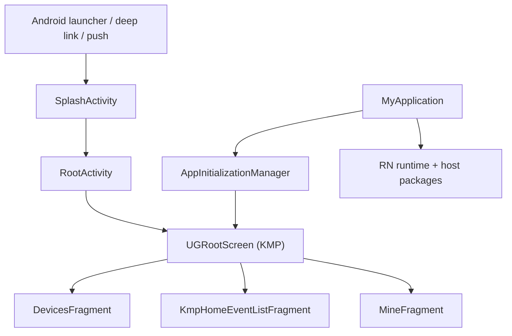

# Feature Map

> **静态快照**：2026-09-14。Android 宿主事实源为 `/Users/daubert/UGreen/ugreen-home`；Shared 的核对来源为同名 `release/1.7.0` 的隔离快照，仅作 Composite Build 的候选来源，**不是 Android 仓库子模块或平级 checkout**。本篇只写 Android 宿主入口与平台适配；共用 KMP 功能请参见 [iOS Feature Map](../UGreen%20Home%20iOS%20项目现状/01-Feature-Map.md)。

> **基线锁定**：Android `release/1.7.0` @ `5543c83e381e8af4676fe3ba22462992928afde6`（源根 `/Users/daubert/UGreen/ugreen-home`）；Shared 配套 `release/1.7.0` @ `4f36969b7894df90af09fe9ae3a2797c8cd117ed`（核对快照 `/private/tmp/ugreen-android-architecture-20260914/shared-release-1.7.0-9q2u2wrq`）。文中 Android 路径均相对 Android 源根，`Shared@4f36969b` 路径均相对该 Shared 快照。

> **跨文档边界**：链接的 iOS 01–05 文档基于其自身的 2026-09-12 / KMM `7abfcd013` 快照，**不是**本 Android 的 Shared 基线；链接只供了解共用概念，本文所有 Shared 版本、模块和路径结论均以 `Shared@4f36969b` 为准。

## 阅读口径

- **R2**：Manifest 的 launcher/系统回调或 `Application` 直接可达；**R1**：可从已确认的根页面、路由或桥接调用到达；**R0**：已编入的聚合实现，本轮未给出唯一外部入口。
- `:app` 的 `main` source set 额外引用 Shared 所生成的 Android strings 资源；该 source set 关系不证明 Shared 当前路径可用。证据：`app/build.gradle:34-38`；原配置/替换规则见 [模块图](02-Module-Dependency-Graph.md)。
- 下表不把 `adapter`、`data`、`util` 等目录当作独立用户功能；它们是支撑层。

## 应用根与主要路径

| 路径 | 路由 / 平台实现 | 级别 | 证据 |
|---|---|---:|---|
| Application | Manifest 声明 `MyApplication`；仅主进程安装 RN 平台、初始化 RN runtime、全局初始化、路由/消息处理器与离线 RN 模块。 | R2 | `app/src/main/AndroidManifest.xml:62-76`；`app/src/main/java/com/ugreen/home/base/MyApplication.kt:48-105` |
| 启动页与深链 | `SplashActivity` 是 launcher，接受 `https://s.ug.live`、`ugh` 与推送启动 action；先提交 Alexa KMP deep link 或保存通用路由，再切入根页。 | R2 | `app/src/main/AndroidManifest.xml:131-179`；`app/src/main/java/com/ugreen/home/ui/SplashActivity.kt:36-107,111-146` |
| Shared 根与首页槽位 | `RootActivity` 用 Compose 承载 `UGRootScreen`；`HomePageHost` 注入 Android Fragment：设备、KMP 事件、我的；客户服务回到 Android WebView Activity。 | R1 | `app/src/main/java/com/ugreen/home/ui/RootActivity.kt:41-44,83-110,126-141` |
| KMP 授权后初始化 | `DefaultAuthClient` 回调中初始化按用户数据库、设备 runtime、OTA、RTC SDK、推送 token 与消息协调器；登出时关闭/清理相应 Android owner。 | R1 | `app/src/main/java/com/ugreen/home/base/AppInitializationManager.kt:311-391` |

## 功能与平台聚合模块

| 模块 / 范围 | 功能边界 | 路由 | Android 接入与证据 |
|---|---|---:|---|
| `ui/fragment/home`、`ui/RootActivity` | 设备首页、底部 Tab、事件/我的宿主 Fragment。 | R1 | Shared Tab selection 被映射到 `MainViewModel` 且控制播放器可见性：`app/src/main/java/com/ugreen/home/ui/RootActivity.kt:126-141`。 |
| `ui/user` | 登录、个人中心、帐号信息、协议、环境、反馈与第三方服务页面。 | R1/R0 | Manifest 注册个人中心与第三方服务等 Activity：`app/src/main/AndroidManifest.xml:181-212`；登录生命周期由 `app/src/main/java/com/ugreen/home/base/AppInitializationManager.kt:311-391` 驱动。 |
| `ui/ipc`、`ui/aiBase` | IPC 直播/回放/事件、设备设置、AI Base 详情、事件和安全报告等传统 Android 页面；一部分事件页以 KMP Compose Activity/Fragment 承载。 | R1/R0 | KMP 事件 Activity 在 Manifest 中声明：`app/src/main/AndroidManifest.xml:214-227`；根页的 Event slot 指向 `KmpHomeEventListFragment`：`app/src/main/java/com/ugreen/home/ui/RootActivity.kt:126-131`。 |
| `repository`、`domain`、`core-*` | 设备、物模型、消息、配网、日志、UI 和工具的宿主业务层，不是单独 UI 入口。 | R0 | `:base` 将 core/domain/repository/net/common 等以 `api` 汇出：`base/build.gradle:26-58`。 |
| `bluetooth`、`camera`、`qrcode`、`permissionx` | BLE、CameraX/ML Kit、人脸能力、扫码与权限组件。 | R1/R0 | `:app` 直接依赖 `:bluetooth` 与 `:camera`：`app/build.gradle:202-203`；CameraX/ML Kit 声明：`camera/build.gradle.kts:15-29`。 |
| RN Device Settings | 运行时 AAR 提供 RN/Hermes/Fabric；宿主 `MyApplication` 安装 native package/host，`rn-platform` 提供桥、bundle 与健康检查。 | R1 | `app/src/main/java/com/ugreen/home/base/MyApplication.kt:54-67,76-104,160-187`；`rn-platform/build.gradle:21-40`。 |
| 播放器 / IPC | `ugreen-media` 是 Android 主仓的 Git 子模块目录；`player-sdk-android` 聚合 runtime 和 AirTC provider，`player-feature-ipc` 是 IPC feature。 | R1 | settings 的 projectDir 映射：`settings.gradle:85-96`；聚合声明：`ugreen-media/player-sdk-android/build.gradle:17-21`。 |
| 推送与崩溃 | App 按 flavor 接入 `push-getui`/`push-google` 与 `crash-report-bugly`/`crash-report-firebase`；其余厂商模块已 include，但不等于当前 app variant 直接依赖。 | R1 | `app/build.gradle:205-214`；厂商清单：`settings.gradle:63-79`。 |

## 关键业务功能清单（Android 宿主源码）

下表按可定位的 Activity/Fragment/ViewModel 汇总关键子功能；“存在”仅表示当前 Android 基线源码有实现或宿主入口，不等同真机/后端已验证。

| 业务域                 | 关键子功能                                                                          | Android 入口/实现证据                                                                                                                                                                                                                                                                                                                                                                                                                                                                                                 | 备注                                                                                                                                                                    |
| ------------------- | ------------------------------------------------------------------------------ | --------------------------------------------------------------------------------------------------------------------------------------------------------------------------------------------------------------------------------------------------------------------------------------------------------------------------------------------------------------------------------------------------------------------------------------------------------------------------------------------------------------- | --------------------------------------------------------------------------------------------------------------------------------------------------------------------- |
| AIBase              | AIBase 详情、设备设置（休眠/通话联系人/二维码/UPS/连接帮助）、存储管理（格式化/文件恢复）、风险/安全事件与安全报告、语音控制/声纹、人员管理 | `app/src/main/java/com/ugreen/home/ui/aiBase/AiBaseDetailsActivity.kt:77-100`；`app/src/main/java/com/ugreen/home/ui/aiBase/AiBaseSettingActivity.kt:85-99`；`app/src/main/java/com/ugreen/home/ui/aiBase/AiBaseStorageManageActivity.kt:72-100`；`app/src/main/java/com/ugreen/home/ui/aiBase/AiBaseEventsActivity.kt:87-100`；`app/src/main/java/com/ugreen/home/ui/aiBase/voicePrint/VoiceprintRecordActivity.kt:22-30`、`app/src/main/java/com/ugreen/home/ui/aiBase/peopleManage/PeopleManageActivity.kt:34-45` | 传统 Android 页面，部分能力通过 RN/KMP adapter 接入                                                                                                                                |
| IPC 直播与回放           | 来电、直播、事件、时间线回放、多设备事件、PTZ/云台、对讲与缩略图                                             | `app/src/main/java/com/ugreen/home/ui/ipc/call/IncomingCallActivity.kt:21-35`；`app/src/main/java/com/ugreen/home/ui/fragment/live/LiveFragment.kt:42-55`；`app/src/main/java/com/ugreen/home/ui/fragment/record/TimelineRecordFragment.kt:62-75`；`app/src/main/java/com/ugreen/home/ui/fragment/ptz/GunCameraControlFragment.kt:25-40`                                                                                                                                                                           | 播放器运行时由 `ugreen-media` 提供；未做真机播放验证                                                                                                                                    |
| 设备设置                | 网络信息、音频/灯光、视频翻转、隐私区域、AI 检测/灵敏度/跟踪/区域、通知、存储、本地布局、通话联系人、流量管理                     | `app/src/main/java/com/ugreen/home/ui/fragment/setting/SettingDeviceIPCFragment.kt:71-92`；`app/src/main/java/com/ugreen/home/ui/fragment/setting/device/SettingPrivacyZoneFragment.kt:1-40`；`app/src/main/java/com/ugreen/home/ui/fragment/setting/ai/SettingAIDetectionFragment.kt:1-40`                                                                                                                                                                                                                       | 页面入口由设备能力与菜单状态决定                                                                                                                                                      |
| 配网/设备接入             | BLE 扫描连接、SoftAP、Wi‑Fi SSID/密码、LTE SIM/APN、网络类型、绑定成功/失败/帮助                      | `app/src/main/java/com/ugreen/home/ui/fragment/deviceSetup/BleConnectFragment.kt:69-88`；`app/src/main/java/com/ugreen/home/ui/fragment/deviceSetup/WifiConfigFragment.kt:85-100`；`app/src/main/java/com/ugreen/home/ui/fragment/deviceSetup/NetworkTypeMainFragment.kt:77-95`；`app/src/main/java/com/ugreen/home/ui/fragment/deviceSetup/DeviceSetupFailFragment.kt:1-35`                                                                                                                                       | 覆盖蓝牙、相机/扫码与 LTE 分支；未证明每型号都可达                                                                                                                                          |
| 首页与家庭               | 设备列表/排序/刷新、事件 Tab、我的 Tab、房间管理与设备房间设置、首页卡片布局                                    | `app/src/main/java/com/ugreen/home/ui/fragment/home/DevicesFragment.kt:99-100`；`app/src/main/java/com/ugreen/home/ui/fragment/home/RoomManagementActivity.kt:14-30`；`app/src/main/java/com/ugreen/home/ui/RootActivity.kt:126-141`                                                                                                                                                                                                                                                                              | Shared `feature-home-management` 在 Shared settings 中存在，但不在 Android substitution 清单；这里只记录 Android Manifest 宿主调用，通用实现路径为 `Shared@4f36969b/feature-home-management/src/` |
| 用户中心与帐号             | 个人信息、环境切换、语言/界面显示、权限/隐私、第三方服务、反馈/联系我们、修改密码、撤回同意                                | `app/src/main/AndroidManifest.xml:181-212,253-306`；`app/src/main/java/com/ugreen/home/ui/user/ui/PersonalCenterActivityNew.kt:98-100`；`app/src/main/java/com/ugreen/home/ui/user/ui/InformationProtectionActivity.kt:15-31`；`app/src/main/java/com/ugreen/home/ui/user/ui/ThirdPartyServicesActivity.kt:9-20`                                                                                                                                                                                                   | 认证核心来自 `Shared@4f36969b/feature-auth/src/`，Android 通过 Activity/Compose host 接入                                                                                        |
| 指导卡 / 设备分享 / 消息中心   | 指导卡列表；设备分享、权限选择、二维码/帐号分享；消息列表与消息设置                                             | `app/src/main/AndroidManifest.xml:318-321,557-596`；`app/src/main/java/com/ugreen/home/ui/guide/GuideCardListActivity.kt:21-35`；`app/src/main/java/com/ugreen/home/ui/dev/share/DeviceShareActivity.kt:33-45`；`app/src/main/java/com/ugreen/home/ui/message/MessageActivity.kt:23-40`                                                                                                                                                                                                                            | R0：仅确认 Manifest 注册及类入口，尚未追到唯一根路由                                                                                                                                      |
| 独立人脸 / AI 搜索 / 车牌管理 | 人脸管理、AI 搜索、车牌管理                                                                | `app/src/main/AndroidManifest.xml:613-618,788-797`；`app/src/main/java/com/ugreen/home/ui/face/FaceManageActivity.kt:15-30`；`app/src/main/java/com/ugreen/home/ui/search/AISearchActivity.kt:58-75`；`app/src/main/java/com/ugreen/home/ui/licensePlate/LicensePlateManagementActivity.kt:14-30`                                                                                                                                                                                                                  | R0：仅确认 Manifest 注册及类入口，尚未追到唯一根路由                                                                                                                                      |
| 消息/通知与 OTA          | 登录提醒/强制退出、设备分享/解绑、设备顺序变化、OTA 升级消息与推送 token 上报                                  | `app/src/main/java/com/ugreen/home/messaging/handlers/LoginMessageHandler.kt:21-54`；`app/src/main/java/com/ugreen/home/ota/AndroidOtaIntegration.kt:1-60`；`app/src/main/java/com/ugreen/home/ui/user/login/PushTokenReporter.kt:23-55`                                                                                                                                                                                                                                                                          | 通信链路见 [05](05-Feature-Communication.md)，未做推送服务动态验证                                                                                                                    |

## KMP、RN、播放器的宿主边界

| 边界 | 已确认 Android 差异 | 证据 |
|---|---|---|
| Shared 根 | Android 直接以 Compose `UGRootScreen` 渲染，三个首页槽位为 Fragment；并非 iOS 的 UIViewController factory。 | `app/src/main/java/com/ugreen/home/ui/RootActivity.kt:83-110,126-141` |
| KMP Deep Link | `SplashActivity` 对 Alexa URL 优先调用 `ThirdPartyServicesDeepLink.submit`，避免进入 Android 通用路由队列。 | `app/src/main/java/com/ugreen/home/ui/SplashActivity.kt:88-97` |
| RN | 仅主进程加载 native runtime；RN `StorageRNBridge` 以独立 MMKV 保存经校验的布尔 key，且不随帐号切换清理。 | `app/src/main/java/com/ugreen/home/base/MyApplication.kt:62-105`；`rn-platform/src/main/java/com/ugreen/home/rn/StorageRNBridge.kt:11-55` |
| 播放 | Activity 是 `DeviceVideoView.Host`，当前根页仅在设备 Tab 暴露主 host 可见性。 | `app/src/main/java/com/ugreen/home/ui/RootActivity.kt:44,61-63,134-140` |

**未把“已存在目录”写成已运行功能：** 本轮未做安装/设备/后端动态验证；第三方服务、RN bundle 和播放器 provider 的运行可达性需以后续构建与 [测试](07-Testing.md) 的实测为准。
