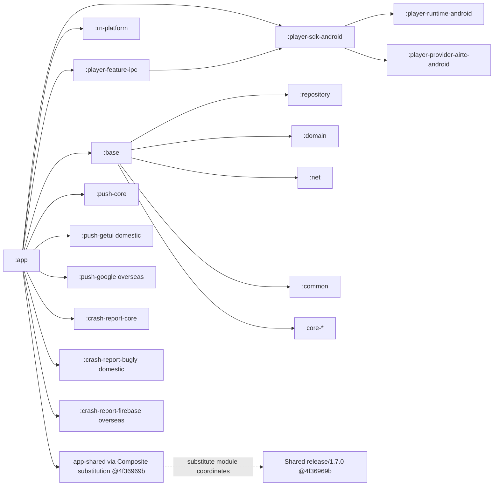
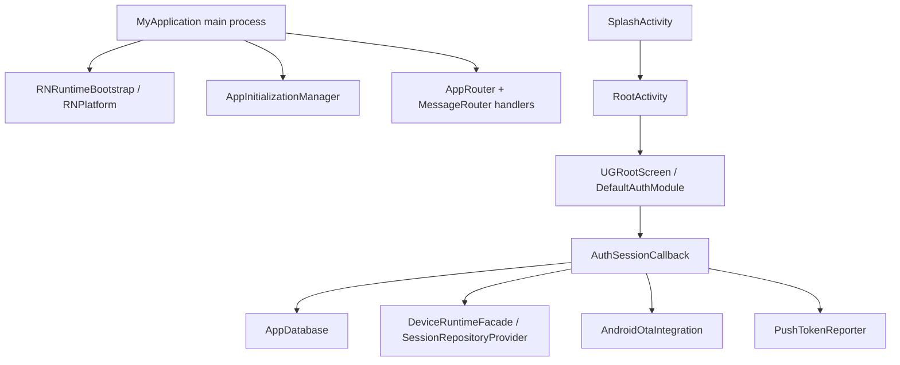

# Module Dependency Graph

> **静态快照**：2026-09-14。声明边来自 Android `settings.gradle:56-147` 与模块 Gradle 文件；运行时边来自 Kotlin 源码，二者不可互换。共用 KMP 细节仅链接 [iOS 模块依赖图](../UGreen%20Home%20iOS%20项目现状/02-Module-Dependency-Graph.md)，但 Shared 模块声明和 substitution 已按本页的同名分支快照核对；本篇仅保留 Android substitution 与宿主调用差异。

> **基线锁定**：Android `release/1.7.0` @ `5543c83e381e8af4676fe3ba22462992928afde6`（源根 `/Users/daubert/UGreen/ugreen-home`）；Shared 配套 `release/1.7.0` @ `4f36969b7894df90af09fe9ae3a2797c8cd117ed`（核对快照 `/private/tmp/ugreen-android-architecture-20260914/shared-release-1.7.0-9q2u2wrq`）。文中 Android 路径均相对 Android 源根，`Shared@4f36969b` 路径均相对该 Shared 快照。

> **跨文档边界**：链接的 iOS 01–05 文档基于其自身的 2026-09-12 / KMM `7abfcd013` 快照，**不是**本 Android 的 Shared 基线；链接只供了解共用概念，本文所有 Shared 版本、模块和路径结论均以 `Shared@4f36969b` 为准。

## 1. 实际 Gradle 工程边界

`settings.gradle:56-115` 的动态 include 完整清点为：`:app`、`:rn-platform`、`:base`、`:common`、`:net`、`:bluetooth`、`:repository`、`:domain`、`:calendarview`、`:qrcode`、`:permissionx`、`:camera`、`:dsbridge`，`core-{util,ui,messaging,device,device-setup,log}`，全部 `push-core`、`push-{google,huawei,xiaomi,oppo,vivo,honor,getui}`、`crash-report-{core,bugly,firebase}`，`core-ui:lint`，及 `player-{core,runtime-android,provider-airtc-android,provider-ugrtc-android,sdk-android,feature-ipc}`。证据：`settings.gradle:56-115`。

- `ugreen-media` 是本仓的 Git 子模块目录，播放器 project 通过 `projectDir` 映射；不是 Composite Build。证据：`settings.gradle:85-96`。
- Shared 是可选 Composite Build：默认相对路径 `../ugreenhome-shared`，可由 `-PugreenHomeSharedPath` 覆盖；源目录不存在时顶层构建显式失败。本文核对值为隔离快照 `/private/tmp/ugreen-android-architecture-20260914/shared-release-1.7.0-9q2u2wrq`，不是误用的 iOS 工作树，也不是 Android 仓库 Git submodule。证据：`settings.gradle:117-147`；`build.gradle:39-44`。
- Composite substitution 的精确坐标为 `core-{util,net,database,ui,kv,mvi,logger,secure-package}`、`device-thing-model`、`airtc-appsdk`、`domain-{env,product}`、`feature-auth`、`app-shared`、`device-biz`、`feature-playback` 和 Android strings；并不包含 `domain-device`、`domain-family`、`core-player` 或 `feature-home-management`。这些模块虽在 `Shared@4f36969b/settings.gradle.kts:24-53` 声明，但不能据此声称被本 Composite substitution 直替。证据：`settings.gradle:125-145`。

| Shared@4f36969b 模块 | 当前 Android 基线关系 | 证据 |
|---|---|---|
| `domain-product` | 被 `settings.gradle:125-145` 的 Composite substitution 直接映射；Android BLE 配网会经 `SessionRepositoryProvider.productRepository` 读取产品信息。 | `settings.gradle:136-137`；`Shared@4f36969b/domain/domain-product/build.gradle.kts:21-34`；`app/src/main/java/com/ugreen/home/ui/fragment/deviceSetup/BleConnectFragment.kt:69-88` |
| `domain-device` / `domain-family` | Shared settings 已 include，但**不在** Android substitution 清单中；本页不把其存在写成 Android 当前直连关系。 | `Shared@4f36969b/settings.gradle.kts:24-34`；`settings.gradle:125-145` |
| `core-player` | Shared settings 已 include，但 Android 当前播放器 project 是 `ugreen-media/player-*`，且 `core-player` 不在 substitution 清单。 | `Shared@4f36969b/settings.gradle.kts:12-23`；`settings.gradle:85-96,125-145` |
| `feature-playback` | `:repository` 声明其 Maven 坐标，Composite substitution 映射到 Shared project。 | `repository/build.gradle:41-46`；`settings.gradle:141-144`；`Shared@4f36969b/feature-playback/build.gradle.kts:22-35` |

## 2. 主要声明依赖边

| 声明端 | 直接边 / 传播方式 | 证据 |
|---|---|---|
| `:app` | 直接依赖 RN、base、播放器 SDK/IPC、`app-shared`、蓝牙、相机、push/crash flavor provider。 | `app/build.gradle:179-203` |
| `:base` | 以 `api` 汇出 core、domain、repository、net、common、qrcode、播放器 SDK 和多项第三方；因此 app 的源码可经 base 可见。 | `base/build.gradle:26-58` |
| `:repository` | 依赖 core database/net、domain、net、Shared app/feature-playback/device-biz、播放器、消息、蓝牙。 | `repository/build.gradle:27-50` |
| `:rn-platform` | 依赖 runtime AAR、Fresco GIF、Media3，及 common/core/crash/core-net；自带规则禁止反向引用 `:app` 具体实现。 | `rn-platform/build.gradle:21-40,42-80` |
| `:player-sdk-android` | `api player-core/runtime`，`implementation player-provider-airtc-android`；`player-feature-ipc` 再依赖 SDK。 | `ugreen-media/player-sdk-android/build.gradle:17-21`；`ugreen-media/player-feature-ipc/build.gradle:27-33` |
| 推送 / 崩溃 | app 只有国内 Getui/Bugly、海外 Google/Firebase 的 variant 边；`settings` include 的 Huawei/Xiaomi/Oppo/Vivo/Honor 模块是可用 provider，不应误标为 app 当前直接边。 | `app/build.gradle:205-214`；`settings.gradle:63-79` |

## 3. 已确认运行时调用边

| 调用链 | 证据 | 与声明边的区别 |
|---|---|---|
| `MyApplication → RNPlatform/RNRuntimeBootstrap → AppInitializationManager` | `app/src/main/java/com/ugreen/home/base/MyApplication.kt:62-105` | `:rn-platform`/runtime 的存在不说明子进程会加载；源码明确仅主进程执行。 |
| `MyApplication → AppRouter / MessageRouter` | `app/src/main/java/com/ugreen/home/base/MyApplication.kt:112-157` | 这是 handler 注册顺序，非 Gradle transitive graph。 |
| `SplashActivity → ThirdPartyServicesDeepLink / AppRouteManager → RootActivity` | `app/src/main/java/com/ugreen/home/ui/SplashActivity.kt:72-107` | 深链先由 Android 路由或 KMP 接收；不是仅因 app 依赖 app-shared 就推断。 |
| `RootActivity → UGRootScreen → Android Fragment slots` | `app/src/main/java/com/ugreen/home/ui/RootActivity.kt:83-110,126-141` | 这是 Android Compose/Fragment 宿主桥，Shared 内部实现另见 iOS 链接。 |
| `AuthSessionCallback → AppDatabase / DeviceRuntimeFacade / SessionRepositoryProvider / OTA / Push` | `app/src/main/java/com/ugreen/home/base/AppInitializationManager.kt:311-391` | 会话回调的初始化/回收时序，不等同于这些库的所有依赖边。 |

## 4. Composite Build 与资源边界

| 项 | 当前结论 | 证据 |
|---|---|---|
| Android 资源 | `:app` 和 `:base` 均以 `rootProject.ext.ugreenHomeSharedDir` 增加生成字符串资源目录。 | `app/build.gradle:34-38`；`base/build.gradle:12-17` |
| 解析替换 | `useUgreenHomeSharedComposite` 默认 `true`；将指定 group:name 替换为 Shared 子工程。 | `settings.gradle:117-147` |
| 当前可用性 | 本次只静态核对；Android 默认相对路径不能据此认定存在。本次核对使用与 Android 同名 `release/1.7.0` 的隔离 Shared 快照；通过 `-PugreenHomeSharedPath=/private/tmp/ugreen-android-architecture-20260914/shared-release-1.7.0-9q2u2wrq` 指定，避免误用 iOS 工作树。 | `build.gradle:39-44`；[调研方案](附件/调研方案与执行记录.md) |

## 5. 不纳入图的内容

- `build/`、`.gradle/`、`.kotlin/` 和播放器本地 AAR/so 产物不是 Gradle 业务模块。
- 版本目录列出的所有库、各 provider 的 transitive 依赖和私仓解析结果未在本轮展开为自有模块边。
- 本篇未把 `Shared@4f36969b` 写成 Android 的子模块；其共同 KMP 逻辑只通过上述 module-coordinate substitution 接入。
