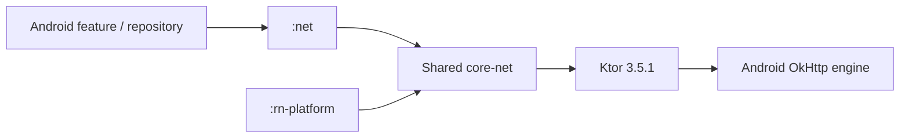
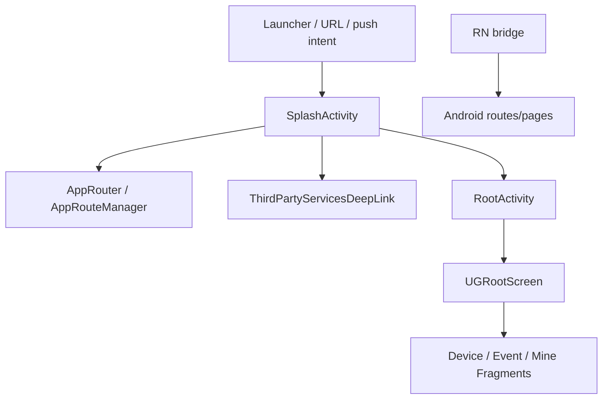

# Core Dependencies

> **静态快照**：2026-09-14。下述版本是 version catalog 或明确 Gradle 声明，不是 resolved dependency graph，也不等同线上可用性。Shared 通用实现细节见 [iOS Core Dependencies](../UGreen%20Home%20iOS%20项目现状/03-Core-Dependencies.md)；这里只记录 Android engine、宿主初始化与调用差异。

> **基线锁定**：Android `release/1.7.0` @ `5543c83e381e8af4676fe3ba22462992928afde6`（源根 `/Users/daubert/UGreen/ugreen-home`）；Shared 配套 `release/1.7.0` @ `4f36969b7894df90af09fe9ae3a2797c8cd117ed`（核对快照 `/private/tmp/ugreen-android-architecture-20260914/shared-release-1.7.0-9q2u2wrq`）。文中 Android 路径均相对 Android 源根，`Shared@4f36969b` 路径均相对该 Shared 快照。

> **跨文档边界**：链接的 iOS 01–05 文档基于其自身的 2026-09-12 / KMM `7abfcd013` 快照，**不是**本 Android 的 Shared 基线；链接只供了解共用概念，本文所有 Shared 版本、模块和路径结论均以 `Shared@4f36969b` 为准。

## 1. 核心能力总表

| 能力 | Android 实现 / 入口 | 当前证据 |
|---|---|---|
| Network | Shared `core-net`（Android 为 Ktor OkHttp 引擎）被 `:net` / `:repository` 使用；传统 Android 模块还保留 Gson、DataStore 等依赖。 | Gradle 声明和 Shared Android artifact/substitution 已确认；未测真实请求。 |
| Database / KV | Android `AppDatabase`（Room）按环境/用户建库；MMKV 初始化后供传统与 RN bridge 使用；下载进度走 Preferences DataStore。 | 创建/关闭、读写 API 有源码证据。 |
| Account | Shared `DefaultAuthClient/DefaultAuthModule` 是根认证入口；Android callback 编排本地 DB、设备/RTC/OTA、推送与消息。 | 宿主 callback 路径已确认，未动态验证认证服务。 |
| Analytics / crash / logging | Android 日志初始化后装 Shared/媒体 logger adapter；国内选 Bugly，海外选 Firebase Crashlytics/Analytics；push 同样随 flavor。 | 声明和初始化/用户标识调用已确认，未验证上报。 |
| Navigation | Manifest → Splash → Compose `UGRootScreen`；KMP 首页 slots 回注 Android Fragment，传统 `AppRouter` 承担通用 deep link/push 路由，RN 有 native bridge。 | 入口、路由注册与槽位实现均有源码证据。 |

## 2. Network

- `:net` 直接依赖 `libs.ugreen.core.net`、JSON、Gson、common 和 Preferences DataStore；`:repository` 亦依赖 core-net 与 `:net`。证据：`net/build.gradle:20-30`；`repository/build.gradle:27-46`。
- Shared catalog 将 Ktor 与 `ktor-client-okhttp` 均声明为 **3.5.1**；这是 Android 的平台引擎差异，通用 `NetworkHolder`/拦截器实现请链接阅读 iOS 文档。证据：`Shared@4f36969b/gradle/libs.versions.toml:10,56-61`（相对指定 Shared 核对根）。
- RN platform 同样依赖 Shared `core-net`，但本轮未定位一个 Android JS 请求到网络 client 的端到端调用，不能把依赖声明写成已复用请求链。证据：`rn-platform/build.gradle:29-40`。

## 3. Database 与 Key-Value Storage

| 存储 | Android owner / 隔离边界 | 证据 |
|---|---|---|
| Room `AppDatabase` | 设备、IPC event/record、物模型等 DAO；DB 名按环境和 user id 生成并缓存，登出 callback 关闭当前用户实例。 | `app/src/main/java/com/ugreen/home/data/AppDatabase.kt:31-59,61-139`；`app/src/main/java/com/ugreen/home/base/AppInitializationManager.kt:319-325,370-389` |
| Shared Room / SQLite bundled | Shared Core 的 Room **2.8.4**、SQLite bundled **2.6.2**；Android 通过 Composite substitution 消费，通用数据库 schema/DAO 不在本篇重复。 | `Shared@4f36969b/gradle/libs.versions.toml:15-17,100-110`；`settings.gradle:128-145` |
| MMKV | `AppInitializationManager` 先初始化 MMKV；传统模块与 RN bridge 使用不同标识。RN bridge 明确不随帐号切换清理。 | `app/src/main/java/com/ugreen/home/base/AppInitializationManager.kt:245-246`；`rn-platform/src/main/java/com/ugreen/home/rn/StorageRNBridge.kt:11-55,78-99` |
| Preferences DataStore | `DownloadStoreManager` 在 app process 维护单例 `ipc_download_progress`，记录下载断点。 | `net/src/main/java/com/ugreen/net/media/downloader/DownloadStoreManager.kt:12-30,55-100` |

**边界：** Android `AppDatabase` 与 Shared Room 都引用 Room 类型，但当前证据不支持把它们写作同一物理数据库或同一 DAO 集合。

## 4. Account

1. `RootActivity` 把 `DefaultAuthModule` 注入 Shared `UGRootScreen`，并以 `DefaultAuthClient.stateValue` 决定能否消费一般 deep link。证据：`app/src/main/java/com/ugreen/home/ui/RootActivity.kt:59,68-70,83-110`。
2. 主进程初始化注册 `AuthSessionCallback`；`onLoginTask` 使用回调 session 的 user id 建库，随后启动设备 runtime、OTA、SDK、崩溃 user id 与推送/消息；`onLogoutTask` 反向停止/关闭这些 owner。证据：`app/src/main/java/com/ugreen/home/base/AppInitializationManager.kt:311-391`。
3. 该 callback 是 Android 宿主协调层，Shared session store、AuthClient 与跨端状态机的共用实现参见 [iOS Account](../UGreen%20Home%20iOS%20项目现状/03-Core-Dependencies.md#4-account)。源码未证明所有 legacy 页面均完成迁移，也未进行服务端会话测试。

## 5. Analytics、Crash、Push 与 Logging

| 能力 | 版本 / flavor | 证据与限制 |
|---|---|---|
| Firebase Crashlytics / Analytics | Firebase BoM **34.7.0**；仅海外 `:crash-report-firebase`。 | catalog：`gradle/libs.versions.toml:28-29`；模块：`crash-report/crash-report-firebase/build.gradle:23-30`。BoM 管理的单组件 resolved version 未在本轮解析。 |
| Bugly | catalog 指定 `latest.release`；仅国内 `:crash-report-bugly`。 | `gradle/libs.versions.toml:86-88`；`crash-report/crash-report-bugly/build.gradle:23-27`。不能从该动态声明推导确定版本。 |
| Push | 国内 `push-getui`（GT SDK **3.3.15.0** / GTC **3.3.3.0**，并含多厂商适配）；海外 `push-google` 使用 Firebase Messaging BoM。 | `app/build.gradle:179-190`；`push/push-getui/build.gradle:24-39`；`push/push-google/build.gradle:23-29`；版本：`gradle/libs.versions.toml:48-50`。 |
| 日志 | Android 初始化 `Logger`，安装 Shared `ILogger` adapter 和媒体 logger；KMP 日志具体实现不重复。 | `app/src/main/java/com/ugreen/home/base/AppInitializationManager.kt:189-243` |

本轮不记录任何签名、token、应用密钥或服务端配置；SDK 声明/初始化不构成埋点或崩溃上报已成功的证据。

## 6. Navigation

- Manifest 对 `SplashActivity` 声明 launcher、web URL、私有 scheme 和推送启动 action。证据：`app/src/main/AndroidManifest.xml:131-179`。
- `MyApplication` 注册添加设备、短链、设备详情/事件/分享、来电、忘记密码等 handler；这是 Android 通用路由责任链。证据：`app/src/main/java/com/ugreen/home/base/MyApplication.kt:112-141`。
- `SplashActivity` 特判 Alexa URL 给 KMP；其余解析保存到 `AppRouteManager`，然后启动 `RootActivity`。证据：`app/src/main/java/com/ugreen/home/ui/SplashActivity.kt:72-107,111-146`。
- `RootActivity` 以 Compose host 承载 Shared root，再回注 Fragment，不应把传统 `MainFragment` 或某个目录存在误写为默认 window root。证据：`app/src/main/java/com/ugreen/home/ui/RootActivity.kt:83-110,126-141`。

## 7. 版本快照

| 依赖 | 声明版本 | 来源 |
|---|---:|---|
| Kotlin / AGP / KSP | 2.4.0 / 9.2.1 / 2.3.9 | `gradle/libs.versions.toml:3-7` |
| Ktor / Shared coroutines | 3.5.1 / 1.11.0 | `Shared@4f36969b/gradle/libs.versions.toml:6,10` |
| Room / SQLite bundled | 2.8.4 / 2.6.2 | `gradle/libs.versions.toml:8-9`；`Shared@4f36969b/gradle/libs.versions.toml:15-16` |
| MMKV / Android DataStore | 1.3.16 / 1.1.1 | `gradle/libs.versions.toml:62-63` |
| Compose MP / Navigation | 1.11.1 / 2.9.1 | `Shared@4f36969b/gradle/libs.versions.toml:20-24` |
| Firebase BoM | 34.7.0 | `gradle/libs.versions.toml:28-29` |
| RN runtime Android | 0.1.4 | `gradle/libs.versions.toml:91-92` |
| Media3 (播放器及 RN 引导 MP4) | 1.8.0 | `ugreen-media/player-runtime-android/build.gradle:87-90`；`rn-platform/build.gradle:24-27` |
| AirTC Shared SDK | 1.6.2.233 | `Shared@4f36969b/gradle/libs.versions.toml:37-38,112-125` |

未运行 dependency insight 或锁定解析；以上不能替代实际 variant 的解析版本与兼容性结论。
