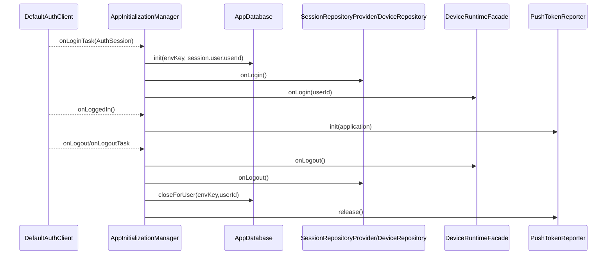
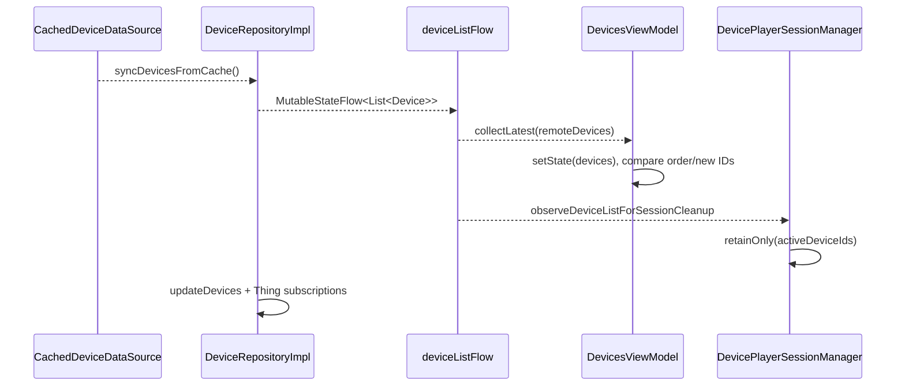
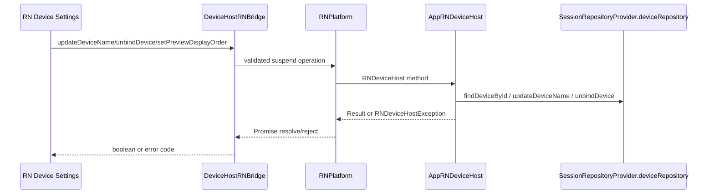

# 04. State Ownership（状态归属）

> 调研日期：2026-09-14。本文是 Android 主工程的静态源码追踪；源码命中仅证明调用/数据结构存在，不等同真实设备运行验证。共用 KMP 实现不在此重复展开，参见 [iOS 04-State-Ownership](../UGreen%20Home%20iOS%20项目现状/04-State-Ownership.md)。

> **基线锁定**：Android `release/1.7.0` @ `5543c83e381e8af4676fe3ba22462992928afde6`（源根 `/Users/daubert/UGreen/ugreen-home`）；Shared 配套 `release/1.7.0` @ `4f36969b7894df90af09fe9ae3a2797c8cd117ed`（核对快照 `/private/tmp/ugreen-android-architecture-20260914/shared-release-1.7.0-9q2u2wrq`）。文中 Android 路径均相对 Android 源根，`Shared@4f36969b` 路径均相对该 Shared 快照。

> **跨文档边界**：链接的 iOS 01–05 文档基于其自身的 2026-09-12 / KMM `7abfcd013` 快照，**不是**本 Android 的 Shared 基线；链接只供了解共用概念，本文所有 Shared 版本、模块和路径结论均以 `Shared@4f36969b` 为准。

## 结论摘要

- **会话 owner 是 KMP `DefaultAuthClient`**；`AppInitializationManager` 以 `AuthSessionCallback` 将登录、登出映射到 Room、SessionRepositoryProvider、DeviceRuntime、推送和全局清理。
- **设备列表 owner 是按会话创建的 `SessionRepositoryProvider.deviceRepository`**，其 `DeviceRepositoryImpl.deviceListFlow` 是 `StateFlow`；`DevicesViewModel` 仅持有页面投影和排序 UI 状态。
- **Room 是账号/环境隔离的持久化缓存**，不是认证真相；`AppDatabase` 按 `(envKey,userId)` 创建并在登出关闭对应实例。
- **设备运行时/KMP `AppDeviceModule` 由 `DeviceRuntimeFacade` 门面装配**，登录初始化、登出释放，Android 宿主入口见源码；共享实现细节交叉引用 iOS 文档。
- **RN MMKV、播放会话、设备房间名/属性等是独立运行态**：RN `StorageRNBridge` 明确不随账号切换清理；播放器按 deviceId 管理 session，并由设备列表 `retainOnly` 清孤儿。

## 状态 owner 矩阵

| 状态域 | 创建/装载 | 权威 owner | 读写者 | reset/生命周期 | 源码证据 |
|---|---|---|---|---|---|
| 账号会话、当前 userId | KMP AuthClient 回调 `onLoginTask/onLoggedIn` | `DefaultAuthClient`；Android 业务读取其 `userId/isLoggedIn` | `AppInitializationManager`、登录页/ViewModel、UserRepository、PushTokenReporter | `onLogout`/`onLogoutTask` 清理会话相关运行态；具体 token 存储由 KMP 负责（本专题未重复） | `app/src/main/java/com/ugreen/home/base/AppInitializationManager.kt:311-391`；`app/src/main/java/com/ugreen/home/ui/user/login/PushTokenReporter.kt:60-64` |
| Session 仓库集合 | `onLogin()` 先 `onLogout()` 再注册各 Repository | `SessionRepositoryProvider.repositories`（当前登录会话内存容器） | ViewModel、消息处理器、RN host、设备能力 | `onLogout()` release ThingModel、调用 `IClearedRepository.onCleared()`、清空 map | `repository/src/main/kotlin/com/ugreen/care/repo/provider/SessionRepositoryProvider.kt:60-82,112-145,317-325` |
| 设备列表/设备 ID map | `DeviceRepositoryImpl` 冷启动从 `CachedDeviceDataSource` 回填，远端 refresh 更新 | `DeviceRepositoryImpl._deviceList` / `deviceListFlow`；`deviceIdMapFlow` 为派生索引 | `DevicesViewModel`、设备详情/分享、消息 handlers、播放器清理、RN host | 仓库登出释放；设备解绑删除缓存并从列表同步；列表变化触发数据通道、Thing、播放器收敛 | `repository/src/main/kotlin/com/ugreen/care/repo/device/list/DeviceRepositoryImpl.kt:72-99,101-121,517-540`；`app/src/main/java/com/ugreen/home/viewModel/DevicesViewModel.kt:103-133,163-174` |
| 首页页面态（列表、网络、排序） | ViewModel 订阅 repository Flow 与网络监控 | `DevicesViewModel` 的 `uiState`/`displayedDeviceIds` 等页面投影，不是设备真相 | Home/Devices UI | ViewModel 生命周期结束时取消 `viewModelScope`；刷新/排序重新投影 | `app/src/main/java/com/ugreen/home/viewModel/DevicesViewModel.kt:59-68,81-133,145-159` |
| 设备 Thing/属性运行态 | 登录时 `SessionRepositoryProvider` 创建 `DeviceThingModel`；列表更新调用 `updateDevices` | 当前会话 `DeviceThingModel`（KMP/device-biz adapter）及其属性流 | DeviceRepository、设备能力、RN host、OTA | `SessionRepositoryProvider.onLogout()` 调 `deviceThingModel.release()`；列表替换同步设备 | `app/src/main/java/com/ugreen/home/base/AppInitializationManager.kt:268-277,325-327,384-386`；`repository/src/main/kotlin/com/ugreen/care/repo/device/list/DeviceRepositoryImpl.kt:517-540` |
| KMP device-biz runtime | 登录回调 `DeviceRuntimeFacade.onLogin(userId)`；门面内部调用 `AppDeviceModule` | `AppDeviceModule.repository`（由 facade 暴露 ready/依赖查询） | 事件模块、宿主同步 IPC descriptors | `DeviceRuntimeFacade.onLogout()` 调 AppDeviceModule 释放；失败只记录日志不阻断登录 | `repository/src/main/kotlin/com/ugreen/care/repo/device/runtime/DeviceRuntimeFacade.kt:17-26,42-68`；`app/src/main/java/com/ugreen/home/base/AppInitializationManager.kt:318-327,384-386` |
| Room 持久化（事件/记录/Thing 属性/设备缓存） | `AppDatabase.init` 动态解析环境和 userId；Room DAO 按需访问 | `AppDatabase` 的 `(envKey,userId)` 数据库文件 | Repository data source、离线首屏/记录页 | `closeForUser(envKey,userId)` 关闭并移除缓存实例；未声明全库清空 | `app/src/main/java/com/ugreen/home/data/AppDatabase.kt:31-47,61-111,114-127`；`app/src/main/java/com/ugreen/home/base/AppInitializationManager.kt:377-389` |
| RN 轻量本地设置 | RN JS 调 `StorageRNBridge.getBoolean/setBoolean` | 独立 MMKV namespace `rn_local_storage` | RN Bundle | 明确“不跟随账号切换清理”；模块 cleanup no-op | `rn-platform/src/main/java/com/ugreen/home/rn/StorageRNBridge.kt:11-27,29-55,78-87` |
| 播放器设备会话 | `DevicePlayerSessionManager.init`；`getOrCreate(config)` 按 deviceId 建立/复用 | 全局 `DevicePlayerSessionManager.sessions` + `activeSessions` StateFlow | IPC/RN native player UI、Talk/thumbnail 回调 | 设备列表变化调用 `retainOnly`；登出路径当前显式关闭 SDK/仓库，播放器孤儿收敛由列表观察；全量 API `releaseAll` 可销毁全部 | `ugreen-media/player-runtime-android/src/main/java/com/ugreen/media/player/session/DevicePlayerSessionManager.kt:17-23,41-68,76-143,168-198`；`app/src/main/java/com/ugreen/home/base/AppInitializationManager.kt:563-571` |
| 推送 token 上报状态 | 登录 `onLoggedIn` 调 `PushTokenReporter.init`；异步取 PushInitializer token | `PushTokenReporter.reportedToken` 与 polling Job（仅上报去重/重试态） | PushTokenReporter → LoginRemoteApi | 登出 `release()` 停止轮询、清 token/initialized | `app/src/main/java/com/ugreen/home/base/AppInitializationManager.kt:341-358,370-390`；`app/src/main/java/com/ugreen/home/ui/user/login/PushTokenReporter.kt:20-55,60-93,96-143` |
| RN/设备 host 上下文与写操作 | Bridge 参数校验后委派 `RNPlatform`，App host 从 SessionRepository 查设备 | Android `AppRNDeviceHost`；不复制设备列表 | RN Device Settings JS | unbind 后清 `DeviceRNContextProvider`；属性/名称/布局写回 Repository/Store | `rn-platform/src/main/java/com/ugreen/home/rn/DeviceHostRNBridge.kt:15-27,29-50,112-128`；`app/src/main/java/com/ugreen/home/rn/host/AppRNDeviceHost.kt:21-50,57-95` |

## 关键边界

- `DeviceRepositoryImpl` 内部同时维护内存 `StateFlow`、缓存 data source、ThingModel 和数据通道；因此 Room/缓存只应描述启动/离线输入，不应被写成当前设备关系唯一 owner。
- `AppInitializationManager.onLoginTask` 在认证回调成功前使用传入 `session.user.userId` 初始化数据库和仓库，避免读取旧 `DefaultAuthClient` 用户；这是明确的异步会话边界。
- `GlobalScope` 观察设备列表并维护播放器孤儿收敛，说明该清理任务不绑定单个 ViewModel；它在 `release()` 才取消，静态证据不足以证明异常进程终止时的完整收尾。

## 登录→设备态与登出 reset（源码证据）

证据：`app/src/main/java/com/ugreen/home/base/AppInitializationManager.kt:311-355`、`:361-391`。

## 设备列表→页面/播放器收敛

证据：`repository/src/main/kotlin/com/ugreen/care/repo/device/list/DeviceRepositoryImpl.kt:82-99,517-540`、`app/src/main/java/com/ugreen/home/viewModel/DevicesViewModel.kt:103-133`、`app/src/main/java/com/ugreen/home/base/AppInitializationManager.kt:563-571`。

## RN 设置写入→宿主 owner

证据：`rn-platform/src/main/java/com/ugreen/home/rn/DeviceHostRNBridge.kt:29-50,70-100,112-128`、`app/src/main/java/com/ugreen/home/rn/host/AppRNDeviceHost.kt:26-50,57-95`。属性写确认另由 `Flow` 在写入前开始收集，见 `rn-platform/src/main/java/com/ugreen/home/rn/DevicePropertyWriteConfirmation.kt:41-77`。

## 共享 KMP 交叉引用与未验证项

共享 Auth/Env/HomeLocation 的通用实现和 iOS 已确认链路见 [iOS 04-State-Ownership](../UGreen%20Home%20iOS%20项目现状/04-State-Ownership.md)。本 Android 文档只记录 `AppInitializationManager` 的 callback adapter、`DeviceRuntimeFacade` 门面、Room 动态 user/environment key 及 Android lifecycle。本轮已完成隔离 App 构建及 JVM/Android 单元测试（见06/07）；以上状态链仍以静态调用为证据，未连接真实 IoT 设备，未证明线上时序、并发调度或持久化加密实现。
