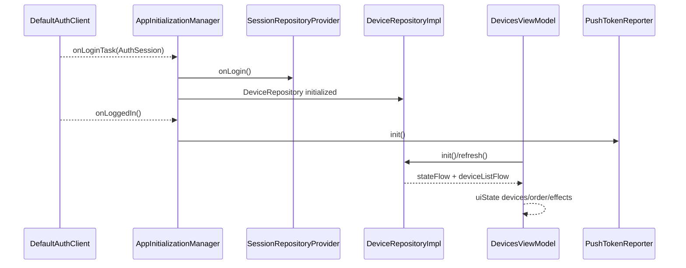
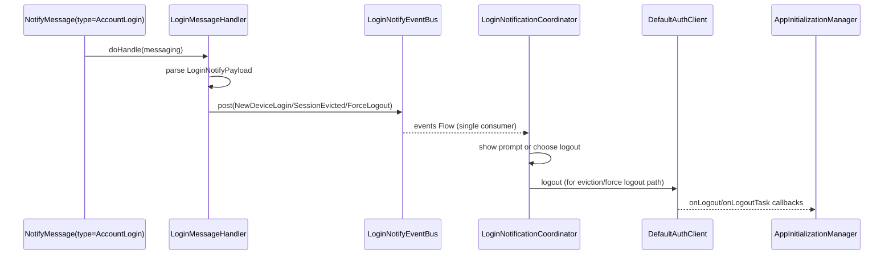
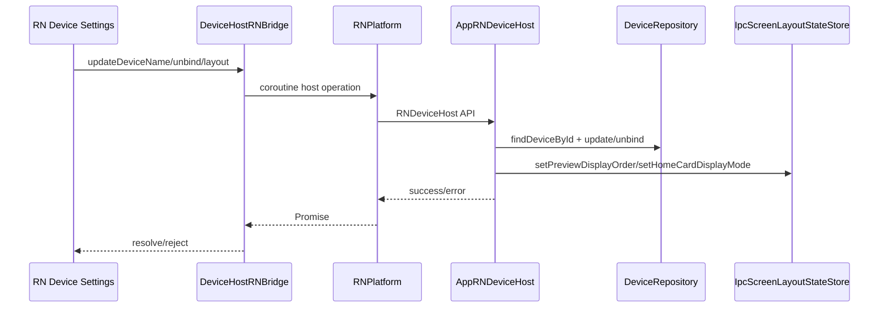

# 05. Feature Communication（功能通信）

> 调研日期：2026-09-14。本文仅依据 Android 源码静态调用点整理 producer→consumer；不把目录、Gradle 声明或测试文件数量当作运行时通信证据。共用 KMP 链路参见 [iOS 05-Feature-Communication](../UGreen%20Home%20iOS%20项目现状/05-Feature-Communication.md)。

> **基线锁定**：Android `release/1.7.0` @ `5543c83e381e8af4676fe3ba22462992928afde6`（源根 `/Users/daubert/UGreen/ugreen-home`）；Shared 配套 `release/1.7.0` @ `4f36969b7894df90af09fe9ae3a2797c8cd117ed`（核对快照 `/private/tmp/ugreen-android-architecture-20260914/shared-release-1.7.0-9q2u2wrq`）。文中 Android 路径均相对 Android 源根，`Shared@4f36969b` 路径均相对该 Shared 快照。

> **跨文档边界**：链接的 iOS 01–05 文档基于其自身的 2026-09-12 / KMM `7abfcd013` 快照，**不是**本 Android 的 Shared 基线；链接只供了解共用概念，本文所有 Shared 版本、模块和路径结论均以 `Shared@4f36969b` 为准。

## 通信媒介

| 机制 | Android 用途 | 生产者→消费者 | 证据 |
|---|---|---|---|
| Kotlin `StateFlow`/`Flow` | 设备列表、设备状态、网络状态、属性确认、主题偏好 | Repository/Thing model/manager → ViewModel、播放器清理、RN host | `repository/src/main/kotlin/com/ugreen/care/repo/device/list/DeviceRepositoryImpl.kt:85-93`；`app/src/main/java/com/ugreen/home/viewModel/DevicesViewModel.kt:81-133`；`rn-platform/src/main/java/com/ugreen/home/rn/DevicePropertyWriteConfirmation.kt:41-77` |
| KMP Auth callback | 登录/登出生命周期 | `DefaultAuthClient` → `AppInitializationManager` → DB/仓库/Runtime/Push | `app/src/main/java/com/ugreen/home/base/AppInitializationManager.kt:311-391` |
| `Channel`/`Flow` 事件总线 | 多端登录提醒、强制退出 | `LoginMessageHandler` → `LoginNotifyEventBus` → coordinator | `app/src/main/java/com/ugreen/home/messaging/handlers/LoginMessageHandler.kt:27-54`；`app/src/main/java/com/ugreen/home/messaging/event/LoginNotifyEventBus.kt:27-42` |
| 显式 suspend/service facade | RN 设备操作、KMP device runtime、设备刷新 | Bridge/宿主 → `RNPlatform`/`DeviceRuntimeFacade`/Repository | `rn-platform/src/main/java/com/ugreen/home/rn/DeviceHostRNBridge.kt:29-50`；`repository/src/main/kotlin/com/ugreen/care/repo/device/runtime/DeviceRuntimeFacade.kt:42-68` |
| Room/缓存读写 | 冷启动设备列表、事件/录像/Thing 属性 | DAO/data source ↔ Repository/ViewModel | `app/src/main/java/com/ugreen/home/data/AppDatabase.kt:31-47,87-111`；`repository/src/main/kotlin/com/ugreen/care/repo/device/list/DeviceRepositoryImpl.kt:95-99` |
| MMKV | RN 独立布尔设置、环境协议内容 | RN bridge/ViewModel ↔ namespace MMKV | `rn-platform/src/main/java/com/ugreen/home/rn/StorageRNBridge.kt:11-23,29-55`；`app/src/main/java/com/ugreen/home/viewModel/HomeViewModel.kt:40-43,78-107` |
| 全局 singleton manager | 播放会话、推送上报、SessionRepositoryProvider | UI/App lifecycle → manager → SDK/网络 | `ugreen-media/player-runtime-android/src/main/java/com/ugreen/media/player/session/DevicePlayerSessionManager.kt:41-68,76-143`；`app/src/main/java/com/ugreen/home/ui/user/login/PushTokenReporter.kt:23-55` |

## Producer→Consumer 矩阵

| Producer | 载体/数据 | Consumer | 结果/边界 | 源码证据 |
|---|---|---|---|---|
| `DefaultAuthClient` | `AuthSession` callback | `AppInitializationManager` | 用 session userId 初始化 Room、Session repositories、DeviceRuntime；登录完成后启动 HomeLocation/Push/Messaging | `app/src/main/java/com/ugreen/home/base/AppInitializationManager.kt:311-358` |
| `DefaultAuthClient` logout | callback + suspend task | Runtime、SessionRepository、Room、Push、消息/缓存 | 清会话运行态，关闭用户数据库；不表示所有跨账号 RN MMKV 都被清理 | `app/src/main/java/com/ugreen/home/base/AppInitializationManager.kt:361-391`；`rn-platform/src/main/java/com/ugreen/home/rn/StorageRNBridge.kt:11-15` |
| `DeviceRepositoryImpl` | `deviceListFlow`、`stateFlow` | `DevicesViewModel`、App 全局 cleanup、消息 handler | 页面更新、设备顺序比较、播放器 retainOnly、设备变更刷新 | `repository/src/main/kotlin/com/ugreen/care/repo/device/list/DeviceRepositoryImpl.kt:85-93`；`app/src/main/java/com/ugreen/home/viewModel/DevicesViewModel.kt:103-133`；`app/src/main/java/com/ugreen/home/base/AppInitializationManager.kt:563-571` |
| CachedDeviceDataSource/Room | 冷启动缓存列表 | DeviceRepository | 回填内存 Flow；随后远端 refresh/Thing update 可覆盖 | `repository/src/main/kotlin/com/ugreen/care/repo/device/list/DeviceRepositoryImpl.kt:95-99` |
| ThingModel/设备能力 | 属性 Flow、设备事件 | DeviceRepository、设备页面、RN 写确认、OTA | 属性写前订阅 Flow，写后等待匹配或读回超时 | `rn-platform/src/main/java/com/ugreen/home/rn/DevicePropertyWriteConfirmation.kt:41-77` |
| `LoginMessageHandler` | `NotifyMessage` type=AccountLogin | `LoginNotifyEventBus`/LoginNotificationCoordinator | 解析 NEW_DEVICE_LOGIN/SESSION_EVICTED/FORCE_LOGOUT；未知类型消费并记录 | `app/src/main/java/com/ugreen/home/messaging/handlers/LoginMessageHandler.kt:27-54`；`app/src/main/java/com/ugreen/home/messaging/event/LoginNotifyEventBus.kt:36-42` |
| `PushTokenReporter` | PushInitializer token + retry Job | LoginRemoteApi | 登录后一次上报，失败/未就绪每 5s 轮询；登出停止 | `app/src/main/java/com/ugreen/home/ui/user/login/PushTokenReporter.kt:60-93,96-143` |
| RN DeviceHost bridge | Promise method + validated maps | `RNPlatform` → `AppRNDeviceHost` | 名称更新、解绑、布局/固件状态；host 再查 SessionRepository/device capability | `rn-platform/src/main/java/com/ugreen/home/rn/DeviceHostRNBridge.kt:29-50,70-100`；`app/src/main/java/com/ugreen/home/rn/host/AppRNDeviceHost.kt:26-50,57-95` |
| RN Storage bridge | boolean key/value | MMKV `rn_local_storage` | JS 偏好持久化，账号切换不自动清理 | `rn-platform/src/main/java/com/ugreen/home/rn/StorageRNBridge.kt:11-23,29-55` |
| RN container lifecycle | Activity start/stop + initial props | RN module lifecycle session/JS bundle | `onStart` start、`onStop/onDestroy` stop；locale/theme/careMode 注入 initial props | `rn-platform/src/main/java/com/ugreen/home/rn/container/RNContainerActivity.kt:59-103,275-323` |
| Device list observer | active device IDs | `DevicePlayerSessionManager` | 销毁设备列表之外的孤儿播放器 session；不是播放 UI 本身状态 owner | `app/src/main/java/com/ugreen/home/base/AppInitializationManager.kt:563-571`；`ugreen-media/player-runtime-android/src/main/java/com/ugreen/media/player/session/DevicePlayerSessionManager.kt:168-198` |

## 登录→首页设备通信

源码证据：`app/src/main/java/com/ugreen/home/base/AppInitializationManager.kt:311-358`、`app/src/main/java/com/ugreen/home/viewModel/DevicesViewModel.kt:163-208`、`repository/src/main/kotlin/com/ugreen/care/repo/device/list/DeviceRepositoryImpl.kt:85-99`。

## 多端登录提醒→强制退出通信

源码证据：`app/src/main/java/com/ugreen/home/messaging/handlers/LoginMessageHandler.kt:27-54`、`app/src/main/java/com/ugreen/home/messaging/event/LoginNotifyEventBus.kt:27-42`；回调收尾见 `app/src/main/java/com/ugreen/home/base/AppInitializationManager.kt:361-391`。协调器的弹窗/路由分支未在本专题重复展开。

## RN 设置→设备仓库/播放器通信

源码证据：`rn-platform/src/main/java/com/ugreen/home/rn/DeviceHostRNBridge.kt:29-50,70-100,112-128`、`app/src/main/java/com/ugreen/home/rn/host/AppRNDeviceHost.kt:26-50,57-89`。RN 容器自身只负责 moduleId、bundle 与生命周期，不直接依赖 app Activity/Repository，见 `rn-platform/src/main/java/com/ugreen/home/rn/container/RNContainerActivity.kt:40-47,59-103`。

## 播放器/设备列表通信

播放器 manager 按 `deviceId` 建立或复用 session，公开 `activeSessions` StateFlow；设备列表观察器向其传入 active IDs，调用 `retainOnly` 销毁孤儿。这里是静态调用链，不代表已在真机播放或登出场景验证。

- 建立/复用：`ugreen-media/player-runtime-android/src/main/java/com/ugreen/media/player/session/DevicePlayerSessionManager.kt:76-143`
- retain/release：同文件 `:168-198`
- 列表消费者：`app/src/main/java/com/ugreen/home/base/AppInitializationManager.kt:563-571`

## KMP 与 Android adapter 边界

KMP Auth/Env/HomeLocation 的共用 producer-consumer 说明复用 iOS 文档；Android 只补 `AuthSessionCallback`、`DeviceRuntimeFacade`、Room user/environment key 和 RN/播放器宿主适配。`DeviceRuntimeFacade` 的 `syncNativeIpcDevices` 接受宿主 `NativeIpcDeviceDescriptor` 并转给 `AppDeviceModule`，见 `repository/src/main/kotlin/com/ugreen/care/repo/device/runtime/DeviceRuntimeFacade.kt:37-52`。本轮已完成隔离 App 构建、JVM/Android 单元测试以及 API36 模拟器上的 App instrumentation 和启动观察（见06/07）。启动到隐私协议页，未同意协议或登录；返回栈测试因 DatabaseHolder 未初始化未进入业务断言。因此不能将整张静态通信图升级为运行验证。
