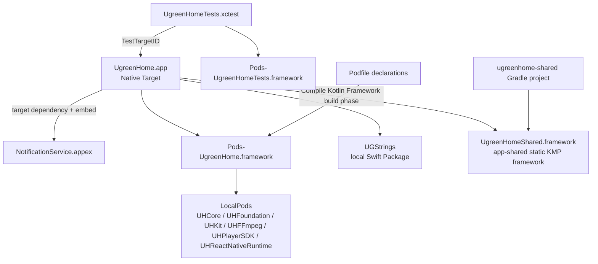
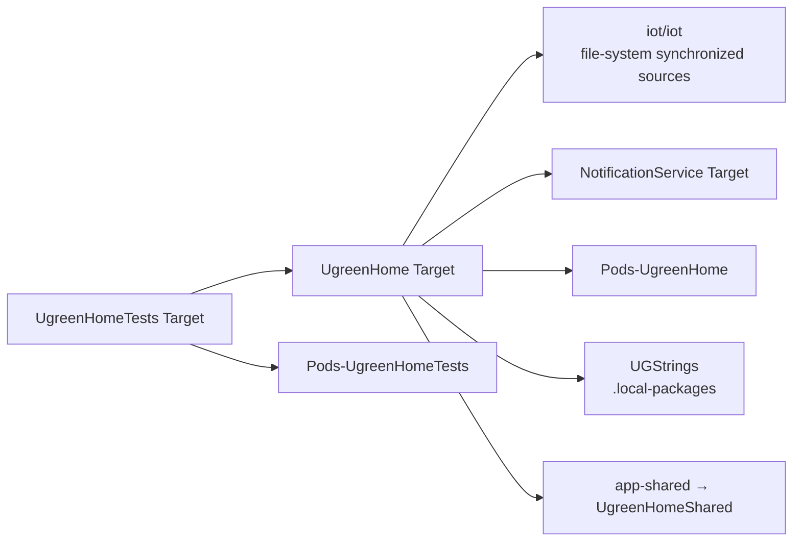
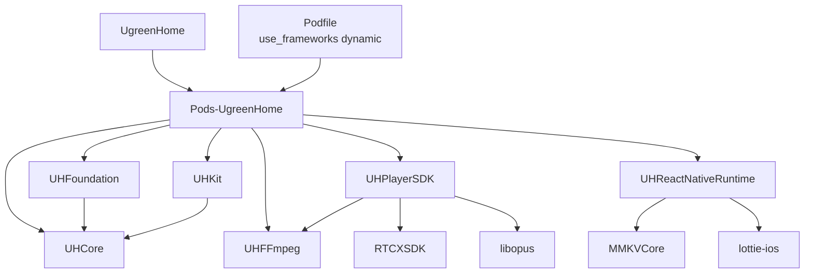
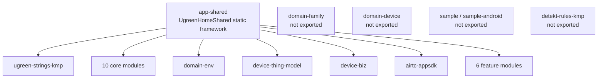
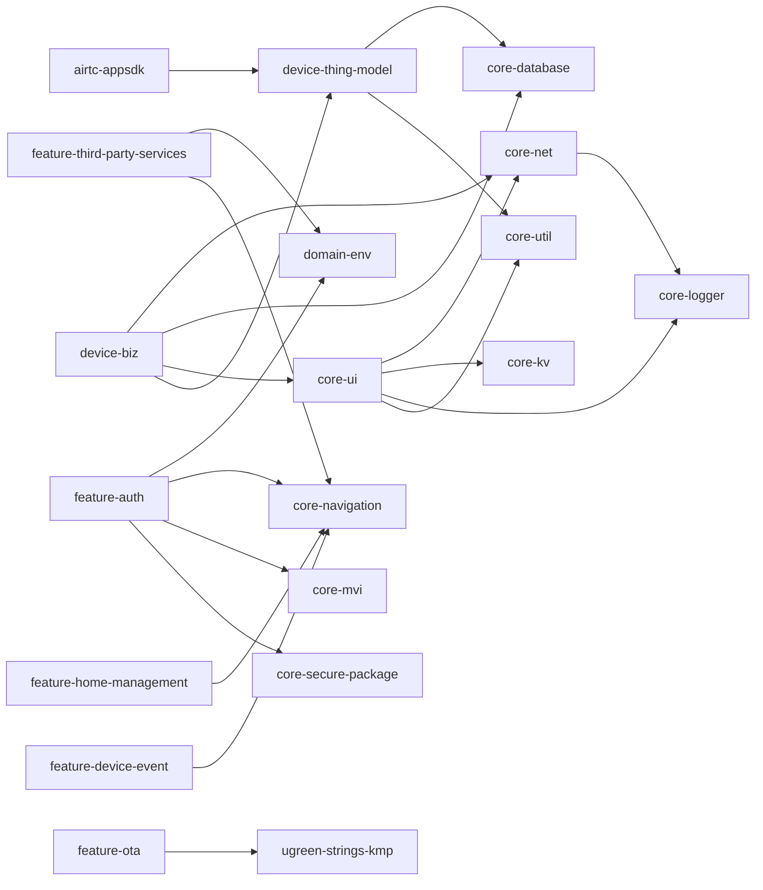

# Module Dependency Graph

> **快照**：2026-09-12；主仓库 `31e1af1aa`，KMM 子仓库 `7abfcd013`。
> **口径**：本篇分开记录 **编译声明（compiled declarations）** 与 **运行时调用（runtime calls）**。声明边来自 Xcode/Podfile/Gradle；运行时边只在源码出现实际 bootstrap、factory、route 或 API 调用时标注。二者不能相互替代。

## 总览

- 主 Target 的 build phases 包含 Pods 校验、`Compile Kotlin Framework`、Sources/Frameworks/Resources、嵌入 Extension 与 Crashlytics 脚本。证据：`iot/UgreenHome.xcodeproj/project.pbxproj:421-450,574-692`。
- Kotlin build phase 明确执行 `:app-shared:embedAndSignAppleFrameworkForXcode`，故本图把 `app-shared` 作为 iOS KMM 伞框架，而不是把每个 Gradle 子工程直接连到 Xcode Target。证据：`iot/UgreenHome.xcodeproj/project.pbxproj:631-648`。
- Notification Service 与 Tests 是单独 Target；前者不在 Podfile Target 声明中，后者仅 `inherit! :search_paths`。证据：`iot/Podfile:29-107`。

## iOS 宿主编译声明

| 声明 | 关系 | 证据 |
|---|---|---|
| `UgreenHome → NotificationService` | 项目 Target dependency 且在 “Embed Foundation Extensions” 阶段嵌入。 | `iot/UgreenHome.xcodeproj/project.pbxproj:421-440` |
| `UgreenHomeTests → UgreenHome` | `TestTargetID` 指向主 Target。 | `iot/UgreenHome.xcodeproj/project.pbxproj:472-492,510-513` |
| `UgreenHome → UGStrings` | Target 的 `packageProductDependencies` 包含本地 Swift Package product。 | `iot/UgreenHome.xcodeproj/project.pbxproj:445-447,1578-1589` |
| `UgreenHome → UgreenHomeShared` | 不是 PBX framework reference；由名为 `Compile Kotlin Framework` 的脚本生成/嵌入。 | `iot/UgreenHome.xcodeproj/project.pbxproj:631-648` |
| `UgreenHome → Pods-UgreenHome` | 主 Target Frameworks 中使用 Pods framework；Podfile 定义该 target。 | `iot/UgreenHome.xcodeproj/project.pbxproj:400-414`；`iot/Podfile:29-102` |
| `UgreenHomeTests → Pods-UgreenHomeTests` | Test Target Frameworks 引用 Tests Pods framework。 | `iot/UgreenHome.xcodeproj/project.pbxproj:472-492` |

> `iot/iot` 同步组的主 Target membership 只排除 `Supporting Files/Info.plist`；因此其中的源码按项目声明属于主 App 输入。证据：`iot/UgreenHome.xcodeproj/project.pbxproj:95-101,421-443`。这并不证明每个源文件都有一个可到达的用户路由。

### CocoaPods 与 LocalPods

- 主 Pod target 明确声明网络/UI/Rx/数据库/分析等第三方与 LocalPods；声明见 `iot/Podfile:34-101`，实际解析版本以 `iot/Podfile.lock` 为准。
- LocalPods 关系是**podspec 声明**，不是对其内部 API 调用的证明。`UHPlayerSDK` 直接依赖 `UHFFmpeg`、`libopus` 和 `RTCXSDK`：`LocalPods/UHPlayerSDK/UHPlayerSDK.podspec:51-53`；RN Runtime 依赖 `MMKVCore` 与 `lottie-ios`：`LocalPods/UHReactNativeRuntime/UHReactNativeRuntime.podspec:20-25`。
- `UGDeviceSetupSDK` 是主 target Pod declaration（默认 Specs 版本；可由未纳入版本控制的 `Podfile.local` 改写），不将本机覆盖文件写为基线：`iot/Podfile:95-101`。

## KMM：伞框架、导出面与未导出模块

`app-shared` 的 `exportedModules` 清单包含 10 个 core、`domain-env`、3 个设备/RTC 模块和 6 个 feature；在 `commonMain` 中对同一清单使用 `api(project(...))`，并额外 `api(:ugreen-strings-kmp)`。证据：`ugreenhome-shared/app-shared/build.gradle.kts:35-85`。

| 分类 | 在 `app-shared` 中 | 模块 |
|---|---|---|
| Core | 导出 | `core-database`、`core-net`、`core-ui`、`core-mvi`、`core-util`、`core-logger`、`core-kv`、`core-navigation`、`core-secure-package`、`core-player` |
| Domain | 导出 | `domain-env` |
| Device/RTC | 导出 | `device-thing-model`、`device-biz`、`airtc-appsdk` |
| Features | 导出 | `feature-auth`、`feature-third-party-services`、`feature-ota`、`feature-home-management`、`feature-device-event`、`feature-playback` |
| Strings | API 暴露 | `ugreen-strings-kmp` |
| Domain | include 但不导出 | `domain-family`、`domain-device` |
| 工具/示例 | include 但不导出 | `detekt-rules-kmp`、`ugreen-strings-android`、`sample`、`sample-android` |

**重要边界**：`AppDeviceModule` 导入的 `com.ugreen.home.device.domain.repository.DeviceRepository` 来自 **`device-biz`** 的 `com.ugreen.home.device` 包，而不是 Gradle 工程 `domain/domain-device`。证据：`ugreenhome-shared/app-shared/src/commonMain/kotlin/com/ugreen/app/shared/device/AppDeviceModule.kt:7-10,117-123`。因此图中没有、也不得增加 `app-shared → domain-device` 或 `app-shared → domain-family` 的直接编译边。

## KMM 全部实际 include 模块与直接 project 边

此表覆盖 `ugreenhome-shared/settings.gradle.kts` 当前 `include` 的所有模块。边仅列**直接** `project(...)` 声明；`app-shared` 的动态清单边按源码展开。原始逐行取证可见[附件/KMM声明依赖边.csv](附件/KMM声明依赖边.csv)。

| 模块 | 是否导出到 iOS Framework | 直接 project 依赖（声明类型） | 边的源码 |
|---|---|---|---|
| `core-database` | 是 | — | `ugreenhome-shared/settings.gradle.kts:33-49` |
| `core-net` | 是 | `core-logger`（implementation） | `ugreenhome-shared/core/core-net/build.gradle.kts:26` |
| `core-ui` | 是 | `core-net`、`core-kv`、`core-logger`、`core-util`（均 implementation） | `ugreenhome-shared/core/core-ui/build.gradle.kts:52-55` |
| `core-mvi` | 是 | `core-util`（implementation） | `ugreenhome-shared/core/core-mvi/build.gradle.kts:23` |
| `core-util` | 是 | — | `ugreenhome-shared/settings.gradle.kts:33-49` |
| `core-logger` | 是 | — | `ugreenhome-shared/settings.gradle.kts:33-49` |
| `core-secure-package` | 是 | — | `ugreenhome-shared/settings.gradle.kts:33-49` |
| `core-kv` | 是 | — | `ugreenhome-shared/settings.gradle.kts:33-49` |
| `core-navigation` | 是 | — | `ugreenhome-shared/settings.gradle.kts:33-49` |
| `core-player` | 是 | — | `ugreenhome-shared/settings.gradle.kts:33-49` |
| `domain-env` | 是 | `core-util`（api）；`core-net`、`core-kv`、`core-logger`（implementation） | `ugreenhome-shared/domain/domain-env/build.gradle.kts:33-36` |
| `domain-family` | 否 | `core-net`、`core-kv`（implementation）；`core-util`（api） | `ugreenhome-shared/domain/domain-family/build.gradle.kts:24-26` |
| `domain-device` | 否 | `core-net`、`core-kv`、`core-logger`、`core-util`（implementation） | `ugreenhome-shared/domain/domain-device/build.gradle.kts:25-28` |
| `device-thing-model` | 是 | `core-util`、`core-database`、`core-logger`（implementation） | `ugreenhome-shared/device-thing-model/build.gradle.kts:23-25` |
| `device-biz` | 是 | `core-net`、`core-logger`、`core-database`、`core-ui`、`device-thing-model`（implementation）；`core-util`（api） | `ugreenhome-shared/device-biz/build.gradle.kts:27-32` |
| `airtc-appsdk` | 是 | `core-util`、`core-kv`、`core-logger`、`device-thing-model`（implementation） | `ugreenhome-shared/airtc-appsdk/build.gradle.kts:60-63` |
| `feature-auth` | 是 | `core-net`、`core-logger`、`core-ui`、`core-kv`、`core-util`、`core-secure-package`、`core-mvi`、`core-navigation`、`domain-env`（implementation） | `ugreenhome-shared/feature-auth/build.gradle.kts:57-66` |
| `feature-third-party-services` | 是 | `core-net`、`core-logger`、`core-mvi`、`core-navigation`、`core-ui`、`core-util`、`domain-env`（implementation） | `ugreenhome-shared/feature-third-party-services/build.gradle.kts:56-62` |
| `feature-device-event` | 是 | `core-net`、`core-logger`、`core-ui`、`core-util`、`core-mvi`、`core-navigation`（implementation） | `ugreenhome-shared/feature-device-event/build.gradle.kts:31-36` |
| `feature-ota` | 是 | `core-kv`、`core-logger`、`core-net`、`core-ui`、`core-util`、`ugreen-strings-kmp`（implementation） | `ugreenhome-shared/feature-ota/build.gradle.kts:28-33` |
| `feature-home-management` | 是 | `core-ui`、`core-mvi`、`core-navigation`、`core-net`、`core-kv`、`core-logger`、`core-util`（implementation） | `ugreenhome-shared/feature-home-management/build.gradle.kts:32-38` |
| `feature-playback` | 是 | `core-util`、`core-logger`（implementation） | `ugreenhome-shared/feature-playback/build.gradle.kts:25-26` |
| `detekt-rules-kmp` | 否 | — | `ugreenhome-shared/settings.gradle.kts:69` |
| `ugreen-strings-android` | 否 | — | `ugreenhome-shared/settings.gradle.kts:71-72` |
| `ugreen-strings-kmp` | 经 `app-shared` API | — | `ugreenhome-shared/settings.gradle.kts:74-75`；`ugreenhome-shared/app-shared/build.gradle.kts:74-85` |
| `app-shared` | 伞框架自身 | `ugreen-strings-kmp`（api）及上节全部显式 export 模块（api，循环展开） | `ugreenhome-shared/app-shared/build.gradle.kts:35-85` |
| `sample` | 否 | `app-shared`、`airtc-appsdk`、`device-thing-model`、`device-biz`、`feature-device-event`、`feature-ota`、`core-player`（implementation） | `ugreenhome-shared/sample/build.gradle.kts:36-42` |
| `sample-android` | 否 | `sample`、`app-shared`（implementation） | `ugreenhome-shared/sample/sample-android/build.gradle.kts:54-55` |

### KMM 直接边图（不展开动态 `app-shared` 清单）

这是选取的高连通性直接边，完整表以上一节为准；没有画 `domain-family/domain-device` 到 `app-shared` 的边。

## 运行时调用：已确认的跨边调用

| 调用链 | 证据 | 与声明图的区别 |
|---|---|---|
| `AppDelegate → UHReactNativeBootstrap / KvStore / ThemeManager / UGProductManager / Firebase` | `iot/iot/Modules/Lanuch/AppDelegate.swift:35-103` | 这是启动调用；Pod/KMM 编译声明本身不说明调用顺序。 |
| `SceneDelegate → UGRootViewManager → UGSharedRootCoordinator → KMM Shared root` | `iot/iot/Modules/Lanuch/SceneDelegate.swift:18-30`；`iot/iot/Modules/Root/UGRootViewManager.swift:43-56` | iOS 通过原生 coordinator 承载 KMM 根页面。 |
| `KMM UGRootScreen → feature-auth / Home / third-party navigation` | `ugreenhome-shared/app-shared/src/commonMain/kotlin/com/ugreen/app/shared/UGRootScreen.kt:52-64,70-97,100-231` | `feature-third-party-services` 有根导航接入；不因缺少 Swift factory 将其标为未接入。 |
| `RN DeviceSettings → KMM 网络` | `iot/iot/Modules/ReactNative/Common/Core/NetworkRNBridgeService.swift:226-251` | RN 实际启动 KMP auth 并取 `NetworkHolder`，不是 Moya 运行时路径。 |
| `KMM AppDeviceModule → device-biz / device-thing-model / core-database` | `ugreenhome-shared/app-shared/src/commonMain/kotlin/com/ugreen/app/shared/device/AppDeviceModule.kt:5-11,97-164` | 这是 KMM 内部组合方法；本轮未找到 iOS 宿主 login/logout/native-sync 调用，不能据此认定该链正在主 App 运行。`DeviceRepository` 的包来源见上文。 |
| `Provisioning success → KMM room settings` | `iot/iot/Provisioning/DeviceConnectNet/BLEConfigNet/Controllers/UGDeviceConnectNetSuccessController.swift:670-754` | 是原生流程中明确的 KMM 页面桥，而非单纯 Framework 导出。 |
| `RN DeviceSettings → KMM home management / OTA` | `iot/iot/Modules/ReactNative/DeviceSettings/Service/DeviceSettingsPageDispatcher.swift:257-337` | 是 RN 到原生再到 KMM/OTA 的运行时分发。 |
| `ThirdPartyServicesDeepLink → third-party feature host router` | `ugreenhome-shared/app-shared/src/commonMain/kotlin/com/ugreen/app/shared/ThirdPartyServicesDeepLink.kt:16-55` | KMM 根内部的深链、登录、导航协调。 |

## 不纳入当前模块图的目录

| 项 | 原因 |
|---|---|
| `ugreenhome-shared/core/core-udc`、`feature-udc`、根下旧 `domain-env` | 目录存在，但 `ugreenhome-shared/settings.gradle.kts` 未 include；不是当前 Gradle 模块。 |
| `LocalPods/UGDeviceThing/.build` | SwiftPM 构建产物，不是可依赖的源码模块。 |
| `ugreenhome-shared/build/`、`.gradle/`、`.kotlin/` | Gradle/Kotlin 生成状态，不是业务依赖节点。 |
| Pods 内部 transitive graph | 本轮保留 Podfile 和本地 podspec 的直接声明；未把解析后的所有第三方 transitive dependency 伪装为自有模块关系。 |
