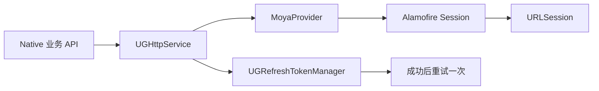
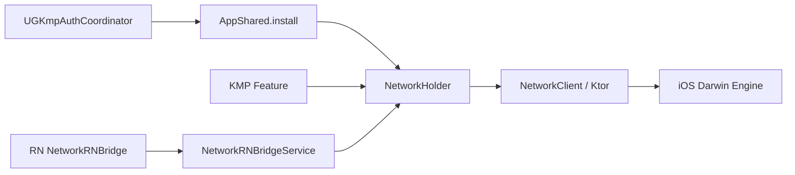
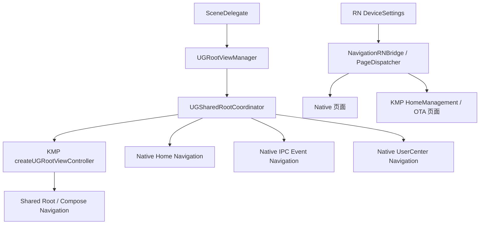

# Core Dependencies

> 基线：2026-09-12，主仓库 `31e1af1aa`，KMM `7abfcd013`。以下是源码与锁定文件证据，不等同于所有线上路径均已运行验证。源码路径均相对 `/Users/daubert/UGreen/ugreenhome`。

[返回调研总览](00-调研总览.md) · [模块依赖](02-Module-Dependency-Graph.md) · [状态归属](04-State-Ownership.md)

## 1. 核心依赖总表

| 能力 | 当前实现与宿主入口 | 证据等级 |
|---|---|---|
| Network | Native `UGHttpService` → Moya/Alamofire；KMP `NetworkHolder` → Ktor/Darwin；RN 网络桥复用 KMP | 原生、KMP、RN 均有源码调用链 |
| Database / KV | Native WCDB、UserDefaults、UGKVStore；KMP Room/SQLite、DataStore KV；RN MMKV 与原生 Storage bridge | 库接入已确认；Room 在当前 App 的登录调用闭环未确认 |
| Account | KMP AuthClient/AuthSessionStore 持有新认证会话，`UGKmpAuthCoordinator` 同步给 `UGUserManager`；保留 legacy 原生入口 | 新链路与兼容代码均存在，不能据此证明两者线上均可达 |
| Analytics | Firebase Core/Crashlytics/Performance、Bugly、原生/KMP日志桥 | 初始化/依赖已确认；统一业务埋点 API 和线上接收结果未验证 |
| Navigation | KMP Shared root + Compose navigation，原生 `UGNavigationController`，RN navigation bridge | 混合宿主与跨栈路由调用已确认 |

## 2. Network

### 2.1 原生网络

- `iot/iot/ServerAPI/UGDeviceAPI.swift:8-34`：设备请求以 Moya Target 描述。
- `iot/iot/Common/Core/Service/UGHttpService.swift:14-60`：持有 provider，配置共享 Alamofire Session、URLProtocol 与 trust manager。
- `iot/iot/Common/Core/Service/UGHttpService.swift:115-148`：请求时创建 `MoyaProvider<MultiTarget>`，token 过期后调用刷新管理器，再以 `refreshToken: false` 重试。这里是实际请求路径，不只是 import 声明。
- 同目录服务提供 callback 与 Rx 使用面；并非所有业务只依赖一层 protocol。

### 2.2 KMP 网络与 RN 复用

- `iot/iot/Common/Login/UGKmpAuthCoordinator.swift:37-71`：安装 AppShared、日志/反馈桥和环境观察。
- `ugreenhome-shared/app-shared/src/commonMain/kotlin/com/ugreen/app/shared/AppShared.kt:78-108`：安装 `NetworkHolder`，绑定环境 base URL、请求头、认证拦截器；切环境前置任务失败时回滚网络地址。
- 同文件 `:121-134`：公共请求头来自认证、平台和环境提供者。本调研不记录具体 token 或服务凭证。
- `ugreenhome-shared/core/core-net/src/commonMain/kotlin/com/ugreen/core/net/NetworkClient.kt:533-541`、`:668-707`：创建 HttpClient，配置超时、编码、JSON、日志、默认请求及拦截器。
- `ugreenhome-shared/core/core-net/src/iosMain/kotlin/com/ugreen/core/net/PlatformEngine.ios.kt:1-6`：Darwin engine；Android 配置为 OkHttp（`core/core-net/build.gradle.kts:22-64`）。
- `iot/iot/Modules/ReactNative/Common/Core/NetworkRNBridgeService.swift:229-251`：RN 请求先确保 KMP 启动，再获取 `NetworkHolder.shared.getOrNull()`，不是重新经过 Moya。

**判断：** Native 和 KMP 双网络栈并存，但不能概括为“三套独立网络”：RN 的该请求桥明确复用 KMP。此处未做后端连通性、证书策略或线上请求正确性的动态验证。

## 3. Database 与 Key-Value Storage

| 存储 | 自有封装/入口 | 数据和隔离边界 | 当前可确认程度 |
|---|---|---|---|
| WCDB.swift | `UHWCDBManager` / `UHDeviceWCDBManager` | 原生设备缓存；数据库名包含用户及环境 | 主 App 保存/恢复路径已确认 |
| UserDefaults | 原生配置与各 repository | 按使用方 key 管理，不是统一业务数据库 | 多处源码调用 |
| UGKVStore | Pod 依赖及原生使用面 | 独立 KV SDK | 锁定依赖已确认，不将其等同于 KMP DataStore |
| Room KMP / bundled SQLite | `DatabaseBuilder` / `AppDeviceDatabaseHolder` | KMP device/thing DAO；按用户数据库 | iOS builder、登录方法存在；当前主 App 调用其登录方法的闭环未确认 |
| KMP IKvStore / DataStore | `KvStore`、`DefaultAuthSessionStore` | 认证会话、环境等命名 store | AppShared 初始化与认证存储调用已确认 |
| RN MMKVCore | `UHReactNativeRuntime` 的原生依赖 | RN runtime/native module 能力 | Podspec/锁定已确认，不能推断全部 RN 数据都写入 MMKV |
| RN Storage bridge | `StorageRNBridgeService` | 独立 suite `com.ugreen.home.rn-local-storage`；布尔 key 白名单 | 已实现读写与写后回读 |

证据：

- `iot/iot/Common/Core/WCDBManager/UHDeviceWCDBManager.swift:23-49`：用户/环境文件名及环境切换；`:68-72`：登出清理；`:76-142`：设备列表读写。
- `iot/iot/Modules/Home/ViewModel/UHHomeViewModel.swift:663-730`：刷新后保存 WCDB，冷启动读取缓存。
- `ugreenhome-shared/core/core-database/build.gradle.kts:32-75`：Room、SQLite bundled、KSP 配置。
- `ugreenhome-shared/core/core-database/src/iosMain/kotlin/com/ugreen/core/database/DatabaseBuilderPlatform.ios.kt:10-40`：iOS Documents 路径与 Room builder。
- `ugreenhome-shared/app-shared/src/commonMain/kotlin/com/ugreen/app/shared/device/AppDeviceDatabase.kt:39-74`：按用户命名数据库，配置设备与物模型 DAO。
- `ugreenhome-shared/app-shared/src/commonMain/kotlin/com/ugreen/app/shared/device/AppDeviceModule.kt:71-79`、`:97-123`：提供登录/登出调度方法和 Room 初始化路径；方法存在不是宿主调用证据。
- `ugreenhome-shared/feature-auth/src/commonMain/kotlin/com/ugreen/feature/auth/data/session/DefaultAuthSessionStore.kt:13-79`：`auth_session/current_session` 持久化与 StateFlow。
- `iot/iot/Modules/ReactNative/Common/Storage/StorageRNBridgeService.swift:8-69`：独立 suite、key 校验、布尔读写。
- `LocalPods/UHReactNativeRuntime/UHReactNativeRuntime.podspec:24-25`：MMKVCore 依赖。

**边界：** 当前证据不支持把 WCDB 与 KMP Room 画成共享同一数据库的两种访问 API；也不支持断言退出登录会删除全部历史账户/环境的持久化文件。清理行为见状态归属文档。

## 4. Account

### 4.1 当前主认证链

1. `AppDelegate` 启动 KMP 环境同步并加载原生用户镜像。
2. `UGRootViewManager` 启动 `UGKmpAuthCoordinator`，注册 iOS auth callback，驱动会话恢复。
3. KMP `AuthModule` 组装 session store、repository、token refresher 和 auth client。
4. Swift 订阅 `AuthState`；认证成功后调用 `UGUserManager.applyKmpSession`，发布原生登录通知。
5. 原生网络、RTCX、首页、推送等消费者继续使用各自兼容入口。

证据：

- `iot/iot/Modules/Lanuch/AppDelegate.swift:77-80`。
- `iot/iot/Modules/Root/UGRootViewManager.swift:45-48`。
- `iot/iot/Common/Login/UGKmpAuthCoordinator.swift:25-34`、`:60-71`、`:172-223`。
- `ugreenhome-shared/feature-auth/src/commonMain/kotlin/com/ugreen/feature/auth/AuthModule.kt:43-69`。
- `iot/iot/Common/Core/Manager/UGUserManager.swift:113-129`：应用/清除 KMP 镜像；`:183-198`：保留旧原生登录实现；`:230-250`：退出转交 KMP 协调器。

### 4.2 不能混淆的概念

- **App 身份认证** 与 **RTCX SDK 的设备云登录** 是两条协作链，不是同一个对象。
- 新认证链的 session store 与原生兼容用户镜像有明确同步方向；源码仍保留 legacy 原生登录方法，是否在所有配置中可达未动态验证。
- 登出清理涉及多个观察者；不能因为根页面切换成功就推断所有设备连接和缓存已销毁。

## 5. Analytics、Crash 与 Logging

| 能力 | 接入事实 | 尚未验证 |
|---|---|---|
| Firebase Core / Crashlytics | AppDelegate 启动调用 `FirebaseApp.configure()`，检查上次崩溃；存在 Crashlytics 构建上传阶段 | 线上上报成功率、隐私设置与各配置上传行为 |
| Firebase Performance | Podfile/lock 明确依赖 | 未找到足以确认自定义 trace/metric 或统一业务埋点的调用证据；SDK 自动采集行为未做运行验证 |
| Bugly | 协议同意后的 `performNetworkOperations()` 调用 `BuglyManager.config()`；具有 JS 异常报告封装 | 后台是否实际接收、线上配置差异 |
| KMP 日志 | `Logger.install(UHKmpLoggerAdapter())` 转发到 Native | 不将本地日志等同于业务 Analytics |
| RN diagnostics | 原生 diagnostics bridge 与 Bugly JS 异常封装 | RN 执行到上传的端到端验收未做 |

证据：

- `iot/iot/Modules/Lanuch/AppDelegate.swift:97-100`、`:268-281`、`:372-382`。
- `iot/iot/Common/Login/UGKmpAuthCoordinator.swift:43-58`。
- `iot/UgreenHome.xcodeproj/project.pbxproj:675-692`：Crashlytics 构建阶段。
- `iot/Pods/FirebaseCrashlytics/run:16-32`、`:48-72`：验证后后台调用上传程序。构建实测已在副本禁用此阶段，避免调研触发上传。

**结论边界：** 当前已确认的是崩溃、性能 SDK 依赖和日志基础设施，不应将这些统称为已完备的“统一 Analytics 平台”。未进行业务埋点事件完整性审计。

## 6. Navigation

- `iot/iot/Modules/Root/UGSharedRootCoordinator.swift:31-77`：KMP root 工厂、native slot 和当前导航容器；`:163-180`：Home/Mine 宿主。
- `iot/iot/UGUIKit/Core/UGNavigationController.swift:93-100`：基于 `RTRootNavigationController` 的原生容器。
- `iot/iot/Modules/Root/UGRootViewManager.swift:106-119`：登录/退出处理与导航栈重置。
- RN page dispatcher 及 OTA factory 的具体功能映射见 [Feature Map](01-Feature-Map.md)，消息传递见 [Feature Communication](05-Feature-Communication.md)。

**判断：** 导航采用混合根容器与宿主适配。旧 `UGTabBarController` 的存在不代表它仍是默认 window root；当前 root 以 `UGRootViewManager` 的实际安装代码为准。

## 7. 版本快照

| 依赖 | 当前版本 | 来源 |
|---|---|---|
| Moya / Alamofire | 15.0.0 / 5.12.0 | `iot/Podfile.lock:196-198`、`:2` |
| RxSwift | 6.9.0 | `iot/Podfile.lock:229` |
| WCDB.swift / UGKVStore | 2.1.16 / 0.1.1 | `iot/Podfile.lock:407`、`:285` |
| RTCXSDK / UGDeviceSetupSDK | 1.6.2.29 / 1.0.3 | `iot/Podfile.lock:210`、`:284` |
| Firebase Core / Crashlytics / Performance | 10.29.0 | `iot/Podfile.lock:14-36` |
| Bugly | 2.6.1 | `iot/Podfile.lock:4` |
| RTRootNavigationController | 0.8.1 | `iot/Podfile.lock:211` |
| UHReactNativeRuntime / MMKVCore | 0.1.6 / 2.4.2 | `iot/Podfile.lock:402`、`:195` |
| React / React Native | 19.1.1 / 0.82.1 | `LocalPods/UHReactNativeRuntime/RuntimeContract.json:6-7`，预编译运行时契约 |
| RN DeviceSettings bridge contract | 4.3.0 | `iot/iot/Resources/RNBundle/DeviceSettings.ios.bundle/manifest.json:6-7`，随包 manifest |
| Kotlin / Coroutines / Serialization | 2.4.0 / 1.11.0 / 1.11.0 | `ugreenhome-shared/gradle/libs.versions.toml:2-6` |
| Ktor | 3.5.1 | `ugreenhome-shared/gradle/libs.versions.toml:10` |
| Room / SQLite bundled | 2.8.4 / 2.6.2 | `ugreenhome-shared/gradle/libs.versions.toml:15-16` |
| Compose Multiplatform / Navigation | 1.11.1 / 2.9.1 | `ugreenhome-shared/gradle/libs.versions.toml:20-23` |
| DataStore | 1.2.1 | `ugreenhome-shared/gradle/libs.versions.toml:35` |

CocoaPods 一栏来自解析锁定结果；KMM 一栏是版本目录的**声明值**，本轮未输出整个 Gradle resolved dependency graph。预编译 RN 版本取自契约文件，不等同于重新从 JS 源码构建验证。
