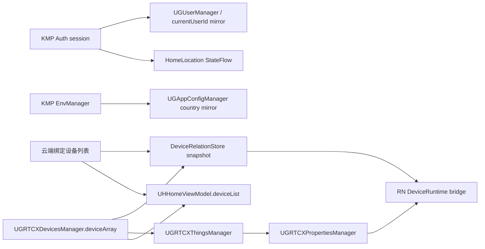

# 04. State Ownership（状态归属）

> 调研日期：2026-09-12。本文只描述当前源码可证明的 iOS 实际运行路径；“权威”指该状态在当前路径中应以谁为准，并不等同于所有数据都只存一份。`ugreenhome-shared` 内存在但未发现 iOS 宿主调用入口的模块，会单独标为“未证实接入”，不纳入 iOS 现状 owner。

## 结论摘要

- **鉴权与环境**由 KMP 侧启动并下发；原生 `UGUserManager`/`UGAppConfigManager` 是面向既有 iOS 模块的会话与环境镜像。
- **首页设备卡片**有两层：WCDB/IPC 缓存用于首屏，`UHHomeViewModel.deviceList` 是页面级投影；账号级关系拓扑由 `DeviceRelationStore` 持有。
- **RTCX 设备、Thing 与属性**分别由三个原生 singleton 管理。Thing/属性依赖设备列表，不能把其当作独立于 RTCX 列表的设备事实来源。
- **HomeLocation** 是已由 iOS 登录/首页路径调用的 KMP 内存 `StateFlow` + 账号隔离磁盘快照；它管理家庭/房间位置，不拥有首页设备列表。
- **RN 设备设置**不拥有设备真相；其 bridge 读取原生 owner，并持有仅为差量事件服务的短生命周期索引。RN 通用存储是单独的 `UserDefaults` suite。

## 状态 owner 矩阵

| 状态域 | 创建/装载 | 当前权威 owner | 主要读写者 | 生命周期与退出清理 | 派生关系/证据 |
|---|---|---|---|---|---|
| 账号会话与当前用户 | KMP `AuthClient` 状态订阅后，`UGKmpAuthCoordinator` 调 `applyKmpSession`；原生冷启动会按 `currentUserId` 从本地用户缓存恢复 | **KMP 鉴权会话**；`UGUserManager.currentUser` 和 `UGAppConfigManager.currentUserId` 为 iOS 镜像 | `UGKmpAuthCoordinator` 写入；原生业务经 `UGUserManager` / `UGAppConfigManager` 读取；`UGUserManager.logout` 转交 KMP | 跨启动的 KMP/原生持久化会话；KMP 退出或失败收尾时清 HomeLocation 内存、清原生用户，并发 `.userDidLogout` | [UGKmpAuthCoordinator.swift:200-222](../../../../../UGreen/ugreenhome/iot/iot/Common/Login/UGKmpAuthCoordinator.swift#L200-L222)、[UGUserManager.swift:120-149](../../../../../UGreen/ugreenhome/iot/iot/Common/Core/Manager/UGUserManager.swift#L120-L149)、[UGUserManager.swift:229-251](../../../../../UGreen/ugreenhome/iot/iot/Common/Core/Manager/UGUserManager.swift#L229-L251) |
| 环境/服务节点 | `UGKmpAuthCoordinator.startIfNeeded()` 订阅 KMP `EnvManager` 并立即读一次快照 | **KMP `EnvManager`**；`UGAppConfigManager.currentCountry` 是下游原生请求/缓存/页面的同步副本 | KMP 环境流写入；`UGKmpAuthCoordinator` 映射并调用 `setCurrentCountry`；原生 API 与业务模块读取 | 跨启动的环境配置；本轮没有将环境切换等同于退出，故未把它记成 session 清理动作 | [UGKmpAuthCoordinator.swift:60-71](../../../../../UGreen/ugreenhome/iot/iot/Common/Login/UGKmpAuthCoordinator.swift#L60-L71)、[UGKmpAuthCoordinator.swift:230-245](../../../../../UGreen/ugreenhome/iot/iot/Common/Login/UGKmpAuthCoordinator.swift#L230-L245) |
| 家庭/房间位置（HomeLocation） | 鉴权成功或首页按用户/环境调用 `startHomeLocationSync`；KMP 先还原账号快照，再按有效期拉远端 | **`HomeLocationRepositoryImpl.snapshot` 的 `StateFlow`**；磁盘快照是当前账号的启动缓存 | iOS 首页订阅家庭名、设备信息页订阅房间名；KMP repository 写内存与缓存 | key 为 `environmentId:userId`；登出清理内存、任务和房间名内存缓存，但按账号隔离的磁盘缓存保留 | [UGKmpAuthCoordinator.swift:210-222](../../../../../UGreen/ugreenhome/iot/iot/Common/Login/UGKmpAuthCoordinator.swift#L210-L222)、[HomeLocationClient.kt:39-86](../../../../../UGreen/ugreenhome/ugreenhome-shared/feature-home-management/src/commonMain/kotlin/com/ugreen/feature/home/management/HomeLocationClient.kt#L39-L86)、[HomeLocationRepositoryImpl.kt:32-82](../../../../../UGreen/ugreenhome/ugreenhome-shared/feature-home-management/src/commonMain/kotlin/com/ugreen/feature/home/management/data/repository/HomeLocationRepositoryImpl.kt#L32-L82)、[UHHomeViewController.swift:324](../../../../../UGreen/ugreenhome/iot/iot/Modules/Home/Controller/UHHomeViewController.swift#L324) |
| 首页设备列表与卡片状态 | `UHHomeViewModel` 先读 WCDB IPC 缓存，再在 RTCX 已认证后并行刷新云端设备、RTCX 列表及附属业务数据 | **`UHHomeViewModel.deviceList` 为首页页面态**；云端绑定列表/RTCX 列表是其刷新输入，而非该数组的持久权威 | 首页 VC 订阅 `deviceListUpdated` / `deviceStateChanged`；ViewModel 写数组、维护请求代次、排序回滚与 AI Base 卡片投影 | ViewModel 存活于首页；账号变化立即清空首页运行态；登出时清 IPC 缓存、数据通道、播放缓存和设备 WCDB | [UHHomeViewModel.swift:43-94](../../../../../UGreen/ugreenhome/iot/iot/Modules/Home/ViewModel/UHHomeViewModel.swift#L43-L94)、[UHHomeViewModel.swift:132-174](../../../../../UGreen/ugreenhome/iot/iot/Modules/Home/ViewModel/UHHomeViewModel.swift#L132-L174)、[UHHomeViewModel.swift:487-562](../../../../../UGreen/ugreenhome/iot/iot/Modules/Home/ViewModel/UHHomeViewModel.swift#L487-L562) |
| 账号级设备关系（父子/AI Base/Gateway） | `DeviceRelationRefreshCoordinator` 读取当前账号、云端绑定设备与 `UGRTCXDevicesManager.deviceArray` 后发布快照 | **`DeviceRelationStore.currentSnapshot`**，仅内存、账号级；刷新协调器只负责并发/代次控制和输入缓存 | 首页、RN runtime bridge 等按 `iotId`/`deviceId` 查询或观察；Store 仅接受当前激活账号的结果 | 账号切换、登出或没有账号时 `invalidate`；旧回包由 generation + accountId 拒绝，Store 不持久化解绑历史 | [DeviceRelationStore.swift:3-80](../../../../../UGreen/ugreenhome/iot/iot/Common/DeviceRelation/DeviceRelationStore.swift#L3-L80)、[DeviceRelationRefreshCoordinator.swift:87-182](../../../../../UGreen/ugreenhome/iot/iot/Common/DeviceRelation/DeviceRelationRefreshCoordinator.swift#L87-L182)、[DeviceRelationRefreshCoordinator.swift:201-251](../../../../../UGreen/ugreenhome/iot/iot/Common/DeviceRelation/DeviceRelationRefreshCoordinator.swift#L201-L251) |
| RTCX 基础设备与在线状态 | RTCX SDK 的设备列表回调替换 `UGRTCXDevicesManager.deviceArray` | **`UGRTCXDevicesManager.deviceArray`**（当前 RTCX 会话的设备快照） | 首页、IPC、AI Base、关系刷新器读取；manager 通过 Rx relay 发布列表/状态/解绑事件 | 跨会话内存态；`.currentUserDidChange` / `.userDidLogout` 清空列表、取消重试并增加请求代次 | [UGRTCXDevicesManager.swift:23-82](../../../../../UGreen/ugreenhome/iot/iot/Common/Core/UGRTCXManager/UGRTCXDevicesManager.swift#L23-L82)、[UGRTCXDevicesManager.swift:108-125](../../../../../UGreen/ugreenhome/iot/iot/Common/Core/UGRTCXManager/UGRTCXDevicesManager.swift#L108-L125)、[UGRTCXDevicesManager.swift:371-408](../../../../../UGreen/ugreenhome/iot/iot/Common/Core/UGRTCXManager/UGRTCXDevicesManager.swift#L371-L408) |
| RTCX Thing（物模型实例及 TSL ready） | 每次 `deviceArray` 替换后，设备 manager 调 `registerThings(devices:reset:)` | **`UGRTCXThingsManager.things` 与 `tslLoadedIotIds`**，是设备列表的运行时派生物 | 配网、设置、RN 属性写入和 IPC 功能调用其 read/write/action API；各功能订阅 manager 提供的 Rx observable | 内存态；重置注册时销毁不再属于新列表的 Thing；不把它当作账号关系或云端设备清单 owner | [UGRTCXThingsManager.swift:13-55](../../../../../UGreen/ugreenhome/iot/iot/Common/Core/UGRTCXManager/UGRTCXThingsManager.swift#L13-L55)、[UGRTCXThingsManager.swift:94-160](../../../../../UGreen/ugreenhome/iot/iot/Common/Core/UGRTCXManager/UGRTCXThingsManager.swift#L94-L160)、[UGRTCXDevicesManager.swift:393-408](../../../../../UGreen/ugreenhome/iot/iot/Common/Core/UGRTCXManager/UGRTCXDevicesManager.swift#L393-L408) |
| RTCX 属性快照 | `UGRTCXPropertiesManager` 绑定设备属性推送、按需全量刷新并更新每设备属性 map | **`UGRTCXPropertiesManager` 的每设备属性缓存**；设备模型字段是其消费者更新后的投影 | IPC 页面和 RN 读取 `getCurrentProperty`；RN 写经 `UGRTCXThingsManager.setProperties`，随后以属性刷新/推送确认 | 内存及其自身属性缓存策略；manager 初始化时注册登出处理，设备列表替换会释放旧订阅 | [UGRTCXPropertiesManager.swift:133-165](../../../../../UGreen/ugreenhome/iot/iot/Common/Core/UGRTCXManager/UGRTCXPropertiesManager.swift#L133-L165)、[UGRTCXDevicesManager.swift:393-408](../../../../../UGreen/ugreenhome/iot/iot/Common/Core/UGRTCXManager/UGRTCXDevicesManager.swift#L393-L408)、[DeviceRuntimeRNBridgeService.swift:57-91](../../../../../UGreen/ugreenhome/iot/iot/Modules/ReactNative/DeviceSettings/Service/DeviceRuntimeRNBridgeService.swift#L57-L91) |
| 播放/直播/回放会话 | 页面以 `UHPlayerDeviceAccess.acquire` 按设备和 owner 取得 lease | **`UHPlayerDeviceAccessRegistry` 的 `DeviceSession`**；底层引擎生命周期由 `UHPlayerDeviceManager` 管理 | IPC 页面持有 Access；SDK 按 `deviceId` 处理接管、复用、停止及销毁 | 页面切换可 relinquish；全局 `destroyAll` 清 session、静音偏好、最后帧并请求销毁 engine；首页登出路径调用播放缓存清理，完整调用链以实际执行为准 | [UHPlayerDeviceAccess+Provider.swift:3-41](../../../../../UGreen/ugreenhome/LocalPods/UHPlayerSDK/Sources/DeviceAccess/UHPlayerDeviceAccess+Provider.swift#L3-L41)、[UHPlayerDeviceAccess+Provider.swift:118-270](../../../../../UGreen/ugreenhome/LocalPods/UHPlayerSDK/Sources/DeviceAccess/UHPlayerDeviceAccess+Provider.swift#L118-L270) |
| 原生 UI 瞬态 | 每个 VC/ViewModel 创建本地字段、Rx Subject、订阅和任务 | **所属 VC/ViewModel**；例如首页 `UHHomeViewModel` 的 Subject 与 AI Base 卡片 store 索引 | 同一页面的 View/VC 消费；跨页面只通过通知、router、singleton service 或显式 bridge | 通常随页面释放；首页 ViewModel `deinit` 取消 work item/任务并移除 observer | [UHHomeViewModel.swift:80-128](../../../../../UGreen/ugreenhome/iot/iot/Modules/Home/ViewModel/UHHomeViewModel.swift#L80-L128) |
| 原生设备数据库与首屏缓存 | WCDB manager 在登录通知后按当前 user ID 打开数据库 | **WCDB 持久化记录**是首屏/离线缓存，不是当前会话设备关系的权威；内存页面态优先由刷新结果更新 | `UHDeviceWCDBManager` 等子类读写；首页冷启动读取；登出通过通知清理/关闭相应缓存 | 数据库按用户 ID 建库；基础 manager 监听登录初始化、登出处理；首页登出额外显式清设备表 | [UHWCDBManager.swift:11-85](../../../../../UGreen/ugreenhome/iot/iot/Common/Core/WCDBManager/UHWCDBManager.swift#L11-L85)、[UHHomeViewModel.swift:555-562](../../../../../UGreen/ugreenhome/iot/iot/Modules/Home/ViewModel/UHHomeViewModel.swift#L555-L562) |
| RN 通用持久化 | RN `StorageRNBridgeService` 经单独 `UserDefaults` suite 操作 | **该 bridge 的 UserDefaults suite**，仅为 RN 键值；不拥有原生账号、RTCX 或设备关系 | RN JS 通过 `StorageRNBridge` 调用；iOS bridge 读写 | 跨 RN 页面/应用启动；本轮未发现其与 `.userDidLogout` 绑定的统一清理 | [StorageRNBridgeService.swift:1-18](../../../../../UGreen/ugreenhome/iot/iot/Modules/ReactNative/Common/Storage/StorageRNBridgeService.swift#L1-L18) |
| RN runtime 的事件差量索引 | `DeviceRuntimeRNBridgeEventCoordinator.start()` 建观察，RN 读属性/host data 时登记关注 key | **仅为 bridge 事件去重的内存索引**，不是设备、属性或固件的权威 | coordinator 从关系快照、RTCX 状态、OTA 和通知计算差量，再经 `DeviceRuntimeRNBridge` 发往 RN | `stop()` 释放 Rx/Notification/关系观察并清所有索引；账号变更/退出清固件上下文索引 | [DeviceRuntimeRNBridgeEventCoordinator.swift:155-242](../../../../../UGreen/ugreenhome/iot/iot/Modules/ReactNative/DeviceSettings/Service/DeviceRuntimeRNBridgeEventCoordinator.swift#L155-L242) |

## 关键派生边界

上图中的箭头是“输入/派生或读取”而非所有权转移：例如 `DeviceRelationStore` 不能回读 WCDB 补全当前拓扑；源码明确限制其查询只使用当前内存快照。[DeviceRelationStore.swift:100-153](../../../../../UGreen/ugreenhome/iot/iot/Common/DeviceRelation/DeviceRelationStore.swift#L100-L153)

## KMM `AppDeviceModule`：代码存在，未计入当前 iOS owner

`app-shared` 中的 `AppDeviceModule` 自身可为每个用户初始化 `DeviceRepository`、Thing model、KMP 数据库并在成功刷新后请求宿主同步原生 IPC 描述；它导入的是 **`com.ugreen.home.device.domain.repository.DeviceRepository`（device-biz）**，不是 `domain/domain-device`。[AppDeviceModule.kt:1-18](../../../../../UGreen/ugreenhome/ugreenhome-shared/app-shared/src/commonMain/kotlin/com/ugreen/app/shared/device/AppDeviceModule.kt#L1-L18)、[AppDeviceModule.kt:97-164](../../../../../UGreen/ugreenhome/ugreenhome-shared/app-shared/src/commonMain/kotlin/com/ugreen/app/shared/device/AppDeviceModule.kt#L97-L164)

本次对 `iot` Swift/ObjC/ObjC++ 调用点的检索未发现 `AppDeviceModule`、`scheduleOnLogin`、`scheduleOnLogout` 或 `syncNativeIpcDevices` 的 iOS 宿主调用。因此不能据该 KMM 目录代码推断它已在当前 iOS 登录、设备列表或状态 owner 链路中运行；上表按可见 iOS 运行路径记录。
