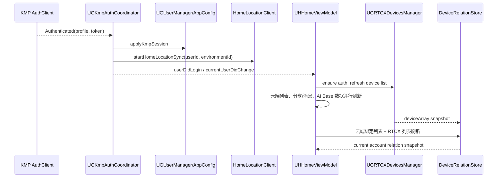
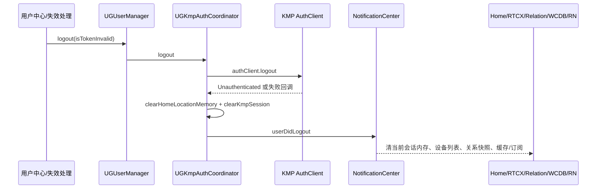
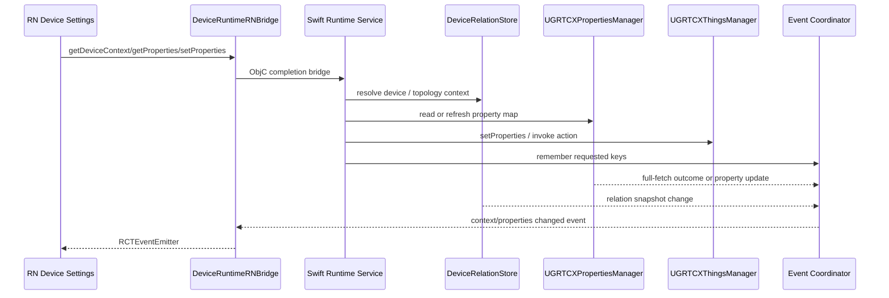

# 05. Feature Communication（功能通信）

> 调研日期：2026-09-12。本文记录当前源码中可定位的通信媒介与生产/消费关系。它不把目录相邻、静态依赖或旧迁移方案视为运行时通信证据。

## 通信种类

| 机制 | 适用场景 | 主要生产者 → 消费者 | 证据 |
|---|---|---|---|
| KMP 回调 / `StateFlow` 订阅 | 鉴权状态、环境、HomeLocation 家庭/房间名称 | KMP auth/env/home-management → `UGKmpAuthCoordinator`、首页/设备信息原生 UI | [UGKmpAuthCoordinator.swift:60-71](../../../../../UGreen/ugreenhome/iot/iot/Common/Login/UGKmpAuthCoordinator.swift#L60-L71)、[HomeLocationClient.kt:153-173](../../../../../UGreen/ugreenhome/ugreenhome-shared/feature-home-management/src/commonMain/kotlin/com/ugreen/feature/home/management/HomeLocationClient.kt#L153-L173)、[UHHomeViewController.swift:324](../../../../../UGreen/ugreenhome/iot/iot/Modules/Home/Controller/UHHomeViewController.swift#L324) |
| `NotificationCenter` | 跨 feature 的账号、设备绑定/解绑、OTA、网络与配置广播 | auth/SDK/业务服务 → 首页、RTCX、缓存、RN runtime | 通知名称定义：[UGNotification.swift:73-77](../../../../../UGreen/ugreenhome/iot/iot/Common/Constants/UGNotification.swift#L73-L77)；首页消费：[UHHomeViewModel.swift:465-574](../../../../../UGreen/ugreenhome/iot/iot/Modules/Home/ViewModel/UHHomeViewModel.swift#L465-L574) |
| RxSwift `Observable` / Relay / Subject | RTCX 设备、属性、Thing 事件；同 feature 的 ViewModel 输出 | RTCX managers / ViewModel → 首页、IPC、RN coordinator、VC | RTCX 列表/状态 relay：[UGRTCXDevicesManager.swift:23-33](../../../../../UGreen/ugreenhome/iot/iot/Common/Core/UGRTCXManager/UGRTCXDevicesManager.swift#L23-L33)；Thing 事件 observable：[UGRTCXThingsManager.swift:24-92](../../../../../UGreen/ugreenhome/iot/iot/Common/Core/UGRTCXManager/UGRTCXThingsManager.swift#L24-L92)；首页输出：[UHHomeViewModel.swift:80-114](../../../../../UGreen/ugreenhome/iot/iot/Modules/Home/ViewModel/UHHomeViewModel.swift#L80-L114) |
| Singleton service / 显式 async 调用 | 设备关系刷新、RTCX 请求、播放会话、属性读写 | VC/ViewModel/bridge → `*.shared` manager → SDK/网络 | 关系刷新入口：[DeviceRelationRefreshCoordinator.swift:49-80](../../../../../UGreen/ugreenhome/iot/iot/Common/DeviceRelation/DeviceRelationRefreshCoordinator.swift#L49-L80)；RN 属性写：[DeviceRuntimeRNBridgeService.swift:150-201](../../../../../UGreen/ugreenhome/iot/iot/Modules/ReactNative/DeviceSettings/Service/DeviceRuntimeRNBridgeService.swift#L150-L201) |
| React Native Native Module（Promise/回调） | RN 设置页访问设备上下文、属性、原生功能和网络 | JS → ObjC++ bridge → Swift service → KMP/RTCX/原生功能 | Factory 注入模块：[UHReactNativeFactoryDelegate.mm:79-109](../../../../../UGreen/ugreenhome/iot/iot/Modules/ReactNative/Common/Core/UHReactNativeFactoryDelegate.mm#L79-L109)；runtime 请求转发：[DeviceRuntimeRNBridge.mm:58-98](../../../../../UGreen/ugreenhome/iot/iot/Modules/ReactNative/DeviceSettings/Bridge/DeviceRuntimeRNBridge.mm#L58-L98) |
| React Native Event Emitter | 向已订阅的 RN 页面推送属性、上下文、host data 变化 | 原生 RTCX/OTA/关系/通知 → runtime coordinator → `DeviceRuntimeRNBridge` → JS | bridge 启停观察：[DeviceRuntimeRNBridge.mm:14-49](../../../../../UGreen/ugreenhome/iot/iot/Modules/ReactNative/DeviceSettings/Bridge/DeviceRuntimeRNBridge.mm#L14-L49)；coordinator 输入与清理：[DeviceRuntimeRNBridgeEventCoordinator.swift:173-242](../../../../../UGreen/ugreenhome/iot/iot/Modules/ReactNative/DeviceSettings/Service/DeviceRuntimeRNBridgeEventCoordinator.swift#L173-L242) |
| 持久化缓存读写 | 首屏、账号缓存、HomeLocation、RN 键值 | DB/缓存 → 页面或 KMP repository；不是即时通知媒介 | WCDB 生命周期：[UHWCDBManager.swift:42-85](../../../../../UGreen/ugreenhome/iot/iot/Common/Core/WCDBManager/UHWCDBManager.swift#L42-L85)；HomeLocation 缓存恢复：[HomeLocationRepositoryImpl.kt:39-63](../../../../../UGreen/ugreenhome/ugreenhome-shared/feature-home-management/src/commonMain/kotlin/com/ugreen/feature/home/management/data/repository/HomeLocationRepositoryImpl.kt#L39-L63) |

## 主要 producer → consumer 矩阵

| Producer | 载体/数据 | Consumer | 处理结果 |
|---|---|---|---|
| KMP Auth | state callback | `UGKmpAuthCoordinator` → `UGUserManager`、根路由、HomeLocation | 建立/清除原生用户镜像；发布登录/退出，启动/清理家庭位置同步。[UGKmpAuthCoordinator.swift:200-222](../../../../../UGreen/ugreenhome/iot/iot/Common/Login/UGKmpAuthCoordinator.swift#L200-L222) |
| KMP Env | `EnvManager` select + subscription | `UGKmpAuthCoordinator` → `UGAppConfigManager` | 以 KMP 节点覆盖原生环境镜像并通知下游。[UGKmpAuthCoordinator.swift:230-245](../../../../../UGreen/ugreenhome/iot/iot/Common/Login/UGKmpAuthCoordinator.swift#L230-L245) |
| 云端绑定设备 API + RTCX device list | async 刷新输入 | `DeviceRelationRefreshCoordinator` → `DeviceRelationStore` | 以同账号校验后的完整输入构建关系快照；失败可返回同账号上次结果但标记非新鲜。[DeviceRelationRefreshCoordinator.swift:128-182](../../../../../UGreen/ugreenhome/iot/iot/Common/DeviceRelation/DeviceRelationRefreshCoordinator.swift#L128-L182) |
| RTCX SDK | `deviceArray`、列表/状态 Relay、属性推送 | 首页、IPC、Thing manager、关系快照、RN runtime | 列表替换注册 Thing 和属性订阅；属性变化广播通知并更新设备投影。[UGRTCXDevicesManager.swift:66-71](../../../../../UGreen/ugreenhome/iot/iot/Common/Core/UGRTCXManager/UGRTCXDevicesManager.swift#L66-L71)、[UGRTCXDevicesManager.swift:393-408](../../../../../UGreen/ugreenhome/iot/iot/Common/Core/UGRTCXManager/UGRTCXDevicesManager.swift#L393-L408) |
| `UHHomeViewModel` | `PublishSubject` / `BehaviorSubject` | `UHHomeViewController` 与首页 cells | 结构变化全表刷新，单设备状态/AI Base 摘要使用轻量更新语义。[UHHomeViewModel.swift:80-114](../../../../../UGreen/ugreenhome/iot/iot/Modules/Home/ViewModel/UHHomeViewModel.swift#L80-L114) |
| HomeLocation KMP repository | 家庭名/房间名 flow | 首页标题、设备信息页 | KMP 缓存或远端变更触发原生订阅回调；家庭改名成功时更新 StateFlow 与磁盘快照。[HomeLocationClient.kt:153-203](../../../../../UGreen/ugreenhome/ugreenhome-shared/feature-home-management/src/commonMain/kotlin/com/ugreen/feature/home/management/HomeLocationClient.kt#L153-L203) |
| RN DeviceRuntime | Native Module method 与关注 key | `DeviceRelationStore`、RTCX properties/Thing、OTA、权限/host service | 读取时解析设备并登记观察范围；写时由 Thing manager 执行，读/事件以原生状态为准。[DeviceRuntimeRNBridgeService.swift:39-91](../../../../../UGreen/ugreenhome/iot/iot/Modules/ReactNative/DeviceSettings/Service/DeviceRuntimeRNBridgeService.swift#L39-L91)、[DeviceRuntimeRNBridgeService.swift:150-209](../../../../../UGreen/ugreenhome/iot/iot/Modules/ReactNative/DeviceSettings/Service/DeviceRuntimeRNBridgeService.swift#L150-L209) |
| RN Network | `NetworkRNBridge` 请求 | KMP `NetworkHolder` raw transport | iOS 会先启动 KMP auth；KMP 持有鉴权、路由和公共 header。不是 RN → 原生 Moya 路径。[NetworkRNBridgeService.swift:220-251](../../../../../UGreen/ugreenhome/iot/iot/Modules/ReactNative/Common/Core/NetworkRNBridgeService.swift#L220-L251)、[NetworkRNBridgeService.swift:301-345](../../../../../UGreen/ugreenhome/iot/iot/Modules/ReactNative/Common/Core/NetworkRNBridgeService.swift#L301-L345) |

## 登录 → 首页 → 设备：已确认通信链

首页首次展示允许从本地设备缓存加载；RTCX 的 IoT 通道不会阻塞首页设备模型刷新。[UHHomeViewModel.swift:155-174](../../../../../UGreen/ugreenhome/iot/iot/Modules/Home/ViewModel/UHHomeViewModel.swift#L155-L174) 关系刷新以当前账号和 generation 拒绝过期结果，而不是让旧账号回包覆盖新快照。[DeviceRelationRefreshCoordinator.swift:134-181](../../../../../UGreen/ugreenhome/iot/iot/Common/DeviceRelation/DeviceRelationRefreshCoordinator.swift#L134-L181)

## 退出：广播驱动的收尾链

这里“清理”并不意味着所有账户历史缓存都删除：HomeLocation 明确只清内存而保留账号隔离磁盘缓存。[HomeLocationClient.kt:76-86](../../../../../UGreen/ugreenhome/ugreenhome-shared/feature-home-management/src/commonMain/kotlin/com/ugreen/feature/home/management/HomeLocationClient.kt#L76-L86)；首页登出处理会清 IPC 缓存、数据通道、播放缓存与设备 WCDB。[UHHomeViewModel.swift:555-562](../../../../../UGreen/ugreenhome/iot/iot/Modules/Home/ViewModel/UHHomeViewModel.swift#L555-L562)

## RN 设置：调用与事件链

事件协调器仅在 bridge 开始 observing 后绑定关系、RTCX、OTA、通知输入，并在停止时解除全部绑定；因此 RN 未订阅时不应把该 coordinator 的差量索引当作全局设备状态缓存。[DeviceRuntimeRNBridgeEventCoordinator.swift:173-242](../../../../../UGreen/ugreenhome/iot/iot/Modules/ReactNative/DeviceSettings/Service/DeviceRuntimeRNBridgeEventCoordinator.swift#L173-L242)

### RN 网络的单独链路

`NetworkRNBridge` 与设备 runtime bridge 是两条不同路径：前者调用 `UGKmpAuthCoordinator.startIfNeeded()` 后从 `NetworkHolder.shared` 取得 KMP client，以 `RawHttpRequest` 执行；其认证、路由和公共 header 由 KMP 负责。[NetworkRNBridgeService.swift:226-251](../../../../../UGreen/ugreenhome/iot/iot/Modules/ReactNative/Common/Core/NetworkRNBridgeService.swift#L226-L251)、[NetworkRNBridgeService.swift:326-345](../../../../../UGreen/ugreenhome/iot/iot/Modules/ReactNative/Common/Core/NetworkRNBridgeService.swift#L326-L345)

## 未纳入当前 iOS 通信链的 KMM `AppDeviceModule`

`AppDeviceModule` 的代码可在 KMP 内部执行 login/logout、建立 `DeviceRepository` 与由宿主同步 IPC 设备，但本次未在 iOS 的 Swift/ObjC/ObjC++ 源码中定位到其宿主调用。并且它使用的是 `com.ugreen.home.device.domain.repository.DeviceRepository`，不应误记为 `domain/domain-device` 模块的 iOS 通信路径。[AppDeviceModule.kt:7-10](../../../../../UGreen/ugreenhome/ugreenhome-shared/app-shared/src/commonMain/kotlin/com/ugreen/app/shared/device/AppDeviceModule.kt#L7-L10)、[AppDeviceModule.kt:71-95](../../../../../UGreen/ugreenhome/ugreenhome-shared/app-shared/src/commonMain/kotlin/com/ugreen/app/shared/device/AppDeviceModule.kt#L71-L95)
