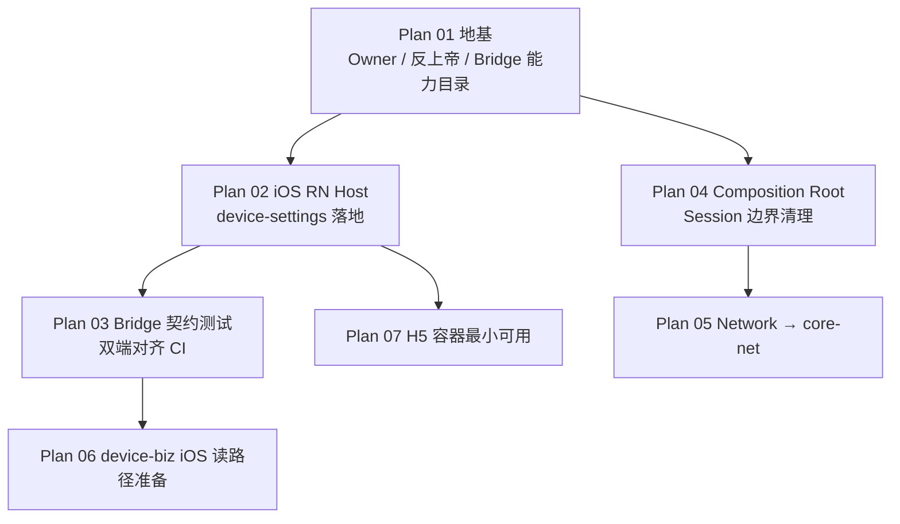

# Ugreen Home 阶段一实施计划索引

> **Spec:** `docs/superpowers/specs/2026-09-12-ugreen-home-hybrid-runtime-constitution-design.md`  
> **Date:** 2026-09-12  
> **策略:** 宪法跨多子系统 → **一份计划只交付一个可验证切片**；按依赖顺序执行。

| 计划 | 文件 | 独立可验证交付 | 依赖 |
|------|------|----------------|------|
| **01 地基** ✅ | `2026-09-12-phase1-foundation-owner-bridge-catalog.md` | Owner SSOT + 上帝点清单 + Bridge 能力目录校验脚本绿 | 无 |
| **02 iOS RN Host** | `2026-09-12-phase1-ios-rn-device-settings-host.md` | develop 可打开 `DeviceSettings`；无 IoT SDK 进 JS | 01 |
| 03 Bridge CI | （待写） | 双端 schema/方法名 CI | 02 |
| 04 Composition Root | （待写） | Root 清单 + 禁止新单例门禁约定落地 | 01 |
| 05 Network | （待写） | RN/新 KMP 走 core-net | 04 |
| 06 device-biz | （待写） | iOS 导出前置清单 + 一条只读适配 | 03 |
| 07 H5 | （待写） | Web 容器 + 鉴权 Bridge + 白名单 | 02 |

**全局约束（所有计划继承宪法）：**

- 动态面不直连 IoT SDK；只经 Host Bridge  
- 一域一 Owner；阶段一设备域仍在 Native  
- 阶段一不做 iOS 物理拆仓；执行 §5.0 逻辑反上帝  
- KMP 不做业务热更主路径  
- 图表用 Mermaid；Obsidian 副本在 `LastStand/obsidian/UGreen-Architecture/`，改文档双仓提交  

**当前进度：** Plan 01 文档 + RN 内部校验器就绪（`validate:bridges` 绿 = schema 示例 ↔ catalog ↔ JS facade 锁步；**不**证明 iOS/Android 原生模块已对齐；原生 parity 属 **Plan 03**）；owner/god SSOT 已回链至 Spec §5.1。**Plan 02 开工前须完成 Task 0**：核对 catalog / `DeviceSettingsBridge` JS 契约名与 feature 分支及 Android 上真实 host 模块名（`DeviceRNBridge` / `DeviceRuntimeRNBridge` / `DeviceHostRNBridge` 等）并决定 reconcile 策略。
