# Ugreen Home 混合运行时架构宪法

> **Status:** Draft for review  
> **Date:** 2026-09-12  
> **Scope:** iOS (`ugreenhome`) + Android (`ugreen-home`) App 级拓扑  
> **Related:** `ugreenhome-shared` (KMP), `ugreenhome-rn` (RN), `kmp-feature-developer-toolkit`  
> **Vision ref:** 钉钉《平台架构设计与规划》(node `NZQYprEoWoe5dB1btqdld4zvJ1waOeDk`) — 愿景引用，非本 Spec 的 SSOT  
> **图表：** 本文架构图 / 流程图统一使用 Mermaid

## 1. 定位、目标与非目标

### 1.1 文档定位

本文是 Ugreen Home **App 级混合架构宪法**：界定 Native / KMP·CMP / RN / H5 的职责边界、导航与状态所有权、跨栈通信红线，以及「目标态 / 阶段一」双视图约束。

- **KMP Feature 内部**施工（Code Role、依赖方向、物理布局、生成与校验）以 `kmp-feature-developer-toolkit` 为 SSOT。  
- **不覆盖** Win / Mac / Web 客户端实现；平台愿景仅作引用。

### 1.2 双视图

| 视图 | 时间 | 含义 |
|------|------|------|
| **目标态** | 约 12–18 个月 | 薄 Host + KMP 域状态 SSOT + RN/H5 动态面 |
| **阶段一** | 约 0–6 个月 | Host 仍编排设备域；KMP 先吃 Session/Env/Net/白名单 Feature；RN 设置类试跑；H5 仅运营弱交互 |

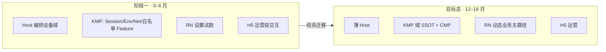

### 1.3 目标

1. 双端使用同一套运行时语言与硬红线，避免 iOS/Android 各自演化出第三套状态机。  
2. 按绞杀者模式迁移：新业务走新边界；旧代码按切片替换，禁止大爆炸重写。  
3. 动态业务可热更（RN 为主、H5 为运营）；稳定域可复用（KMP）；体验与实时敏感路径保留 Native。

### 1.4 非目标

- 不重写整 App；不规定具体业务字段或后端 API 合同。  
- **本宪法不把 KMP/KMM 选作业务动态化主路径**（详见 [1.6](#16-kmpkmm-与业务动态化)）；动态面默认 RN + H5。  
- 不替代 Toolkit 的 Role/Recipe/生成细节；不设计「组件市场」产品本身。  
- **不强制阶段一做 iOS 物理组件化**（Pod/SPM/Framework 拆仓）；另开宿主组件化子 Spec。阶段一必须做的是 [5.0](#50-阶段一反上帝边界逻辑组件化非物理拆仓) 的逻辑边界，避免上帝模块/上帝类继续膨胀。  
- 阶段一不要求设备域一次性迁入 KMP，不要求 RN 生产环境远端热更全开。

### 1.5 五条硬原则

1. **一域一 Owner**：同一业务事实禁止多个可写 Owner。  
2. **动态面不直连 IoT SDK**：RN/H5 禁止直连 RTCX / 物模型 / 配网 SDK；只经 Host Bridge → 域层。  
3. **Host 薄、Feature 厚**：随阶段加强；Composition Root 在双端 App 宿主，不在 Shared Feature 模块内。  
4. **新 KMP Feature 默认遵循 Toolkit 契约**；iOS 默认单一 `UgreenHomeShared` XCFramework 交付（ADR-006 对齐）。  
5. **安置看变更率与实时性**，不看团队习惯。

### 1.6 KMP/KMM 与业务动态化

网上讨论里的「KMP/KMM 动态化」通常不是一种现成能力，而是几类**不同问题**被混称：

| 常见说法 | 实际含义 | 对本 App 的可用性 |
|----------|----------|-------------------|
| Android App Bundle / Dynamic Feature | 按需下载 **仍随商店分发的原生 split** | 仅 Android；不是热修业务；iOS 无对等「下载可执行代码」模型 |
| 自研下载 `.so` / 动态 Framework | 运行时加载原生二进制 | **iOS 审核与安全红线极严**，商店分发 App 基本不可作为主方案 |
| Kotlin/JS 或 Wasm 共享逻辑 + WebView | 用 KMP 编译到 JS/Wasm 做部分逻辑热更 | 与现网 `androidMain/iosMain`+CMP 主轴分叉；要另建 target、桥与性能模型；ROI 差 |
| Server-Driven UI / 配置下发 | 原生壳 + 服务端描述 UI/流程 | 可做运营配置，**不是** KMP 热更；可归 H5/配置通道 |
| KMP 共享域 + RN/H5 动态 UI | 编译期共享逻辑，动态面用已有容器 | **与本宪法一致，推荐** |

**结论（宪法裁决）：**

1. KMP/KMM **擅长**编译期双端复用（Domain/Data/MVI，及可选 CMP），产物是 AAR / XCFramework，**默认随 App 发版**。  
2. 「用 KMP 做业务热更新」在工程上等于自建第四套动态运行时，且在 **iOS 上几乎无法合法下载执行原生码**；复杂度高于维护 RN/H5。  
3. 因此：**动态业务 → RN（主）+ H5（运营）**；**稳定域与可发版共享 → KMP**。不将 KMP 动态化列入阶段一/目标态主路径；若未来出现可过审、双端对称的官方方案，再单独立项，不暗改本宪法。

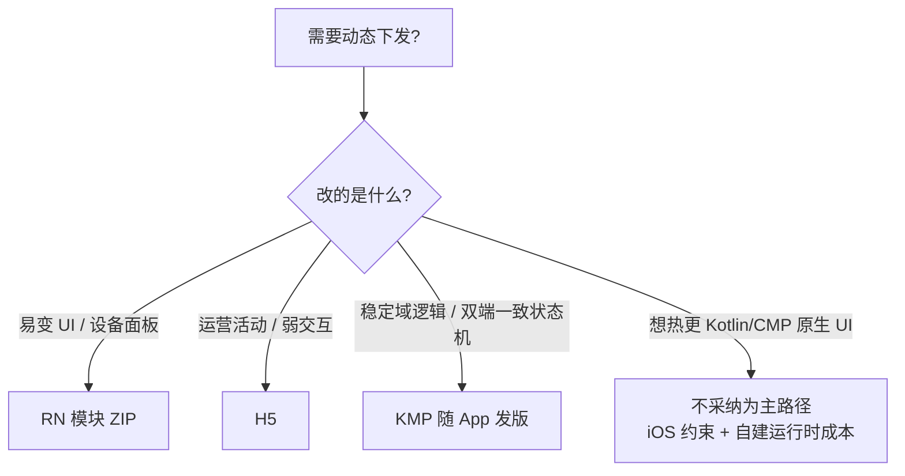

---

## 2. 运行时拓扑与职责

### 2.1 拓扑

运行时范围：**三栈为主**（Native Host、KMP、RN），**H5 作为动态面子节**（与 RN 同属动态面，但约束更严、能力更弱）。

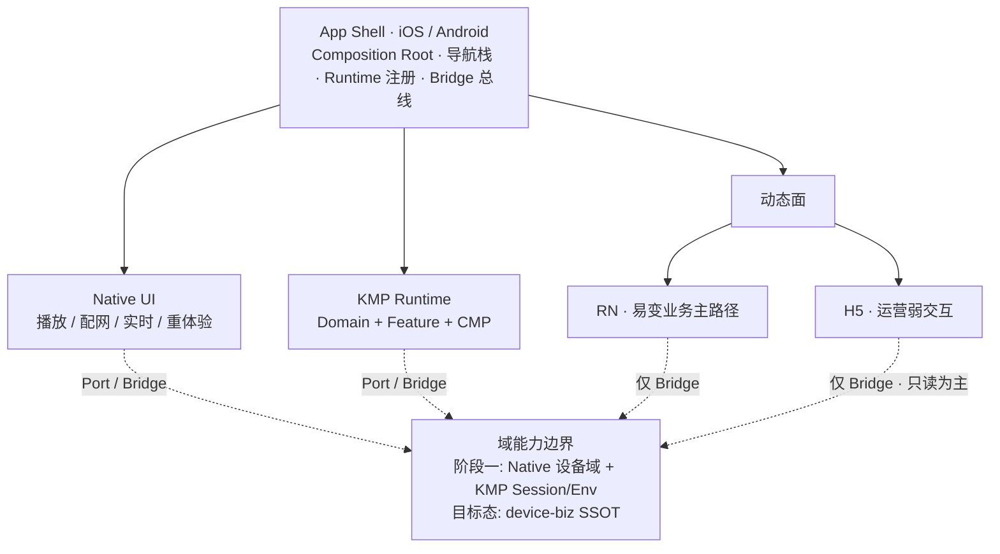

### 2.2 职责表

| 运行时 | 负责 | 不负责 |
|--------|------|--------|
| **Native Host** | 进程生命周期、导航壳、Bridge 实现、平台 SDK 适配；阶段一含设备域 Owner | 业务规则第二套实现；在 RN/H5 内复制 IoT 协议 |
| **KMP** | Session/Env/Net/MVI；白名单 Feature 域逻辑；目标态 `device-biz` + `DeviceUnifiedState`；CMP（目标态新 Feature 默认） | 业务 ZIP 热更；在 Shared 内持有双端 Activity/UIViewController 业务总装 |
| **RN** | 易变业务页（如 device-settings）、模块化 ZIP 交付 | 直连 IoT SDK；自建鉴权/Session |
| **H5** | 运营/活动/弱交互；经 JSBridge 获取 token 与只读展示数据 | 设备控制主路径；绕过 Bridge 调用原生 IoT |

### 2.3 Runtime 注册

Host 维护登记表：`native | kmp | rn | h5` → 入口工厂、所需 Bridge 能力集、是否允许远端包。未登记的 runtime/module **不得**打开。

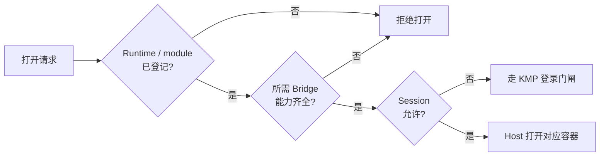

### 2.4 与 Toolkit 的边界

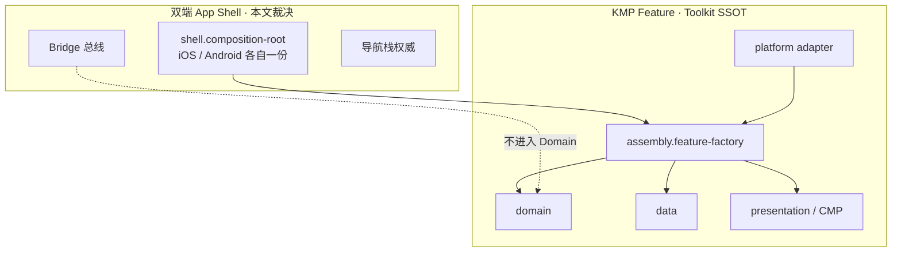

- Feature 内：`domain` / `data` / `presentation` / `assembly.feature-factory`（及必要 platform adapter）。  
- 双端各自拥有 `shell.composition-root`（对齐 Toolkit ADR-002）。  
- Host 三栈拓扑与 Bridge 总线由**本文**裁决；Toolkit 不定义 RN/H5。

---

## 3. 状态所有权与导航

### 3.1 状态 Owner（阶段一 → 目标态）

| 状态 | 阶段一 Owner | 目标态 Owner | 消费者约束 |
|------|--------------|--------------|------------|
| Session / Token / 登录门闸 | KMP `feature-auth` | 同左 | Native / RN / H5 只读或经 Bridge |
| Env / 国家节点 | KMP `domain-env` | 同左 | 同上 |
| 主题 / 部分 KV | KMP `core-kv` + Host 适配 | KMP | 同上 |
| 设备列表 / 在线 / 能力 / 统一设备态 | **Native**（iOS `UGDeviceManager` 等；Android domain/repository），经 Adapter 向 OTA 等注入快照 | **KMP** `device-biz` → `DeviceUnifiedState` | UI 只订阅，不另建可写缓存 |
| OTA 会话机 | KMP `feature-ota`（单一 Store） | 同左 | CMP / Host 入口 |
| RN 页内 UI 状态 | RN 模块内 | 同左 | 不得上升为全局设备真相 |
| H5 页内状态 | H5 内 | 同左 | 同上 |

**红线：** 同一事实禁止第二套可写 Owner。阶段一 Native 设备域是**过渡** Owner；新代码不得再开并行设备缓存。

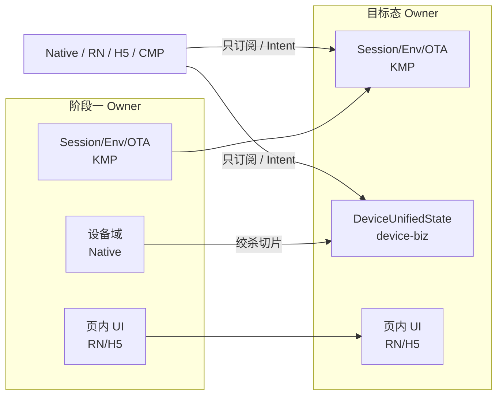

### 3.2 导航

| 关注点 | 阶段一 | 目标态 |
|--------|--------|--------|
| 根 Tab / 登录门闸 | KMP Root Shell + Native Tab 内容（可延续现状） | 同；Tab 内容可逐步 CMP/RN |
| 栈 Owner | **各端 Native 导航控制器**为唯一 push/present 权威 | 同；KMP/RN/H5 只发路由意图 |
| 打开 KMP 页 | Host Hosting 容器 | 同 |
| 打开 RN | Host RN Container + moduleId/route | 同 + 远端包解析（若启用） |
| 打开 H5 | Host Web 容器 + 域白名单 | 同 |
| 深链 / 推送 | Host 解析 → 路由意图表 | 意图表进入 Shared 契约，双端同一份 |

**路由意图（概念）：** `{ runtime, target, params, requiredCapabilities }` → Host 校验 Session 与登记表后打开。RN/H5/KMP **不得**直接操作对方导航栈。

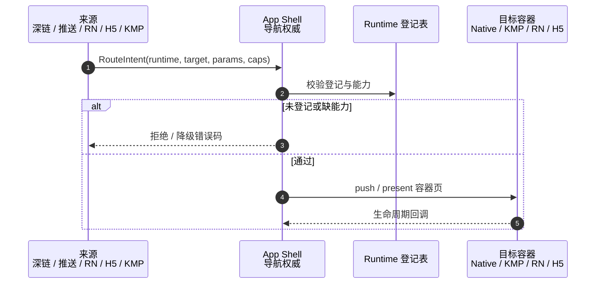

### 3.3 登出与环境切换

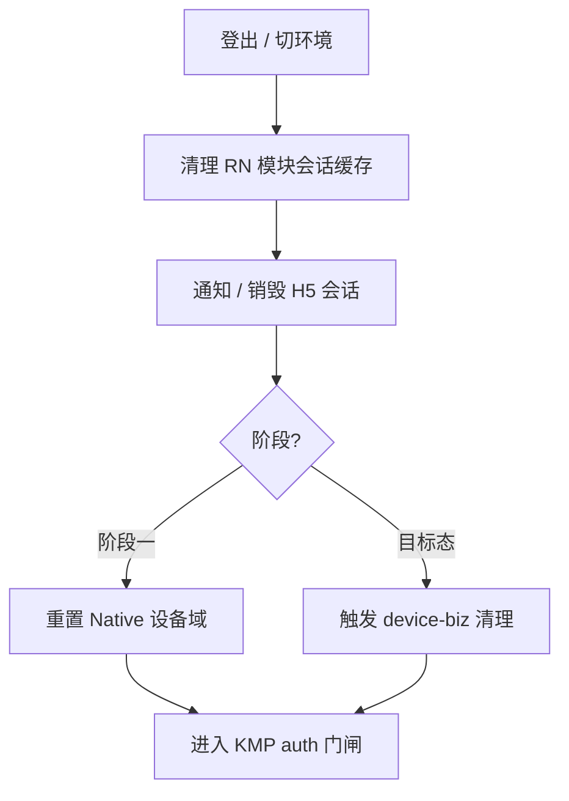

---

## 4. Bridge、安置矩阵、错误与验证

### 4.1 Bridge 总线

| Bridge | 阶段一提供者 | 目标态 | 用途 |
|--------|--------------|--------|------|
| Account / Session | KMP → Host 暴露 | 同 | token、登录态、登出 |
| Network | Host 转发至 KMP `core-net`（收敛中） | KMP | RN/H5 禁止另建业务 HTTP 栈 |
| Device（读） | Native 设备域 | `device-biz` | 设置页状态、能力位 |
| Device（写/动作） | Native 执行 | KMP Port → platform adapter | 属性/服务调用 |
| Navigation | Host | Host | close、打开二级页、回原生 |
| Storage | Host 沙箱 | 同 | 模块私有；非全局真相 |
| Media / 实时 | **仅 Native 表面**；RN 可嵌原生视图 | 同 | 播放逻辑核不在 RN |

**硬规则：** 缺 Bridge 就补 Bridge，禁止把 IoT 协议拷贝进 JS/H5。

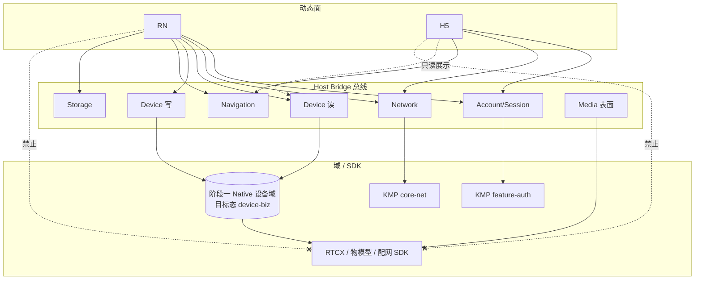

### 4.2 业务安置矩阵

| 类型 | 默认运行时 | 示例 |
|------|------------|------|
| 实时音视频 / 配网 / 系统权限敏感 | **Native** | IPC 播放、BLE 配网 |
| 稳定域 + 双端一致逻辑 | **KMP**（UI：阶段一可 Native；目标态新 Feature 默认 CMP） | 登录、Env、OTA、家庭/房间 |
| 高频改版设备面板/设置 | **RN** | `device-settings` |
| 运营活动、营销、弱交互 | **H5** | 活动页 |
| 不确定 | Domain 先入 KMP Port；UI 选 Native 或 RN；禁止先用 H5 控设备 | — |

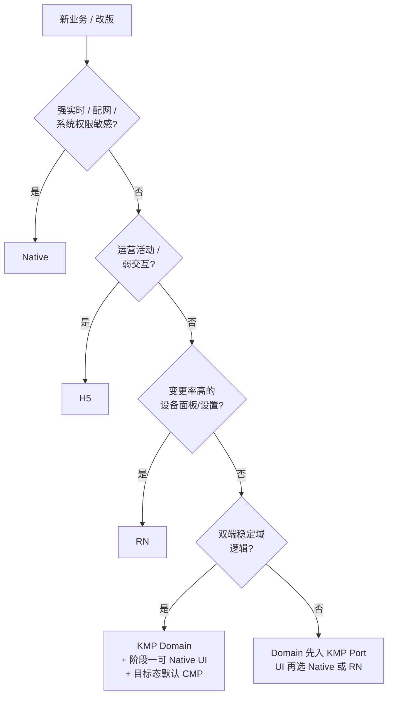

### 4.3 KMP UI 策略（分阶段）

- **阶段一：** 允许「KMP 只共享 Domain/Data，UI 仍 Native/RN」；CMP 白名单（如 auth、OTA、home-management）。  
- **目标态：** 新 KMP Feature 默认 CMP（Toolkit Golden Path）；存量按绞杀迁移。

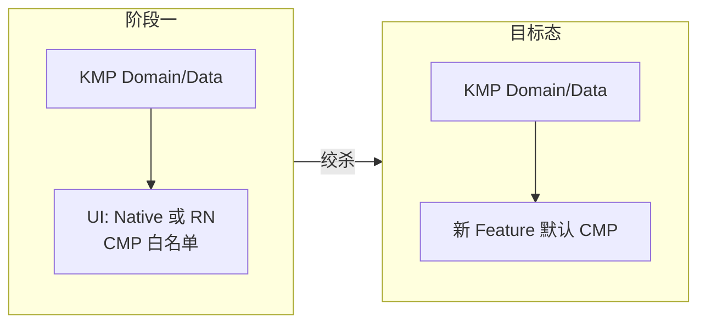

### 4.4 错误模型

- **Domain 错误（KMP）：** 稳定错误码；UI/Bridge 只做展示映射。  
- **Bridge 错误：** 能力未注册 / 未登录 / 设备离线 / 无权限 → 结构化码，允许 RN/H5 降级。  
- **动态包错误：** RN 校验失败回退内置包；H5 白名单或证书失败则阻断。  
- 禁止静默失败后在本地「再猜一套」设备状态。

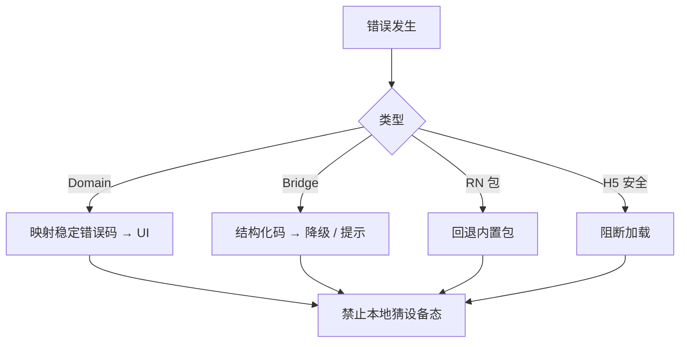

### 4.5 验证要求（宪法级）

1. RN/H5 工程依赖扫描不得链接 IoT SDK。  
2. Owner 测试：Session/OTA 仅一个可写 Store；阶段一设备态仅 Native 可写。  
3. 双端 Bridge schema 契约测试（建议 SSOT：`ugreenhome-rn/contracts` + Shared 导出）。  
4. 新 KMP Feature：Toolkit `verify-existing` / Role 依赖方向作为准入。  
5. 阶段一出口：iOS RN 宿主与 Android 同 module 可开；Network 收敛具备明确适配层。

---

## 5. 阶段一落地约束与风险

### 5.0 阶段一反上帝边界（逻辑组件化，非物理拆仓）

**目的：** 阶段一不强制 iOS Pod/SPM 拆仓，但必须用**逻辑边界**阻止上帝模块/上帝类继续长大，降低未来宿主组件化成本。

**已知风险点（示例，非穷尽）：** iOS `UGDeviceManager`、根 Coordinator / App 入口装配扩散；Android 大型 `SessionRepositoryProvider` 式定位器与过胖 `base`/`app` 模块。此类点列入后续「宿主组件化」子 Spec 的迁移清单，**阶段一禁止再向其堆新职责**。

**硬规则（阶段一即生效）：**

1. **按能力分包，不按「方便」堆目录**：新代码落入明确能力区——`account` / `device` / `navigation` / `bridge` / `media` / `provisioning`（名称可本地化，边界必须可说清）。  
2. **禁止扩大上帝面**：改动现有上帝类/上帝模块时，只允许「抽 Port、加 Adapter、外移职责」；禁止顺手新增无关业务方法或缓存。  
3. **Composition Root 唯一新依赖入口**：新建服务/仓库/桥只从双端 Composition Root 装配；禁止新增全局可写单例。  
4. **跨栈入口收口**：RN/H5/KMP 进入设备写路径必须走已登记 Bridge；禁止再开「临时 Manager 门面」。  
5. **依赖方向（逻辑）**：UI / Bridge → 域接口 ← 基础设施；UI 与 Bridge 不直接依赖 RTCX/物模型实现类型。  
6. **一域一 Owner 执行面**：与第 3 节一致；发现第二套可写设备缓存必须删除或降级为只读投影。

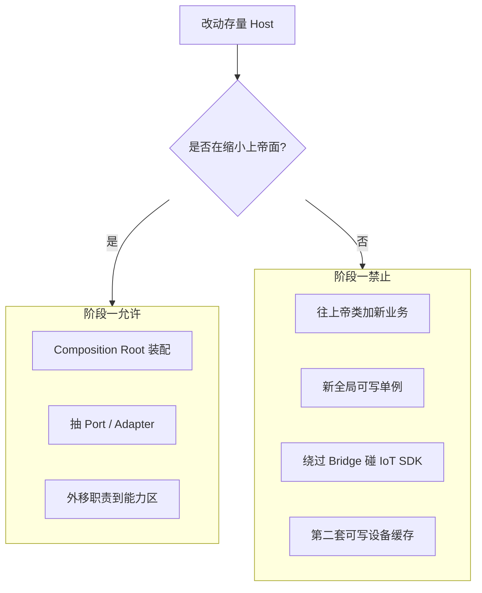

**与未来物理组件化的关系：** 逻辑边界是物理拆仓的前置条件；宿主组件化子 Spec 负责 Pod/SPM/Gradle 映射与第一批组件清单，不在本文展开。

### 5.1 阶段一必须做

1. 公布并执行第 3 节 Owner 表，以及 **5.0 反上帝边界**。  
2. **iOS RN 宿主**补齐到与 Android 同模块可运行（首模块 `device-settings`）；Bridge 按契约实现。  
3. **Network 收敛：** 新 KMP / RN 走 `core-net`；Native Moya 仅存量，禁止新接口双栈并行扩张。  
4. **Composition Root 显式化：** 双端各一处装配；存量单例用 Adapter 包裹，避免继续扩散。  
5. **H5 最小集：** Web 容器 + 鉴权 Bridge + 域白名单；不做设备写。  
6. 列出 `device-biz` 进入 iOS umbrella 的前置条件（编译、Adapter、迁移切片）；阶段一只准备，不要求切完。  
7. 维护「上帝点 / 粗模块」清单（Obsidian 或本仓库 docs），供后续宿主组件化子 Spec 使用。
8. 阶段一 SSOT 文档：`docs/superpowers/phase1/owner-registry.md`、`docs/superpowers/phase1/god-surface-inventory.md`；RN Bridge 目录校验：`ugreenhome-rn` 中 `npm run validate:bridges`（**仅** RN 仓内 schema 示例 ↔ catalog ↔ JS facade 三者锁步；**不**证明 iOS/Android 原生 `RCTBridgeModule` 已注册同名模块，原生双端 parity 属 Plan 03）。

### 5.2 阶段一明确不做

- 全量 CMP 化；设备域一次迁入 KMP。  
- RN 生产远端热更全开（可保留签名校验脚手架；默认内置包）。  
- KMP 业务热更新方案（调研以外不投入）。  
- Win/Mac/Web、组件市场平台产品化。

### 5.3 进入目标态强化的入口条件

- Bridge schema 双端稳定且契约测试通过。  
- 至少一条设备**读**路径可经 Adapter 切到 `device-biz` 而不改 RN 页面。  
- 新 Feature 强制 Toolkit Preset；iOS 单一 Shared Framework 无回归。

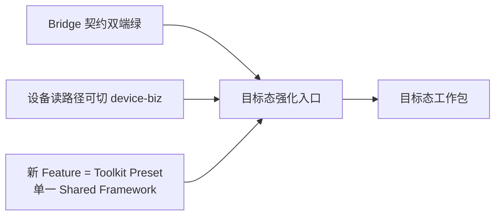

### 5.4 风险与缓解

| 风险 | 缓解 |
|------|------|
| 多栈导航/返回错乱 | 路由意图只由 Host 执行；容器统一返回协议 |
| Native↔KMP 双设备缓存 | 禁止新可写缓存；跨模块只读快照注入 |
| iOS/Android RN 能力漂移 | 同一 `contracts/` + CI |
| Toolkit Android-first，iOS Adapter 证据不足 | 补 iOS Presentation Adapter 样板（auth/OTA） |
| 与钉钉规划/白板漂移 | 本 Spec + Obsidian 为 App 运行时 SSOT；钉钉文档为组织愿景 |

### 5.5 建议后续工作包（实施计划拆分）

本宪法覆盖多个子系统，实施时应拆为独立计划，例如：

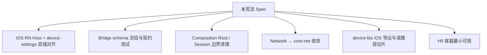

---

## 6. 决策摘要

| 项 | 决定 |
|----|------|
| 宪法写法 | Runtime 编排宪法（Host Orchestrator） |
| 时间视图 | 目标态 + 阶段一双视图 |
| 运行时 | 三栈为主；H5 为动态面子节 |
| 状态/导航 | 阶段一 Host 编排设备域 → 目标态 KMP 域 SSOT；导航栈始终 Host |
| RN/H5 与设备 | 禁止直连 SDK；只经 Bridge |
| KMP UI | 阶段一可域先共享；目标态新 Feature 默认 CMP |
| 动态下发 | RN（主）+ H5（运营）；**不把 KMP 选作业务热更主路径**（见 1.6） |
| iOS 组件化 | 阶段一不做物理拆仓；执行 **5.0 逻辑反上帝边界**；物理组件化另开子 Spec |

---

## 7. 参考路径

| 资产 | 路径 |
|------|------|
| iOS Host | `/Users/daubert/UGreen/ugreenhome/iot` |
| KMP Shared | `/Users/daubert/UGreen/ugreenhome/ugreenhome-shared` |
| Android Host | `/Users/daubert/UGreen/ugreen-home` |
| RN | `/Users/daubert/UGreen/ugreenhome-rn` |
| Toolkit | `/Users/daubert/UGreen/kmp-feature-developer-toolkit` |
| Obsidian KB | `/Users/daubert/Github/LastStand/obsidian/UGreen-Architecture/` |
