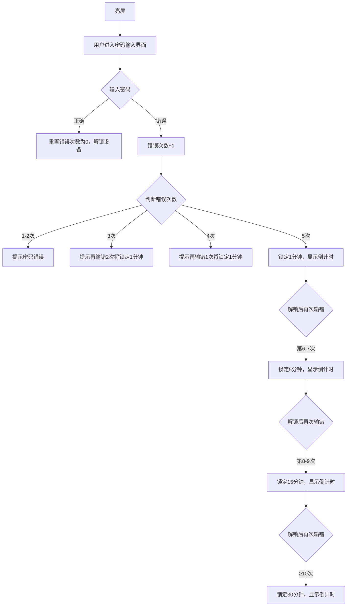

# **更新记录**

| 更新日期 | 更新内容 | 更新人 |
|------------|------------|---------|
| 2026-8-21 | <ul><li>1. 补充因增加外置SD卡，涉及的逻辑修改</li> <li style="margin-left:1em">1. 增加推送提醒 [Smart Display Pro 智能中控屏软件需求PRD](https://alidocs.dingtalk.com/i/nodes/XPwkYGxZV3RKNB2yclK5d5dxWAgozOKL?utm_scene=person_space&iframeQuery=anchorId%3Duu_mt2ptyrqm8d2jnyu2lo)</li> <li style="margin-left:1em">2. 首页增加存储卡异常提醒[Smart Display Pro 智能中控屏软件需求PRD](https://alidocs.dingtalk.com/i/nodes/XPwkYGxZV3RKNB2yclK5d5dxWAgozOKL?utm_scene=person_space&iframeQuery=anchorId%3Duu_mt2q5v3utq1s1tuxrnm)</li> <li style="margin-left:1em">3. 存储管理，增加外置存储容量以及对应状态[Smart Display Pro 智能中控屏软件需求PRD](https://alidocs.dingtalk.com/i/nodes/XPwkYGxZV3RKNB2yclK5d5dxWAgozOKL?utm_scene=person_space&iframeQuery=anchorId%3Duu_mt2r0eghgo145gm3gur)</li> <li style="margin-left:1em">4. 事件下载，增加下载位置逻辑及相关提示[Smart Display Pro 智能中控屏软件需求PRD](https://alidocs.dingtalk.com/i/nodes/XPwkYGxZV3RKNB2yclK5d5dxWAgozOKL?utm_scene=person_space&iframeQuery=anchorId%3Duu_mt2rp0dx3mb1lhhtfml)</li> <li style="margin-left:1em">5. 相册，增加SD卡内容判断，需要同时与内置存储的一起展示[Smart Display Pro 智能中控屏软件需求PRD](https://alidocs.dingtalk.com/i/nodes/XPwkYGxZV3RKNB2yclK5d5dxWAgozOKL?utm_scene=person_space&iframeQuery=anchorId%3Duu_mt2ri0itcy3z84f5pg)</li> <li style="margin-left:1em">6. 回放，增加下载位置逻辑及相关提示[Smart Display Pro 智能中控屏软件需求PRD](https://alidocs.dingtalk.com/i/nodes/XPwkYGxZV3RKNB2yclK5d5dxWAgozOKL?utm_scene=person_space&iframeQuery=anchorId%3Duu_mt2s40iaaa1nlf3b3d6)</li></ul> |  |
| 2026-5-19 | 补充需求：增加关怀模式开关[Smart Display Pro 智能中控屏软件需求PRD](https://alidocs.dingtalk.com/i/nodes/XPwkYGxZV3RKNB2yclK5d5dxWAgozOKL?utm_scene=person_space&iframeQuery=anchorId%3Duu_mpcew3f4y3xlzltji2) | 张阔夫 |
| 2026-3-2 | 补充需求：网络列表，自动保存的网络支持用户手动删除[Smart Display Pro 智能中控屏软件需求PRD](https://alidocs.dingtalk.com/i/nodes/XPwkYGxZV3RKNB2yclK5d5dxWAgozOKL?utm_scene=person_space&iframeQuery=anchorId%3Duu_mj9v2o9um4cow3piw9) | 张阔夫 |
| 2026-1-20 | <ul><li>1. 增加中控屏通过数据线连接电脑导出数据的功能需求：[Smart Display Pro 智能中控屏软件需求PRD](https://alidocs.dingtalk.com/i/nodes/XPwkYGxZV3RKNB2yclK5d5dxWAgozOKL?utm_scene=person_space&iframeQuery=anchorId%3Duu_mkdonjb2lfbnpenbqi)</li> <li>2. 补充事件需求[Smart Display Pro 智能中控屏软件需求PRD](https://alidocs.dingtalk.com/i/nodes/XPwkYGxZV3RKNB2yclK5d5dxWAgozOKL?utm_scene=person_space&iframeQuery=anchorId%3Duu_mjbdy63c5qwrbvd3h1s)</li> <li>3. 补充回放需求[Smart Display Pro 智能中控屏软件需求PRD](https://alidocs.dingtalk.com/i/nodes/XPwkYGxZV3RKNB2yclK5d5dxWAgozOKL?utm_scene=person_space&iframeQuery=anchorId%3Duu_mjnn1rqqm6y5o6ydcag)</li></ul> | 张阔夫 |
| 2026-1-5 | <ul><li>1. 配置Wi-Fi增加手动输入[Smart Display Pro 智能中控屏软件需求PRD](https://alidocs.dingtalk.com/i/nodes/XPwkYGxZV3RKNB2yclK5d5dxWAgozOKL?utm_scene=person_space&iframeQuery=anchorId%3Duu_mji5qv6fwj9lig76uln)</li> <li>2. 账号解绑逻辑补充[Smart Display Pro 智能中控屏软件需求PRD](https://alidocs.dingtalk.com/i/nodes/XPwkYGxZV3RKNB2yclK5d5dxWAgozOKL?utm_scene=person_space&iframeQuery=anchorId%3Duu_mj9o40m07cenjoil6yb)</li> <li>3. 增加锁定密码[Smart Display Pro 智能中控屏软件需求PRD](https://alidocs.dingtalk.com/i/nodes/XPwkYGxZV3RKNB2yclK5d5dxWAgozOKL?utm_scene=person_space&iframeQuery=anchorId%3Duu_mjjqq4d48v5p787ie35)</li> <li>4. 增加锁屏页[Smart Display Pro 智能中控屏软件需求PRD](https://alidocs.dingtalk.com/i/nodes/XPwkYGxZV3RKNB2yclK5d5dxWAgozOKL?utm_scene=person_space&iframeQuery=anchorId%3Duu_mjnn5qrg2x1imyc7ten)</li> <li>5. 通知设置支持设备通知开关[Smart Display Pro 智能中控屏软件需求PRD](https://alidocs.dingtalk.com/i/nodes/XPwkYGxZV3RKNB2yclK5d5dxWAgozOKL?utm_scene=person_space&iframeQuery=anchorId%3Duu_mj8eajndugg3r9xxsa)</li> <li>6. 增加密码设置[Smart Display Pro 智能中控屏软件需求PRD](https://alidocs.dingtalk.com/i/nodes/XPwkYGxZV3RKNB2yclK5d5dxWAgozOKL?utm_scene=person_space&iframeQuery=anchorId%3Duu_mjjtmljeqiufmfkgtwj)</li> <li>7. 增加IPC语音呼叫[Smart Display Pro 智能中控屏软件需求PRD](https://alidocs.dingtalk.com/i/nodes/XPwkYGxZV3RKNB2yclK5d5dxWAgozOKL?utm_scene=person_space&iframeQuery=anchorId%3Duu_mj8iza8xg4m5ty6w5k7)</li> <li>8. 增加IPC事件通知[Smart Display Pro 智能中控屏软件需求PRD](https://alidocs.dingtalk.com/i/nodes/XPwkYGxZV3RKNB2yclK5d5dxWAgozOKL?utm_scene=person_space&iframeQuery=anchorId%3Duu_mj8j1r17s3bsfmli9ug)</li> <li>9. 增加与App视频通话[Smart Display Pro 智能中控屏软件需求PRD](https://alidocs.dingtalk.com/i/nodes/XPwkYGxZV3RKNB2yclK5d5dxWAgozOKL?utm_scene=person_space&iframeQuery=anchorId%3Duu_mjny5dr0dpp6copv2qq)</li></ul> | 张阔夫 |
| 2025-12-23 | 正式版本P0需求外审 | 张阔夫 |
| 2025-12-15 | 针对CES展会特殊情况调整需求： <ul><li>1. 考虑到展会无人为干预手动刷新页面的情况，CES版本直播页面加载失败时，不显示失败提示，页面内一直自动刷新。[Smart Display Pro 智能中控屏软件需求PRD](https://alidocs.dingtalk.com/i/nodes/XPwkYGxZV3RKNB2yclK5d5dxWAgozOKL?utm_scene=person_space&iframeQuery=anchorId%3Duu_mj6i784zumcg5pyo8t9)</li> <li>2. CES展版本需要支持被分享设备，可不要求分享权限的区分，被分享设备在直播页可显示全部功能。后续正式版本再统一输出权限需求[Smart Display Pro 智能中控屏软件需求PRD](https://alidocs.dingtalk.com/i/nodes/XPwkYGxZV3RKNB2yclK5d5dxWAgozOKL?utm_scene=person_space&iframeQuery=anchorId%3Duu_mgqheszhun94ubkb2i)</li> <li>3. 隐私模式开启时参考直播页功能逻辑补充云台禁用[Smart Display Pro 智能中控屏软件需求PRD](https://alidocs.dingtalk.com/i/nodes/XPwkYGxZV3RKNB2yclK5d5dxWAgozOKL?utm_scene=person_space&iframeQuery=anchorId%3Duu_mg08hkrsz5h3v88iwi)</li></ul> | 张阔夫 |
| 2025-12-10 | 调整文档格式，区分CES展功能需求和正式版本功能需求 | 张阔夫 |
| 2025-11-11 | 修改音量调整的逻辑：直播页面调节中控屏的音量时仅在当前直播页生效，在设置-音量调节页面调节音量时全局生效。 [Smart Display Pro 智能中控屏软件需求PRD](https://alidocs.dingtalk.com/i/nodes/XPwkYGxZV3RKNB2yclK5d5dxWAgozOKL?utm_scene=person_space&iframeQuery=anchorId%3Duu_mg07d89yuo1m8uq5tp) | 张阔夫 |
| 2025-11-4 | 硬件PRD补齐 | 李宗情 |
| 2025-10-24 | 增加绑定中控屏时，中控屏端的二维码过期流程，二维码有效期为1分钟。 | 张阔夫 |
| 2025-10-20 | 智能中控屏和手机App双向视频通话需求补充 | 张阔夫 |
| 2025-10-16 | 智能中控屏软件需求评审，软件需求范围确认 | 张阔夫 |
| 2025-10-10 | 产品形态变更：智能相框 改为 智能中控屏 | 温向猛、张阔夫 |
| 2025-9-19 | 软件需求文档创建、撰写 | 温向猛、张阔夫 |

# **中控屏硬件规格**

| **类目** |  | **规格&功能** | **备注** |
|----------|---|-----------------|----------|
| 系统 | 核心处理器（品牌/型号） | RK3562 |  |
|  | 主频 | Quad-Core A53, up to 2GHz |  |
|  | 制程 | 22nm |  |
|  | NPU算力 | Up to 1TOPS |  |
|  | GPU | Mali-G52-2EE 1GHz |  |
|  | 最大编码能力 | 4K@30fps H.265 HEVC/MVC；4K@30fps VP9：2K@60fps H.264 AVC/MVC； |  |
|  | DDR | 2GB | 先用2G开发，评估1G |
|  | Flash/eMMC | 64G eMMC | 内置64G eMMC，考虑成本降到32G |
| 屏幕 | 品牌/型号 | TD1070-101025032AA |  |
|  | 屏幕尺寸 | 135.36(H)×216.58(V) 10寸屏 |  |
|  | 外型尺寸 | 143.04(H)x228.64(V)x2.6(body) |  |
|  | 触摸集成 | 带模组， 框贴TP |  |
|  | 分辨率 | 1920\*1200（1080P） |  |
|  | 面板类型 | IPS |  |
|  | 亮度 | 300 | 评估400，英唐确认 |
|  | 对比度 | 1000 |  |
|  | 色域 | NTSC 56% |  |
|  | 色彩深度 | 8 |  |
|  | 响应时间 | 30ms |  |
|  | 视角 | ALLO’clock |  |
|  | 驱动IC | JD9365DA-H3 |  |
|  | 触摸功能 | 额外增加TP | 肯定要 |
|  | 多点触控 | 最大5点触摸 |  |
|  | AF涂层 | 可以增加 |  |
|  | AG涂层 | 可以增加 |  |
| 摄像头 | 像素 | 500万 | 支持带物理隐私遮蔽片 |
|  | sensor | GC08A8 |  |
|  | 焦距 | 2.78mm |  |
|  | 摄像头TTL | 4.41 |  |
|  | 光圈 | F2.0 |  |
|  | FOV | D77度 |  |
|  | 畸变 | 小于1.0% |  |
|  | 镜片结构 | 4P |  |
| 麦克风 | 数量 | 2个 | 支持远场拾音算法， 1、评估4个，主要考虑性能提升幅度，英唐评估性能，1元一个， 2、4mic英唐沟通，RK需要收取算法8人民币 3、 波洛斯2mic成本8元，2mic和4mic效果等同（厂家算法做的好） |
|  | 类型 | 硅麦麦克风 |  |
|  | 灵敏度 | -32dB |  |
|  | 频率响应 | 20-20kHz |  |
|  | 信噪比（SNR） | ≥68dB |  |
|  | 自噪声 | ≤28 dBA |  |
|  | 语音对讲 | 全双工 |  |
|  | 拾音距离 | 6米 | 拾音距离6米（mic正方位6米处，播放60db分贝声音，正常清晰） |
|  | 采样率 | 16K |  |
| 喇叭 | 功率 | 2W | 暂定2W，根据实际情况调整 |
|  | 频率范围 | 0-20kHz |  |
|  | 额定阻抗 | 8Ω |  |
|  | 嗽叭分贝 | 100dB | 1m处最大音量达到100db，需要英唐评估是否可以，标准不低于eufy（0.15m 87db eufy竞品） |
|  | 喇叭尺寸 | / | 根据ID结构来适配 |
|  | BOX | 支持 |  |
|  | 振膜材质 | PEN |  |
|  | 磁通量 | 70Gs |  |
| Wi-Fi | Wi-Fi芯片品牌/型号 | ATM6463 | 支持蓝牙 |
|  | 2.4GHz频段：支持802.11n及以上 | IEEE 802.11b/g/n/ax，2.4GHz |  |
|  | 5GHz频段：支持802.11ac及以上 | IEEE 802.11a/n/ac/ax，5GHz |  |
|  | 支持802.11ax（WiFi6） | 支持 |  |
|  | 无线标准 | IEEE 802.11 |  |
|  | Wi-Fi最大传输速率（蓝牙不工作） | 287Mbps/S |  |
|  | Wi-Fi传输距离 | 以实测为准 |  |
|  | Wi-Fi传输速率 （WiFi连接2.4G，与蓝牙同时工作） | 验收标准待定 |  |
|  | 内置天线 | 3dBi |  |
|  | 天线数量 | 2根天线 |  |
| 按键 | 报警键 | 不支持 | 评估不需要 |
|  | 复位/电源按键 | 支持 |  |
|  | 音量键 | 支持 | 评估需要 |
|  | 一键静拾音 | 可以关闭MIC拾音 | 需要 |
| 供电方式 | 电源接口 | Type-C  5V⎓2A  \+ POGO pin |  |
|  | 电源线长 | 可自定义， 2M |  |
| 网络 | 无线 | 2.4GHz&5GHzWi-Fi6 |  |
|  | 有线RJ45 | 不支持 |  |
|  | 蓝牙 | 支持 |  |
|  | matter | 不支持 |  |
| 功耗与供电要求 | 供电电压/电流 | 5V⎓2A，供电电压为 5V，输出电流2A |  |
|  | 最大功耗 | Normal:0.75W (5.0V/150mA); Max: 3.0W (5.0V/600mA); Min:0.025W (5.0V/5mA)” |  |
| 电源适配器 | 品牌/型号 | 5V2A |  |
|  | 认证标准 | 根据销售区域，满足各地区法规要求 |  |
| 环境光传感器 | 品牌/型号 | / | 按照英唐选型 |
|  | 检测范围 | 0.01 lux – 64 000 lux |  |
|  | 检测精度 | ALS sensing tolerance（检测误差）为 ±12.5%（在白光 LED 平行光源下） |  |
|  | 响应时间 | 由积分时间（IT\_ALS）决定，支持 7 档可调，范围为 25ms、50ms、100ms、200ms、400ms、800ms、1600ms。 |  |
| 距离感应器 | 感应距离 | 0-5cm | 评估不需要 |
| 电池 | 电池类型 | 软包电池 | 需要过认证 FCC IC CE |
|  | 电池容量 | 5000mAh |  |
|  | 电量计精度 | 1% | 做兼容，外挂大概成本2元 |
| 屏幕显示 | 屏幕显示 | 只需要横屏，不需要旋转 |  |
| 接口 | USB-C | 充电 |  |
|  | TF卡座 | 支持 |  |
| 上墙支架 | 上墙支架 | 支持 |  |
| 单独桌子摆放 | 单独桌子摆放 | 支持 |  |
| 座充角度可调节 | 座充角度可调节 | 支持 | 待确定：根据ID情况确定 |

# **设计稿**

交互稿：[https://www.figma.com/design/IuhOvRyUZtGcD5Pm0hiA1O/%E6%99%BA%E8%83%BD%E7%9B%B8%E6%A1%86?node-id=0-1&p=f&t=kRAZLTKf5N8uI6CQ-0](https://www.figma.com/design/IuhOvRyUZtGcD5Pm0hiA1O/%E6%99%BA%E8%83%BD%E7%9B%B8%E6%A1%86?node-id=0-1&p=f&t=kRAZLTKf5N8uI6CQ-0)

UI稿：[https://www.figma.com/design/q6lLGF388WWXvbkH57nujw/%E4%B8%AD%E6%8E%A7%E5%B1%8F?node-id=172-282&t=L4fdTFDsaezkRdXR-1](https://www.figma.com/design/q6lLGF388WWXvbkH57nujw/%E4%B8%AD%E6%8E%A7%E5%B1%8F?node-id=172-282&t=L4fdTFDsaezkRdXR-1)

# ~~**CES展功能需求（已完成，作废）**~~

## **添加设备(P0)**
- 智能中控屏支持通过设备自带触控屏完成网络连接，联网后可通过 APP 扫码快速完成设备绑定。

| **功能** | **功能描述** | **示意图** |
|----------|----------------|-------------|
| 端侧联网 | <ul><li>1. 设备开机后，进行激活、设备联网、绑定判断</li> <li>2. 提示用户选择 WiFi 网络</li> <li style="margin-left:1em">1. 默认展示设备周边的WiFi进行选择</li> <li style="margin-left:2em">1. 信号强度降序排序</li> <li style="margin-left:1em">2. 用户输入 WiFi 密码进行连接</li> <li style="margin-left:2em">1. 密码错误判断</li> <li style="margin-left:2em">2. 密码可为空提醒</li> <li style="margin-left:2em">3. WiFi密码长度大于8位，小于64位</li> <li style="margin-left:2em">4. 若密码为空，则选择WiFi时直接连接无需输入</li> <li style="margin-left:1em">3. 联网成功后，设备自动请求并生成唯一设备二维码，显示在屏幕上</li> <li style="margin-left:2em">1. 引导用户从手机APP扫码进行绑定设备</li> <li style="margin-left:2em">2. 二维码内容初定：设备型号，设备SN码</li> <li style="margin-left:2em">3. 二维码有效期：1分钟，到期后自动更新。</li> <li style="margin-left:3em">1. 若自动更新失败，则在中控屏的二维码上显示“二维码更新失败”及刷新按钮，用户可尝试手动刷新。</li></ul> | [https://www.figma.com/design/q1MJ0s5rHnuPXRZEEHYMJ0/%E4%B8%AD%E6%8E%A7%E5%B1%8F?node-id=1669-162202](https://www.figma.com/design/q1MJ0s5rHnuPXRZEEHYMJ0/%E4%B8%AD%E6%8E%A7%E5%B1%8F?node-id=1669-162202) |
| APP侧扫码绑定 | <ul><li>1. 用户在Ugreen Connect APP上点击扫一扫进行扫码绑定</li> <li>2. 设备验证</li> <li style="margin-left:1em">1. 二维码判断</li> <li style="margin-left:1em">2. SN码是否有效</li> <li style="margin-left:1em">3. 设备区分国内和海外（SN码规则需包含区域）</li> <li style="margin-left:1em">4. 设备是否被绑定</li> <li style="margin-left:1em">5. 二维码是否过期</li> <li style="margin-left:2em">1. 过期时提示：二维码已失效，请重新扫描最新的二维码。</li> <li>3. 验证成功，APP绑定设备</li> <li style="margin-left:1em">1. 默认名称为：设备型号</li></ul> |  |

异常场景

| 分类 | **异常场景** | **描述** | **系统处理方式** |
|------|----------------|----------|----------------------|
| 端侧联网 | Wi-Fi 连接失败 | 用户输入错误密码 | 提示“连接失败，请检查 Wi-Fi 设置或密码”，~~并返回 Wi-Fi 列表~~ |
|  | 无可用 Wi-Fi | 未搜索到网络 | 提示“未检测到可用 Wi-Fi”，提供刷新按钮 |
|  | 设备无法联网 | 网络异常 | 提示“网络连接异常，请稍后重试” |
| APP绑定 | 二维码无效 | 扫描错误二维码或损坏 | APP 提示“二维码无效，请重新扫描” |
|  | 二维码过期 | 扫描的二维码已超过有效期失效 | APP提示“二维码已过期，请重新扫描最新的二维码” |
|  | SN码不符合区域 | 国内账号不可绑定海外设备，海外账号不可绑定国内设备, | APP 提示“设备与账号所在区域不匹配，无法绑定使用，请检查后重试。” |
|  | SN码不存在 | 设备是否绿联设备 | APP 提示【设备无法绑定】 |
|  | 设备已被其他用户绑定 | 设备为强绑定，被其他人绑定 | APP提示【该设备已被其它账号绑定，请先在原账号下解绑设备后再添加】 |
|  | 绑定超时 | 扫码后未在限定时间内完成绑定 | 提示“绑定超时，请重新尝试” |
|  | ~~设备已被绑定~~ | ~~设备已被其他账号绑定~~ | ~~提示“该设备已绑定，请联系管理员”~~ |
| 网络配置 | Wi-Fi 密码错误 | 用户输入错误密码 | 提示“密码错误，请重新输入” |
|  | Wi-Fi 信号弱 | 网络信号不稳定 | 提示“信号弱，可能导致连接失败” |
|  | 未搜索到网络 | 无可用 Wi-Fi 网络 | 提示“未检测到可用网络，点击刷新” |
|  | 连接超时 | 超过设定时间仍未连接成功 | 提示“连接超时，请重试” |
|  | 其他原型 | 网络配置错误等错误原因 | 提示“连接失败，请重试” |

## **连接IPC（P0）**

| 功能 | 功能描述 | 示意图 |
|------|------------|---------|
| 与IPC绑定逻辑 | <ul><li>1. 用户使用 Ugreen Connect App 添加中控屏设备后，中控屏自动关联当前账号下的所有已添加的 IPC 设备，不需要用户再手动将中控屏与IPC绑定。</li> <li>2. 同一账号可同时绑定多台中控屏，若用户同一账号下添加了多台中控屏，则每个中控屏都可以与账号下的所有 IPC 设备绑定。</li> <li>3. 若用户在 App 端将账号下的 IPC 删除，则关联中控屏内的 IPC 也会同步删除。</li> <li>4. 由他人分享的IPC设备正常显示，CES版本可不要求分享权限的区分，被分享设备在直播页可显示全部功能。</li></ul> |  |

## **App端设备管理(P1，CES不做)**

| 功能 | 功能描述 | 示意图 |
|------|------------|---------|
| 设备列表 | <ul><li>1. 绑定后的中控屏设备显示在App首页的设备列表内展示</li> <li style="margin-left:1em">1. 设备名称</li> <li style="margin-left:1em">2. 设备图片</li> <li style="margin-left:1em">3. 电量</li> <li style="margin-left:1em">4. 在线状态</li> <li>2. 点击设备卡片进入中控屏设备管理页面</li></ul> |  |
| 中控屏管理页 | <ul><li>1. 导航栏显示设备名称</li> <li>2. 点击设置按钮进入设置页面</li> <li>3. 展示设备图片</li> <li>4. 屏幕亮度调节</li> <li style="margin-left:1em">1. 自动亮度调节，默认开，设备根据当前环境光强度自动调节屏幕亮度值</li> <li style="margin-left:1em">2. 用户可手动拉动滑块调整屏幕亮度，亮度值 0% ~ 100%。</li> <li>5. 声音设置</li> <li style="margin-left:1em">1. 音量值 0% ~ 100%。</li> <li style="margin-left:1em">2. 支持手动拉动滑块调整设备麦克风声音，默认70%（待设备实测）。</li> <li>6. 设备离线时</li> <li style="margin-left:1em">1. 设备离线时提示：设备已离线，请在中控屏内检查网络配置。</li> <li style="margin-left:1em">2. 设备设置、屏幕亮度调节和声音设置选项隐藏不显示。</li> <li style="margin-left:1em">3. 点击重新连接按钮重新刷新设备在线状态。</li></ul> |   |
| 设备设置页 | <ul><li>1. 设备卡片</li> <li style="margin-left:1em">1. 设备图</li> <li style="margin-left:1em">2. 设备名称</li> <li style="margin-left:1em">3. 设备型号</li> <li>2. 重启设备</li> <li style="margin-left:1em">1. 点击按钮后弹窗二次确认：确认要进行设备重启吗？点击确认则设备立即重启，点击取消关闭弹窗</li> <li style="margin-left:1em">2. 设备重启不会更改设备的绑定关系及配网信息，重新启动后回到设备首页。</li> <li>3. 删除设备</li> <li style="margin-left:1em">1. 点击按钮后弹窗二次确认：确认删除设备吗？删除后将清除设备所有配置/数据，恢复至出厂初始状态。点击确认则立即删除设备，点击取消则关闭弹窗</li> <li style="margin-left:1em">2. 设备删除后恢复至出厂状态并清空已存储的数据和配置，进入重新配网状态。</li> <li>4. 点击设备卡片进入设备信息页面</li> <li style="margin-left:1em">1. 设备名称，支持修改。</li> <li style="margin-left:2em">1. 用户可修改保存服务端，且不为空，默认的是设备型号</li> <li style="margin-left:2em">2. 设备名称最长30个字符，不支持特殊符号，支持空格</li> <li style="margin-left:1em">2. 产品型号：待定，仅可查看。</li> <li style="margin-left:1em">3. 固件版本号：显示当前设备的固件版本号。若有新版本则可点击升级按钮进行OTA升级。</li> <li style="margin-left:2em">1. 若当前设备电量＜50%，或未接通电源，则弹窗提示：请将设备接通电源并确保电量高于50%后重试。</li> <li style="margin-left:2em">2. 若当前设备电池电量≥50%且已连接电源，则进入固件更新页面。</li> <li style="margin-left:1em">4. 序列号，支持一键复制。</li> <li style="margin-left:1em">5. MAC地址，支持一键复制。</li> <li style="margin-left:1em">6. IP地址，支持一键复制。</li></ul> |    |

## **首页设备管理(P0)**

| 功能 | 功能描述 | 示意图 |
|------|------------|---------|
| 首页 | <ul><li>1. 导航栏显示：</li> <li style="margin-left:1em">1. 时间：YYYY-MM-DD  hh:mm</li> <li style="margin-left:1em">2. Wi-Fi信号强度</li> <li style="margin-left:2em">1. 4格（Excellent）：大于等于 -60 dBm</li> <li style="margin-left:2em">2. 3格（Great）: \[-67，-60) dBm</li> <li style="margin-left:2em">3. 2格（Fair）: \[-78, -67) dBm</li> <li style="margin-left:2em">4. 1格（Poor）: 小于 -78 dBm</li> <li style="margin-left:2em">5. 无信号</li> <li style="margin-left:1em">3. 电量：0%~100%</li> <li>2. 摄像机直播画面</li> <li style="margin-left:1em">1. 账号下只有一台IPC，则仅显示一台IPC的直播画面（直播码流1080P）</li> <li style="margin-left:2em">1. 点击设备画面空白处或右上角全屏按钮直接进入此设备直播画面。</li> <li style="margin-left:1em">2. 账号下有2台IPC，则显示为2分屏直播样式（直播码流1080P）</li> <li style="margin-left:1em">3. 账号下有3台及以上IPC，则显示为4分屏直播样式（直播码流480P）</li> <li style="margin-left:2em">1. 默认按照App端保存在云端服务器的顺序显示。</li> <li style="margin-left:2em">2. 若超过四路画面，一个四分屏页面显示不下所有设备，则展示分页滑块，可左右滑动切换下一页/上一页，支持第一页和最后一页的循环滑动切换。</li> <li style="margin-left:2em">3. 若当前页面不够4个画面，则无设备的画面显示默认为空的状态图。</li> <li style="margin-left:2em">4. 点击单个设备画面空白处进入此设备的直播页。</li> <li style="margin-left:2em">5. 点击右上角全屏按钮进入四分屏直播页面。</li> <li>3. 视频通话：在中控屏侧发起视频通话，可在App上进行接听，实现双向视频对讲功能。</li> <li>4. 相册：点击进入查看中控屏本地相册文件。</li> <li>5. 设置：点击进入中控屏设置页面。</li></ul> |  |

## **App视频通话（P1，CES不做）**

| 功能 | 功能描述 | 示意图 |
|------|------------|---------|
| 中控屏发起视频通话 | <ul><li>1. 在中控屏上点击视频通话功能按钮，向App侧发起通话。</li> <li>2. 中控屏进入通话待接听状态</li> <li style="margin-left:1em">1. 显示当前中控屏摄像头拍摄的画面。</li> <li style="margin-left:1em">2. 挂断按钮，点击后立刻结束当前通话请求。</li> <li style="margin-left:1em">3. 摄像头开关，</li> <li style="margin-left:2em">1. 默认开启，点击可切换是否使用中控屏摄像头。</li> <li style="margin-left:2em">2. 关闭后，不显示中控屏摄像头拍摄的画面，提示“摄像头已关闭”。</li> <li style="margin-left:1em">4. 音量调节，可手动调节中控屏喇叭音量。</li> <li style="margin-left:1em">5. 若请求60s未接听，则停顿一下，自动关闭退出该页面。toast提示【请求通话结束】，判断时间为设备发起的时间。</li> <li>3. 中控屏与App视频通话中（App侧接听后，进入双向视频通话）</li> <li style="margin-left:1em">1. 中控屏大屏显示手机摄像头拍摄的画面。</li> <li style="margin-left:2em">1. 若App端关闭摄像头或未授予手机摄像头系统权限，画面显示“摄像头已关闭”。</li> <li style="margin-left:1em">2. 小窗显示中控屏摄像头拍摄的画面。</li> <li style="margin-left:1em">3. 点击小窗，可交换大屏和小窗显示的内容。</li> <li style="margin-left:1em">4. 显示通话中状态及通话时长（时：分：秒）。</li> <li style="margin-left:1em">5. 音量调节，可手动调节中控屏喇叭音量。</li> <li style="margin-left:1em">6. 挂断按钮，点击后立刻结束当前通话请求。</li> <li style="margin-left:1em">7. 摄像头开关，</li> <li style="margin-left:2em">1. 默认开启，点击可切换是否使用中控屏摄像头，</li> <li style="margin-left:2em">2. 关闭后，不显示中控屏摄像头拍摄的画面，提示“摄像头已关闭”。</li> <li>4. App侧拒接</li> <li style="margin-left:1em">1. 中控屏提示：对方拒绝接听，1s后退出通话页面。</li> <li>5. App侧通话中挂断</li> <li style="margin-left:1em">1. 中控屏提示：通话已结束，1s后退出通话页面。</li></ul> |  |
| App接收视频通话 | <ul><li>1. 在中控屏上点击视频通话功能按钮，向App侧发起通话。</li> <li>2. App收到通话请求，弹出语音接听页面，在整个APP的任一页面，都弹出该页面进行接听或拒绝。</li> <li style="margin-left:1em">1. 显示中控屏设备名称。</li> <li style="margin-left:1em">2. 显示正在呼叫状态。</li> <li style="margin-left:1em">3. 展示手机摄像头拍摄的画面，默认使用前置镜头</li> <li style="margin-left:1em">4. 摄像头切换按钮，点击切换手机前置/后置摄像头</li> <li style="margin-left:1em">5. 摄像头开关[，]()</li> <li style="margin-left:2em">1. 默认开启，点击可切换是否使用手机摄像头。</li> <li style="margin-left:2em">2. 关闭后，不显示手机摄像头拍摄的画面，提示“摄像头已关闭”。</li> <li style="margin-left:1em">6. 接听按钮，点击后进入双向视频通话页面。</li> <li style="margin-left:1em">7. 拒接按钮，点击后拒接，App退出当前页面，中控屏提示：对方拒绝接听，1s后退出通话页面。</li> <li style="margin-left:1em">8. 若请求60s未接听，则停顿一下，自动关闭退出该页面。toast提示【请求通话结束】，判断时间为设备发起的时间</li> <li>3. 当APP未被手机系统杀死时</li> <li style="margin-left:1em">1. 用户停留在当前APP上，设备侧发起语音通话（打电话），则APP触发震动，并可进行接听、拒绝</li> <li style="margin-left:1em">2. 当APP在后台运行时，则通知提醒用户【xx设备正在给你打电话，请尽快打开Ugreen Connect应用接听】，此时手机触发触发震动，点击消息通知打开APP，在首页显示通话请求页面。</li> <li>4. 当APP被手机系统杀死时</li> <li style="margin-left:1em">1. 则通知提醒用户【xx设备正在给你打电话，请尽快打开Ugreen Connect应用接听】，此时手机触发震动，点击消息通知打开APP，在首页显示通话请求页面</li> <li>5. 中控屏与App视频通话中（App侧接听后，进入双向视频通话）</li> <li style="margin-left:1em">1. 中控屏大屏显示中控屏摄像头拍摄的画面。</li> <li style="margin-left:2em">1. 若中控屏端关闭摄像头，画面显示“摄像头已关闭”。</li> <li style="margin-left:1em">2. 小窗显示手机摄像头拍摄的画面。</li> <li style="margin-left:1em">3. 点击小窗，可交换大屏和小窗显示的内容。</li> <li style="margin-left:1em">4. 显示通话中状态及通话时长（一小时内显示分:秒，一小时及以上显示时:分:秒）。</li> <li style="margin-left:1em">5. 声音开关，关闭后App将无法听到中控屏的声音（App静音）。</li> <li style="margin-left:1em">6. 对讲开关，关闭后手机麦克风关闭，中控屏侧将无法听到手机端的语音。</li> <li style="margin-left:1em">7. 挂断按钮，点击后立刻结束当前通话请求。</li> <li style="margin-left:1em">8. 摄像头开关，</li> <li style="margin-left:2em">1. 默认开启，点击可切换是否使用手机摄像头，</li> <li style="margin-left:2em">2. 关闭后，不显示手机摄像头拍摄的画面，提示“摄像头已关闭”。</li> <li style="margin-left:1em">9. 摄像头切换按钮，点击切换手机前置/后置摄像头。</li> <li>6. 中控屏侧通话中挂断</li> <li style="margin-left:1em">1. App提示：通话已结束，1s后退出通话页面。</li></ul> |  |

## **IPC直播拉流(P0)**

| 功能 | 功能描述 | 示意图 |
|------|------------|---------|
| 四分屏直播 | <ul><li>1. 在设备列表页面摄像机模块四分屏状态下，右上角全屏按钮进入四分屏直播页面。</li> <li>2. 四分屏画面：</li> <li style="margin-left:1em">1. 中控屏屏幕内四等分显示设备直播画面。</li> <li style="margin-left:2em">1. 自动播放当前页面内的4路直播流画面，不支持暂停。</li> <li style="margin-left:2em">2. 每路画面内显示设备名称和声音按钮。</li> <li style="margin-left:2em">3. 点击声音按钮切换当前画面的 IPC 声音开启和关闭（所有画面的声音默认关闭）。</li> <li style="margin-left:2em">4. 中控屏上仅支持同时开启一台设备的声音。</li> <li style="margin-left:3em">1. 若当前有设备已开启声音，打开另一台设备的声音开关后，会将上一台设备的声音按钮切换为关闭。</li> <li style="margin-left:3em">2. 针对双目设备，两路画面的声音开关状态保持一致（操作任意画面的按钮都会同时开、同时关）。</li> <li style="margin-left:1em">2. 若超过四路画面，一个四分屏页面显示不下所有设备，则展示分页滑块，可左右滑动切换下一页/上一页，支持第一页和最后一页的循环滑动切换。</li> <li style="margin-left:1em">3. 若当前页面不够4个画面，则无设备的画面显示默认为空的状态图。</li> <li style="margin-left:1em">4. 若设备离线，则画面内显示“设备离线”及“重连”按钮，点击重连按钮后重新拉流。</li> <li style="margin-left:1em">5. 处于隐私模式的摄像机显示为隐私模式开启状态。</li> <li>3. 四分屏页面下，所有设备默认使用 480P 分辨率，不支持切换清晰度。</li> <li>4. 四分屏画面排序：默认按照App端保存在云端服务器的顺序显示。</li></ul> |  |
| 双屏直播 | 当中控屏仅连接了2台IPC设备时，页面展示2路直播画面（1080P），而非四分屏画面。 |  |
| 单屏直播 | <ul><li>1. 在首页或四分屏页面点击单个IPC的设备卡片，进入此IPC的直播页</li> <li>2. 单屏直播页功能：</li> <li style="margin-left:1em">1. 返回</li> <li style="margin-left:2em">1. 点击返回按钮退出单屏直播页，返回上一页（返回四分屏模式或退出监控中心）</li> <li style="margin-left:1em">2. ~~音量~~</li> <li style="margin-left:2em">1. ~~进入直播页时，中控屏的默认音量值为在中控屏设置-音量设置页面设置的音量大小。~~</li> <li style="margin-left:2em">2. ~~用户在直播页面手动调整音量大小后，仅在当前直播页面内生效，当用户退出当前直播页面时，中控屏音量恢复成之前的音量值（中控屏设置-音量设置页面设置的音量大小。）~~</li> <li style="margin-left:1em">3. 报警</li> <li style="margin-left:2em">1. 可开启，报警过程中再次点击，可关闭。</li> <li style="margin-left:2em">2. 设备回传能力给到中控屏，触发报警，用户手动点击按钮开启后摄像机播放报警音频，每次响铃3秒，循环5次后自动停止。</li> <li style="margin-left:2em">3. 若在报警过程中，用户开启对讲，则中断报警，优先执行对讲。</li> <li style="margin-left:2em">4. 设备正在播放报警音频时不执行声音相关算法。</li> <li style="margin-left:2em">5. 当设备正在执行手动报警任务时，有其他账号操作该功能，则提示用户【当前有账号在正在操作该功能】。</li> <li style="margin-left:1em">4. 对讲</li> <li style="margin-left:2em">1. 点击开启，提示【开始对话】，再次点击则提示【关闭对话】。点击和关闭，icon需显示不同的状态。</li> <li style="margin-left:2em">2. 若对讲通道正在使用中，在中控屏点击开启对讲时，因通道占用不允许开启，则提醒用户【当前有用户正在使用对讲】。</li> <li style="margin-left:2em">3. 若中控屏音量为0，开启对讲后自动将音量调整为20（具体音量值需设备音量实测后待定），退出对讲后音量自动切换回0；若中控屏音量不为0，则保持当前音量不变。 </li> <li style="margin-left:1em">5. 截屏</li> <li style="margin-left:2em">1. 截屏功能由中控屏实现，通过设备传入的通道码流进行截图。</li> <li style="margin-left:2em">2. 截屏的图片自动存入中控屏本地相册内“设备截屏”分类下。</li> <li style="margin-left:1em">6. 隐私模式</li> <li style="margin-left:2em">1. 默认关闭，可手动开启，开启时，设备进入物理关闭摄像机，实时画面自动置黑。</li> <li style="margin-left:2em">2. 拉流画面提示：已开启隐私模式，摄像机不会进行工作。再次点击可关闭隐私模式。</li> <li style="margin-left:2em">3. 隐私模式开启后，音量、报警、对讲、截屏、云台等功能按钮置灰，不可点击。</li> <li style="margin-left:1em">7. 双指缩放（与App交互体验保持一致）</li> <li style="margin-left:2em">1. 画面支持8倍数码变焦放大，用户在中控屏屏幕上可以双指在实时视频画面缩放查看变焦画面。</li> <li style="margin-left:2em">2. 双指操作通道画面，展开双指可放大，放大后，可缩放。</li> <li style="margin-left:2em">3. 无极放大缩小，过程无卡顿，1-8档，每次双指放大放大一次，并画面显示档数，例如1.7x。</li> <li style="margin-left:1em">8. 云台</li> <li style="margin-left:2em">1. 手动操作中控屏的方向轮，以满足上下左右四个方向在最大限度内转动转动摄像头。</li> <li style="margin-left:2em">2. 转动无延时，转动角度连续可调；</li> <li style="margin-left:2em">3. 方向点击和画面反馈无明显延迟;</li> <li style="margin-left:2em">4. 长按方向按钮，镜头连续转动不卡顿，转动速度为20°/s；</li> <li style="margin-left:2em">5. 单次点击方向，方向转动12°左右；</li> <li style="margin-left:2em">6. 云台转动开始、转动过程中和停止时画面无明显抖动；</li> <li style="margin-left:2em">7. 非物理隐私模式情况下，镜头不能转到设备内部看到设备结构（做硬限位或软限位）</li> <li style="margin-left:2em">8. 若到云台转动到边界，则需要画面红色高亮提示用户</li> <li>3. 进入直播页时，默认显示所有的功能按钮及设备名称，若用户3s无操作，则自动隐藏，单击屏幕空白处可立即切换隐藏和显示。</li> <li>4. 考虑到展会无人为干预手动刷新页面的情况，CES版本直播页面加载失败时，不显示失败提示，页面内一直自动刷新。</li></ul> |  |

## **中控屏设置(P1，CES不做)**

| 功能 | 功能描述 | 示意图 |
|------|------------|---------|
| 设置页面 | 在首页点击设置按钮进入设置页面 |  |
| 设备信息 | <ul><li>1. 设备名称，仅可查看，只能在App端修改</li> <li>2. 产品型号：待定，仅可查看</li> <li>3. 固件版本号：显示当前设备的固件版本号。若有新版本则可点击升级按钮进行OTA升级</li> <li style="margin-left:1em">1. 若当前设备电量＜50%，~~或未接通电源，~~则弹窗提示：请~~将设备接通电源并~~确保电量高于50%后重试。</li> <li style="margin-left:1em">2. 若当前设备电池电量≥50%~~且已连接电源~~，则进入固件更新页面</li> <li style="margin-left:2em">1. 页面显示：固件下载中，下载完成后设备将重启，请勿断电</li> <li style="margin-left:2em">2. 0%~100%进度条显示下载进度</li> <li style="margin-left:2em">3. 下载完成后设备自动进入固件安装流程</li> <li>4. 序列号，仅可查看</li> <li>5. MAC地址，仅可查看</li> <li>6. IP地址，仅可查看</li> <li>7. 重启设备</li> <li style="margin-left:1em">1. 点击按钮后弹窗二次确认：确认要进行设备重启吗？点击确认则设备立即重启，点击取消关闭弹窗</li> <li style="margin-left:1em">2. 设备重启不会更改设备的绑定关系及配网信息，重新启动后回到设备首页。</li> <li>8. 恢复出厂设置</li> <li style="margin-left:1em">1. 点击按钮后弹窗二次确认：确认恢复出厂设置吗？恢复后将清除设备所有配置/数据，恢复至出厂初始状态。点击确认则立即恢复出厂设置，点击取消则关闭弹窗</li> <li style="margin-left:1em">2. 设备恢复至出厂状态并清空已存储的数据和配置后，进入重新配网状态。</li></ul> |  |
| 亮度调节 | <ul><li>1. 自动亮度调节</li> <li style="margin-left:1em">1. 默认开，设备根据当前环境光强度自动调节屏幕亮度值</li> <li>2. 用户可手动拉动滑块调整屏幕亮度，亮度值 0% ~ 100%。</li></ul> |  |
| 声音设置 | <ul><li>1. 音量值 0% ~ 100%。</li> <li>2. 支持手动拉动滑块调整设备麦克风声音，默认70%（待设备实测）。</li> <li>3. 在此页面调整中控屏音量后，全局生效。</li></ul> |  |
| 网络配置 | <ul><li>1. 显示当前已连接的Wi-Fi名称及信号强度</li> <li>2. 显示当前设备搜索到的其他Wi-Fi列表</li> <li style="margin-left:1em">1. 支持手动刷新列表</li> <li style="margin-left:1em">2. 点击Wi-Fi进入Wi-Fi配置流程，Wi-Fi配置完成后回到设备首页</li></ul> |    |
| 存储管理 | <ul><li>1. 显示总空间和剩余空间大小，单位GB，精确到小数点后1位。</li> <li>2. 图片和视频的存储方式默认自动循环覆盖。</li> <li>3. 点击格式化，弹窗确认【格式化将清空存储的所有文件，确认要格式化吗？】</li> <li style="margin-left:1em">1. 点击确认，设备进入格式化流程，显示正在格式化...，并返回结果【格式化成功】或【格式化失败】。</li> <li style="margin-left:1em">2. 点击取消关闭弹窗。</li></ul> |  |
| 语言设置 | 默认英语，支持手动选择其他语言 一期先支持英文和中文 |  |

## **相册(P0)**

| 功能 | 功能描述 | 示意图 |
|------|------------|---------|
| 相册 | <ul><li>1. 显示保存在中控屏本地存储的图片和视频文件</li> <li>2. 文件来源</li> <li style="margin-left:1em">1. 直播页截屏图片</li> <li style="margin-left:1em">2. 设备语音控制拍照图片</li> <li style="margin-left:1em">3. 设备语音控制录像视频</li> <li>3. 支持按视频和图片格式筛选，默认全部</li> <li>4. 相册文件按日期时间倒序排列</li> <li>5. 点击单个文件可查看图片详情或播放视频内容</li> <li style="margin-left:1em">1. 显示文件名称</li> <li style="margin-left:2em">1. 设备名称\+文件保存的时间</li> <li style="margin-left:2em">2. ~~直播页截屏图片：截屏（摄像机名称）\+文件保存时间~~</li> <li style="margin-left:2em">3. ~~设备语音控制拍照图片：拍照（摄像机名称）\+文件保存时间~~</li> <li style="margin-left:2em">4. ~~设备语音控制录像视频：录像（摄像机名称）\+文件保存时间~~</li> <li style="margin-left:1em">2. 屏幕内左右滑动切换上一张/下一张（图片&视频）</li> <li style="margin-left:1em">3. 照片</li> <li style="margin-left:2em">1. 来自设备端语音拍照的图片文件默认保存缩略图，用户点击查看图片详情时默认加载原图保存在中控屏本地。</li> <li style="margin-left:1em">4. 视频播放</li> <li style="margin-left:2em">1. 点击视频文件默认直接播放视频，可手动切换播放/暂停。</li> <li style="margin-left:2em">2. 支持手动调节中控屏音量。</li> <li style="margin-left:2em">3. 支持拖动视频进度条播放，进度条需显示视频文件时长和当前已播放时长。</li> <li>6. 删除（CES不需要）</li> <li style="margin-left:1em">1. 点击右上角多选按钮进入选择文件删除页面</li> <li style="margin-left:1em">2. 可点击文件缩略图选中多个文件</li> <li style="margin-left:1em">3. 点击“删除”，弹窗提示【确认删除吗？删除后的文件将无法找回】</li> <li style="margin-left:2em">1. 点击“确认”则删除已选中的文件并返回相册页面</li> <li style="margin-left:2em">2. 点击“取消”则不执行删除操作，返回相册页面</li> <li>7. 增加外置存储卡后，相册仍然保持**一个统一入口和一个内容列表**，不拆成「内置存储 / 存储卡」两个相册。- - 8月21日更新</li> <li style="margin-left:1em">1. SD卡正常：正常按照创建时间倒序排列（本地存储\+SD卡存储）- - 8月21日更新</li> <li style="margin-left:1em">2. SD卡被拔出：SD 卡中的内容保留缩略记录，但不可播放（需要讨论），toast提示：视频暂不可用（换行）插入原存储卡后即可查看。 \- - 8月21日更新</li> <li style="margin-left:1em">3. 插回原 SD 卡：自动恢复可查看 \- - 8月21日更新</li> <li style="margin-left:1em">4. 插入另一张 SD 卡：原卡内容仍不可查看，不错误关联 \- - 8月21日更新</li> <li style="margin-left:1em">5. SD 卡异常：SD 卡中的内容保留缩略记录，但不可播放（需要讨论），toast提示：视频暂不可用（换行）插入原存储卡后即可查看。 \- - 8月21日更新</li> <li style="margin-left:1em">6. SD 卡格式化：卡内相册内容同步删除/标记已删除 \- - 8月21日更新</li></ul> |  |

## **IPC AI语音拍照、录像 - 仅在当前设备直播页弹出(P0)**
- 在IPC端通过语音指令触发拍照和录像时，IPC将拍摄的照片或录像视频传给已绑定的中控屏播放展示。

| 功能 | 功能描述 | 示意图 |
|------|------------|---------|
| IPC 语音拍照/录像指令 | 在 IPC 侧，用户可通过语音指令触发 IPC 拍照/录像，IPC 在完成拍照/录像的指令后，需要立即将图片/视频文件推送给中控屏(缩略图)，默认保存在中控屏本地相册内。 |  |
| 直播页提醒 | <ul><li>1. 中控屏在当前设备直播页面时，若设备端触发了语音语音拍照/录像指令，则在文件录制完成后在中控屏弹窗提示</li> <li style="margin-left:1em">1. 显示标题：“语音拍照” / “语音录像”。</li> <li style="margin-left:1em">2. 点击“查看”按钮跳转进入相册内查看图片、视频文件。</li></ul> |  |

## **IPC语音呼叫(P1，CES不做)**
1. IPC端触发语音呼叫
    - 在IPC端（手势或语音）触发语音呼叫时，已绑定的中控屏会显示语音呼叫接受页面，可点击接听按钮或拒接按钮控制。

| 功能 | 功能描述 | 示意图 |
|------|------------|---------|
| IPC 语音通话 | <ul><li>1. IPC 端侧发起语音通话时，中控屏弹出接听页面，用户可进行接听或拒绝。</li> <li style="margin-left:1em">1. 语音接听页面，在中控屏的任一页面，都弹出该页面进行接听或拒绝。</li> <li style="margin-left:2em">1. 接听则进入设备单屏直播页面并开启双向语音对讲，接听时若失败或者异常则提醒用户【连接失败】，退出引导页面。</li> <li style="margin-left:2em">2. 拒绝，则退出该页面。</li> <li style="margin-left:2em">3. 标题显示“【设备名称】正在呼叫...”。</li> <li style="margin-left:2em">4. 在接听页面，默认加载设备的直播画面（声音关闭）。</li> <li style="margin-left:1em">2. 中控屏收到 IPC 语音通话，弹出接听页面时，播放默认的通知铃声。</li> <li style="margin-left:1em">3. 若请求60s未接听，则停顿一下，自动关闭退出该页面。中控屏页面提示【请求通话结束】，判断时间为设备发起的时间。</li> <li style="margin-left:1em">4. 若当前语音通话被其他终端接听，则自动关闭语音通话接听页面，若此时用户点击接听，则提示用户【当前通话已被其他设备接听】。</li> <li>2. IPC设备侧逻辑：当IPC设备语音发起打电话时，若语音中包含【联系人】，则只针对联系人的账号发起语音通话推送，中控屏绑定的账号非此联系人时不会收到推送。</li> <li style="margin-left:1em">1. 例如：现在设备的主人账号是账号B且绑定了中控屏，对着IPC说，给爸爸（命名了账号A）拨打电话，则只有登录了账号A的App端能收到通话推送，账号B的App和中控屏都不应该收到通话的推送。</li></ul> |  |

# **中控屏正式版本功能需求**

## **软件功能清单**

[【中控屏】软件项目管理](https://alidocs.dingtalk.com/i/nodes/MNDoBb60VLrxeBo9sK6N1DYk8lemrZQ3?utm_scene=person_space&iframeQuery=sheet_range%3Dst-714a2234-65854_82_3_1_1)

## **实体按键功能定义（新增）**

| 实体按键 | 功能描述 | 示意图 |
|------------|------------|---------|
| 复位/电源按键 | <ul><li>1. 关机状态</li> <li style="margin-left:1em">1. 短按：无操作。</li> <li style="margin-left:1em">2. 长按2s：开机，显示开机动画。</li> <li>2. 开机状态</li> <li style="margin-left:1em">1. 亮屏时短按：关闭屏幕。</li> <li style="margin-left:1em">2. 息屏时短按：打开屏幕。</li> <li style="margin-left:1em">3. 长按2s：弹出关机/重启界面，需用户手动确认</li> <li style="margin-left:2em">1. 关机</li> <li style="margin-left:2em">2. 重启</li> <li style="margin-left:2em">3. 取消</li> <li style="margin-left:2em">4. 关机时需要显示关机动画后息屏</li> <li style="margin-left:1em">4. 长按7s：强制重启</li> <li style="margin-left:2em">1. 不需要用户确认，长按7s后，设备自动进入重启流程</li></ul> |  |
| 音量加减键 | <ul><li>1. 音量分为通知音量和媒体音量两种</li> <li style="margin-left:1em">1. 媒体音量：看流时播放的声音，包括查看直播，事件和录像回放，视频和语音通话等。</li> <li style="margin-left:1em">2. 通知音量：所有系统提示声音，包括按键提示音、推送提示音。</li> <li style="margin-left:2em">1. 通知音量为0时，静音模式同步开启，不为0时，静音模式关闭。</li> <li style="margin-left:2em">2. 系统的通知类型参考[Smart Display Pro 智能中控屏软件需求PRD](https://alidocs.dingtalk.com/i/nodes/XPwkYGxZV3RKNB2yclK5d5dxWAgozOKL?utm_scene=person_space&iframeQuery=anchorId%3Duu_mj8iy6mojbe7l8s65pq)</li> <li>2. 在关机状态和开机后息屏状态时，按键点击无操作。</li> <li>3. 屏幕开启状态下</li> <li style="margin-left:1em">1. 正在看流时，控制媒体音量</li> <li style="margin-left:1em">2. 未在看流时，控制通知音量</li> <li>4. 音量条滑块</li> <li style="margin-left:1em">1. 音量按钮调整生效时，屏幕同步显示对应调整的媒体音量或通知音量值滑块（两种用图标区分），音量从左到右增加。</li> <li style="margin-left:1em">2. 使用音量按键调节时，音量条分为15 段，每按一下，步长1/15，长按音量\+或-，音量条连续变化。</li> <li style="margin-left:1em">3. 支持手动拖动音量调滑块调节，在屏幕上拖动滑块或点击设置条的任意位置也可调整音量。</li> <li style="margin-left:1em">4. 音量条呼出后，2s 无操作，自动消失。</li></ul> |   |
| 一键禁拾音 | <ul><li>1. 关机状态，按下无操作</li> <li>2. 开机状态</li> <li style="margin-left:1em">1. 息屏时轻按（＜1s）：无操作</li> <li style="margin-left:1em">2. 息屏时按住≥1s：切换拾音（Mic）开启/关闭，并亮屏显示开关切换动画和状态。</li> <li style="margin-left:1em">3. 亮屏时轻按（＜1s）：显示当前Mic开关状态，并在屏幕上显示按钮位置的提示动画并文字提示（效果可参考 iPhone 15 pro 以上机型左上角的“操作按钮”样式）：</li> <li style="margin-left:2em">1. 当前Mic关闭时，提示【按住开启麦克风】</li> <li style="margin-left:2em">2. 当前Mic开启时，提示【按住关闭麦克风】</li> <li style="margin-left:1em">4. 亮屏时按住≥1s：切换拾音（Mic）开启/关闭，浮窗显示开关切换动画和状态，2s后自动关闭浮窗。</li> <li>3. 功能按钮拓展（后续版本考虑增加），支持用户在设置页面自定义此按钮功能：</li> <li style="margin-left:1em">1. 禁拾音（Mic开关），默认</li> <li style="margin-left:1em">2. 一键报警（触发IPC手动报警）</li> <li style="margin-left:1em">3. 静音模式（关闭通知音量）</li> <li style="margin-left:1em">4. 勿扰模式（通知不自动亮屏、不响铃、不弹窗）</li></ul> |  |
| 摄像头隐私拨片 | 手动拨动拨片可遮挡/不遮挡摄像头 拨片无位置传感器，因此不做软件测的位置状态提示。当拨片处于镜头遮挡位置时，用户可看到红色的遮挡物，进而直观的判断当前镜头是否已被物理遮挡。 |  |

## **系统固件版本**

基于 Android 13 版本裁剪，除开中控屏系统必须的应用，其他应用全部删除。

产品型号：Smart Display Pro

产品名称：Ugreen Smart Display Pro

## **开机及账号绑定流程(修改)**

### **设备开机流程图**

### **需求描述**

| 功能分类 | 功能描述 | 示意图 |
|------------|------------|---------|
| 设备开机联网 | <ul><li>1. 设备开机后，显示 UGREEN Logo 和加载动画。</li> <li>2. 选择语言（新增加）</li> <li style="margin-left:1em">1. 默认英语标题展示“Choose a Language”。</li> <li style="margin-left:1em">2. 支持英文、德语、意大利语、法语、西班牙语、日语、中文（简体）、中文（繁体）</li> <li style="margin-left:1em">3. 每行语言显示格式：</li> <li style="margin-left:2em">1. 英文仅显示 English。</li> <li style="margin-left:2em">2. 其他语言显示其对应语种的名称和英文名称。</li> <li style="margin-left:2em">3. 英文排在首位，其它语言按英文名称的首字母顺序排列</li> <li style="margin-left:2em">4. 显示内容：</li> <li style="margin-left:3em">1. English</li> <li style="margin-left:3em">2. 中文（简体）/ Chinese (Simplified)</li> <li style="margin-left:3em">3. 中文（繁体）/ Chinese (Traditional)</li> <li style="margin-left:3em">4. Français / French</li> <li style="margin-left:3em">5. Deutsch / German</li> <li style="margin-left:3em">6. Italiano / Italian</li> <li style="margin-left:3em">7. 日本語 / Japanese</li> <li style="margin-left:3em">8. Español / Spanish</li> <li>3. 选择国家/地区（新增加）</li> <li style="margin-left:1em">1. 国家/地区选择列表与App端一致</li> <li style="margin-left:1em">2. 根据上一步用户选择的语言默认选择一个国家/地区，同时用户可以手动在下方列表中选择其他国家/地区</li> <li style="margin-left:2em">1. 英语 - 美国</li> <li style="margin-left:2em">2. 中文（简体）- 中国大陆</li> <li style="margin-left:2em">3. 中文（繁体）- 中国香港</li> <li style="margin-left:2em">4. 法语 - 法国</li> <li style="margin-left:2em">5. 德语 - 德国</li> <li style="margin-left:2em">6. 意大利语 - 意大利</li> <li style="margin-left:2em">7. 日语 - 日本</li> <li style="margin-left:2em">8. 西班牙语 - 西班牙</li> <li style="margin-left:1em">3. 列表排序**（需要研发预研）**：</li> <li style="margin-left:2em">1. 需要为国家/地区选择模块实现多小语种适配，核心是让不同语种下的国家列表按当地语言规则排序（**复用Android系统原生的本地化排序能力？**），</li> <li style="margin-left:2em">2. 同时保留字母标尺的快速跳转功能，适配非英语的小语种场景。根据当前语种动态提取标尺项（字母 / 音节），而非固定使用 A-Z</li> <li style="margin-left:1em">4. 页面文案提示：我们需要使用您的国家/地区以确保您个人数据的存储和管理符合当地数据隐私法规。请确保您选择的国家/地区与您使用设备的国家/地区一致。</li> <li style="margin-left:1em">5. 选择对应国家和地区后，后续需要根据用户选定的国家/地区访问对应的服务器（与App账号登录选择国家/地区逻辑保持一致）</li> <li style="margin-left:1em">6. 页面可返回至上一步选择语言</li> <li>4. 选择 WiFi 网络</li> <li style="margin-left:1em">1. 默认展示设备周边的WiFi进行选择</li> <li style="margin-left:2em">1. 信号强度降序排序</li> <li style="margin-left:2em">2. Wi-Fi信号强度显示格式与中控屏系统一致（4格），样式以UI为准</li> <li style="margin-left:1em">2. 用户输入 WiFi 密码进行连接</li> <li style="margin-left:2em">1. 使用系统默认键盘输入（支持英文字母，数字和特殊符号）。</li> <li style="margin-left:2em">2. 密码错误判断。</li> <li style="margin-left:2em">3. 密码可为空提醒。</li> <li style="margin-left:2em">4. WiFi密码长度大于等于8位，小于64位。</li> <li style="margin-left:2em">5. 若密码为空，则选择WiFi时直接连接无需输入。</li> <li style="margin-left:1em">3. 连接Wi-Fi成功后，进入二维码绑定页面</li> <li style="margin-left:1em">4. 支持手动输入Wi-Fi名称连接Wi-Fi（新增加）</li> <li style="margin-left:2em">1. 在 Wi-Fi 列表最底部增加“添加网络”选项，点击后进入手动添加 Wi-Fi 页面</li> <li style="margin-left:2em">2. 手动添加Wi-Fi页面功能：</li> <li style="margin-left:3em">1. 输入Wi-Fi名称，仅支持系统自带英文键盘输入，最大长度32字节。</li> <li style="margin-left:3em">2. 安全性选项</li> <li style="margin-left:4em">1. 无</li> <li style="margin-left:4em">2. 增强开放（英文术语：Enhanced Open）</li> <li style="margin-left:4em">3. WEP</li> <li style="margin-left:4em">4. WPA/WPA2-个人版（默认，仅支持个人版，不支持企业级）</li> <li style="margin-left:4em">5. WPA3-个人版（仅支持个人版，不支持企业级）</li> <li style="margin-left:3em">3. 密码</li> <li style="margin-left:4em">1. WiFi密码长度大于等于8位，小于64位</li> <li style="margin-left:4em">2. 安全性选择为“无”和“增强开放”时，无需输入密码，因此不显示密码输入框</li> <li style="margin-left:3em">4. 隐藏网络选项</li> <li style="margin-left:4em">1. 否（默认）</li> <li style="margin-left:4em">2. 是</li> <li style="margin-left:3em">5. 连接按钮，需对页面Wi-Fi名称和密码输入规则进行校验</li> <li style="margin-left:4em">1. Wi-Fi名称不为空，且密码≥8位，“连接”按钮亮起，点击进行下一步连接网络</li> <li style="margin-left:4em">2. Wi-Fi名称为空，或密码＜8位，“连接”按钮置灰不可点击。</li> <li style="margin-left:1em">5. 页面可返回至上一步选择国家/地区</li> <li>5. 操作过程中关机/重启</li> <li style="margin-left:1em">1. 若用户在成功连接Wi-Fi后，将中控屏关机或重启，下次开机后则不需要再选择语言和Wi-Fi，自动进入二维码绑定的页面。</li> <li style="margin-left:1em">2. 若用户未成功连接Wi-Fi，将中控屏关机或重启，下次开机后需要从第一步选择语言重新开始。</li></ul> |  |
| 设备端二维码 | <ul><li>1. 联网成功后，设备自动请求并生成唯一设备二维码，显示在屏幕上。</li> <li>2. 引导用户从手机APP扫码进行绑定设备。</li> <li style="margin-left:1em">1. 可显示 Ugreen Home App 的下载二维码，用户手机扫描后自动跳转至对应的应用市场（App Store / Google Play）下载App</li> <li style="margin-left:1em">2. App下载链接二维码待补充（待App上线）</li> <li>3. 二维码内容由后端生成。</li> <li style="margin-left:1em">1. 需包含当前中控屏选择的国家/地区信息，以便App扫码时校验是否一致。</li> <li>4. 二维码有效期：1分钟，到期后自动更新。</li> <li style="margin-left:1em">1. 若自动更新失败，则在中控屏的二维码上显示“二维码更新失败”及刷新按钮，用户可尝试手动刷新。</li> <li>5. 扫码页面支持用户切换 Wi-Fi 和国家/地区，不支持返回上一步 。</li> <li style="margin-left:1em">1. 切换国家/地区后，需要重新判断对应的服务器节点，根据账号所在地区的服务器重新获取二维码。</li></ul> |  |
| APP侧扫码绑定 | <ul><li>1. 用户在 Ugreen Home App 上点击扫一扫进行扫码绑定</li> <li>2. 用户在 Ugreen Home App 上选择设备进行绑定，具体需求见：[Smart Display Pro 智能中控屏软件需求PRD](https://alidocs.dingtalk.com/i/nodes/XPwkYGxZV3RKNB2yclK5d5dxWAgozOKL?utm_scene=person_space&iframeQuery=anchorId%3Duu_mjavbhuxi7owxexq718)</li> <li>3. 设备验证</li> <li style="margin-left:1em">1. 判断二维码码是否有效</li> <li style="margin-left:1em">2. App账号登录与中控屏选择的国家/地区是否一致</li> <li style="margin-left:2em">1. 不一致则提示：【国家/地区不一致。请在设备屏幕上选择与App账号相同的国家/地区】</li> <li style="margin-left:1em">3. 二维码是否过期</li> <li style="margin-left:2em">1. 过期时提示：二维码已失效，请重新扫描最新的二维码。</li> <li>4. 验证成功，APP绑定设备</li> <li style="margin-left:1em">1. 默认名称为：Ugreen Smart Display Pro</li> <li>5. 绑定成功后，中控屏端登录App的账号，并同步账号的国家地区及手机端时区后进入下一步设置锁定密码。</li></ul> |  |
| 账号与设备绑定关系 | 1\. 用户使用 Ugreen Home App 添加中控屏设备后，中控屏自动关联当前账号下的所有已添加的 IPC、门铃、AI Base 设备，不需要用户再手动将中控屏与其他设备绑定。 2\. 同一账号可同时绑定多台中控屏。 3\. 若用户在 App 端将账号下的 IPC 删除，则关联中控屏内的 IPC 也会同步删除。 4\. 由他人分享的IPC设备正常显示，不同权限功能区别详见：[Smart Display Pro 智能中控屏软件需求PRD](https://alidocs.dingtalk.com/i/nodes/XPwkYGxZV3RKNB2yclK5d5dxWAgozOKL?utm_scene=person_space&iframeQuery=anchorId%3Duu_mj42njyddqml93irfq)。 |  |
| 账号解绑 | <ul><li>1. 用户在中控屏上手动解绑账号（退出登录、恢复出厂设置）</li> <li style="margin-left:1em">1. 执行操作后，设备立即重启</li> <li>2. 用户在App端解绑账号（删除设备、账号注销）</li> <li style="margin-left:1em">1. 中控屏接收到账号解绑信息后，立即执行账号解绑操作（重启后重新进入选择语言和网络，及账号绑定流程）</li> <li style="margin-left:1em">2. 若中控屏处于关机状态，下次开机后查询到账号已解绑后执行解绑操作</li> <li style="margin-left:1em">3. 若中控屏网络断开，则在网络恢复正常后查询到云端账号已解绑后执行解绑操作。</li> <li style="margin-left:1em">4. 若中控屏本地账号绑定关系与云端不一致，立即执行账号解绑操作（重启后重新进入选择语言和网络，及账号绑定流程）</li></ul> |  |

### **异常场景**

| 分类 | **异常场景** | **描述** | **系统处理方式** |
|------|----------------|----------|----------------------|
| 端侧联网 | Wi-Fi 连接失败 | 用户输入错误密码 | 提示“连接失败，请检查 Wi-Fi 设置或密码” |
|  | 无可用 Wi-Fi | 未搜索到网络 | 提示“未检测到可用 Wi-Fi”，提供刷新按钮 |
|  | 设备无法联网 | 网络异常 | 提示“网络连接异常，请稍后重试” |
| APP绑定 | 二维码无效 | 扫描错误二维码或损坏 | APP 提示“二维码无效，请重新扫描” |
|  | 二维码过期 | 扫描的二维码已超过有效期失效 | APP提示“二维码已过期，请重新扫描最新的二维码” |
|  | 国家/地区不一致 | App账号登录时选择的国家/地区与中控屏选择的国家/地区必须一致 | APP 提示“国家/地区不一致。请在设备屏幕上选择与App账号相同的国家/地区” |
|  | SN码不存在 | 设备非绿联设备 | APP 提示【设备无法绑定】 |
|  | ~~设备已被其他用户绑定~~ | ~~设备为强绑定，被其他人绑定~~ | ~~APP提示【该设备已被其它账号绑定，请先在原账号下解绑设备后再添加】~~ |
|  | 绑定超时 | 扫码后未在限定时间内完成绑定 | 提示“绑定超时，请重新尝试” |
| 网络配置 | Wi-Fi 密码错误 | 用户输入错误密码 | 提示“密码错误，请重新输入” |
|  | Wi-Fi 信号弱 | 网络信号不稳定 | 提示“信号弱，可能导致连接失败” |
|  | 未搜索到网络 | 无可用 Wi-Fi 网络 | 提示“未检测到可用网络，点击刷新” |
|  | 连接超时 | 超过设定时间仍未连接成功 | 提示“连接超时，请重试” |
|  | 其他原因 | 网络配置错误等错误原因 | 提示“连接失败，请重试” |

##  **锁定密码(Passcode)（P1）**

### **设置密码**

| 功能分类 | 功能描述 | 示意图 |
|------------|------------|---------|
| 提醒设置密码 | <ul><li>1. 在用户完成账号绑定后，中控屏进入密码设置页面</li> <li>2. 密码设置流程</li> <li style="margin-left:1em">1. 提示：请设置密码以保护您的数据安全。</li> <li style="margin-left:1em">2. 用户可点击【忽略】按钮，则跳过此步骤，不设置密码。</li> <li style="margin-left:1em">3. 支持设置4位数字密码。</li> <li style="margin-left:1em">4. 页面提供0~9数字键盘及回退键（每点击一次可删除上一次输入的数字）。</li> <li style="margin-left:1em">5. 用户输入4位数字后，“下一步”按钮亮起，否则不可点击。</li> <li style="margin-left:1em">6. 点击“下一步”，提示用户“请再次输入密码”。</li> <li style="margin-left:1em">7. 用户再次输入4位数字密码后，“确认”按钮亮起，否则不可点击。</li> <li style="margin-left:1em">8. 点击“确认”后，校验两次输入的密码是否一致</li> <li style="margin-left:2em">1. 不一致：提示：两次密码不一致，请重新输入。</li> <li style="margin-left:2em">2. 一致：密码设置成功，进入首页。</li></ul> |  |
| 输入密码页面/弹窗 | <ul><li>1. 若用户设置了密码，则执行以下操作时弹出输入密码页面：</li> <li style="margin-left:1em">1. 每次重新开机或息屏后重新亮屏解锁时需要输入密码</li> <li style="margin-left:1em">2. 点击“退出登录”和“恢复出厂设置”按钮时先弹出输入密码弹窗(支持返回)，密码输入正确时再进入二次确认弹窗。</li> <li>2. 在密码输入页面和弹窗提供“忘记密码”选项，用户点击后进入忘记密码流程。详见：[Smart Display Pro 智能中控屏软件需求PRD](https://alidocs.dingtalk.com/i/nodes/XPwkYGxZV3RKNB2yclK5d5dxWAgozOKL?utm_scene=person_space&iframeQuery=anchorId%3Duu_mk0wkdbbjebvuar6pgc)</li> <li>3. 密码连续输入错误锁定逻辑见：[Smart Display Pro 智能中控屏软件需求PRD](https://alidocs.dingtalk.com/i/nodes/XPwkYGxZV3RKNB2yclK5d5dxWAgozOKL?utm_scene=person_space&iframeQuery=anchorId%3Duu_mjjs2w4vstxkkub6iis)</li></ul> |  |
| 设置锁定密码 | 用户可在设置页面管理密码，具体需求见：[Smart Display Pro 智能中控屏软件需求PRD](https://alidocs.dingtalk.com/i/nodes/XPwkYGxZV3RKNB2yclK5d5dxWAgozOKL?utm_scene=person_space&iframeQuery=anchorId%3Duu_mjjtmljeqiufmfkgtwj) |  |

### **连续输入错误锁定逻辑**

| 连续错误次数 | 触发行为 | 提示文案 |
|------------------|------------|------------|
| 1-2 次 | 仅提示错误，无锁定 | 密码错误，请重试！ |
| 3 次 | 预警提示，无锁定 | 密码错误！再输错 2 次，设备将锁定 1 分钟 |
| 4 次 | 强化预警，无锁定 | 密码错误！再输错 1 次，设备将锁定 1 分钟 |
| 5 次 | 首次锁定，时长 1 分钟 | 多次输错密码，设备已锁定，剩余解锁时间：01:00（显示实时的剩余时间倒计时） |
| 1 分钟锁定解除后，再次输错（第 6-7 次） | 二次锁定，时长 5 分钟 | 多次输错密码，设备已锁定，剩余解锁时间：05:00（显示实时的剩余时间倒计时） |
| 5 分钟锁定解除后，再次输错（第 8-9 次） | 三次锁定，时长 15 分钟 | 多次输错密码，设备已锁定，剩余解锁时间：15:00（显示实时的剩余时间倒计时） |
| 15 分钟锁定解除后，再次输错（≥10 次） | 终极锁定，时长 30 分钟 | 多次输错密码，设备已锁定，剩余解锁时间：30:00（显示实时的剩余时间倒计时） |
| 任意一次正确输入 | 重置错误次数为 0，解除锁定 | 无 |

### **忘记密码**

| 功能分类 | 功能描述 | 示意图 |
|------------|------------|---------|
| 中控屏点击忘记密码 | <ul><li>1. 在输入锁定密码的页面，点击“忘记密码”跳转至忘记密码页面</li> <li>2. 忘记密码页面支持切换Wi-Fi</li> <li style="margin-left:1em">1. 若当前Wi-Fi已连接，但网络异常则提示【网络异常，请切换Wi-Fi后重试】</li> <li style="margin-left:1em">2. 若当前Wi-Fi断开，则提示【请连接网络后重试】</li> <li>3. 提示【请使用 Ugreen Home App 扫描屏幕二维码，重置密码】</li> <li>4. 引导用户从手机APP扫码进行绑定设备。</li> <li style="margin-left:1em">1. 打开 Ugreen Home App 并登录已绑定此设备的账号</li> <li style="margin-left:1em">2. 点击右上角“\+”图标，再点击「扫一扫」</li> <li style="margin-left:1em">3. 扫描屏幕二维码</li> <li>5. 二维码内容由后端生成。</li> <li style="margin-left:1em">1. 需包含当前中控屏绑定的账号和登录时选择的国家/地区信息，以便App扫码时校验是否一致。</li> <li>6. 二维码有效期：1分钟，到期后自动更新。</li> <li style="margin-left:1em">1. 若自动更新失败，则在中控屏的二维码上显示“二维码更新失败”及刷新按钮，用户可尝试手动刷新。</li> <li>7. App侧完成扫码验证后，原密码作废，进入密码重新设置页面</li> <li style="margin-left:1em">1. 用户设置新的密码，则按照新设置的密码生效</li> <li style="margin-left:1em">2. 用户跳过设置新密码，则密码功能关闭，后续不需要输入密码</li></ul> |  |
| App侧扫码验证 | <ul><li>1. 用户在 Ugreen Home App 上点击扫一扫扫描中控屏忘记密码页面生成的二维码</li> <li>2. 设备验证</li> <li style="margin-left:1em">1. 判断二维码是否有效</li> <li style="margin-left:1em">2. App账号登录与中控屏绑定的账号及国家/地区是否一致</li> <li style="margin-left:2em">1. 账号不一致则提示：【账号不一致】</li> <li style="margin-left:2em">2. 账号一致但国家地区不一致则提示：【国家/地区不一致。请在App上登录与此设备绑定时相同国家/地区的账号后重试】</li> <li style="margin-left:1em">3. 二维码是否过期</li> <li style="margin-left:2em">1. 过期时提示：【二维码已失效，请重新扫描最新的二维码。】</li> <li style="margin-left:1em">4. 扫码验证成功</li> <li style="margin-left:2em">1. App端弹出页面提示【密码重置成功，请在设备端重新设置密码】</li></ul> |  |

## **锁屏页（P1）**

| 功能分类 | 功能描述 | 示意图 |
|------------|------------|---------|
| 锁屏页触发场景 | <ul><li>1. 新设备，用户绑定账号并配置或跳过锁定密码后，直接进入首页，不进入锁屏页面。</li> <li>2. 中控屏息屏或重新开机后，默认先进入锁屏页面。</li> <li>3. 若设置了锁定密码，从锁屏页跳转其他页面时，需输入密码。</li> <li>4. 二期需求考虑事件按照设备折叠</li></ul> |  |
| 顶部状态栏（全局） | 显示全局顶部状态栏：内容详见[Smart Display Pro 智能中控屏软件需求PRD](https://alidocs.dingtalk.com/i/nodes/XPwkYGxZV3RKNB2yclK5d5dxWAgozOKL?utm_scene=person_space&iframeQuery=anchorId%3Duu_mj3yvxu4an8b1plnofk) |  |
| 时间 | <ul><li>1. 显示当前时区的时间（时区信息在绑定账号时从手机App端同步）</li> <li>2. 突出展示时间 hh:mm，如：12:20</li> <li>3. 显示日期：月/日/年\+周几</li></ul> |  |
| 背景图 | 显示默认背景图片，后续考虑支持自定义背景图功能 |  |
| 消息列表 | <ul><li>1. 设备绑定用户账号后，若在App端开启了 IPC 和 AI Base 的侦测开关，则在中控屏上也能收到对应的事件推送。</li> <li style="margin-left:1em">1. 设备未连接 AI Base 时，事件等设备侧消息由 IPC 设备推送（连接 Nas 后也由 IPC 设备推送）。</li> <li style="margin-left:1em">2. 设备连接 AI Base 后，IPC 的事件等设备侧消息由其连接的 AI Base 推送。</li> <li>2. 支持图生文内容描述及缩略图显示（标题\+内容描述\+缩略图），App默认不带缩略图，可在App内的设备的报警设置内选择是否带缩略图格式：</li> <li style="margin-left:1em">1. 非图生文告警</li> <li style="margin-left:2em">1. 标题：【设备名称】</li> <li style="margin-left:2em">2. 内容描述：触发了【事件类型】（设备端推送提供）</li> <li style="margin-left:2em">3. 事件缩略图（默认不带缩略图，设备设置页内可配置系统消息是否带缩略图，，参考8.9-设备设置-报警设置-通知内容格式选择：[ID500 Pro室内云台机-APP需求文档](https://alidocs.dingtalk.com/i/nodes/dQPGYqjpJYgjGpvmid035bjZWakx1Z5N?utm_scene=person_space&iframeQuery=anchorId%3Duu_mdfqxpkens0iup53h3)）</li> <li style="margin-left:1em">2. 图生文告警</li> <li style="margin-left:2em">1. 标题：【设备名称】</li> <li style="margin-left:2em">2. 内容描述：设备产生并推送的图生文文本信息</li> <li style="margin-left:2em">3. 事件缩略图（默认不带缩略图）</li> <li style="margin-left:1em">3. 语音通话</li> <li style="margin-left:2em">1. 标题：【设备名称】</li> <li style="margin-left:2em">2. 内容描述：【语音通话呼叫中...】</li> <li>3. 最多显示最近的50条未读消息，按推送时间倒序排列，可单指拖动上滑显示更多消息。</li> <li>4. 消息时间显示格式：</li> <li style="margin-left:1em">1. 一分钟内，显示为“现在”</li> <li style="margin-left:1em">2. 一小时内，显示为“x分钟前”</li> <li style="margin-left:1em">3. 超过一小时但在当天内，显示hh:mm，如：12:20</li> <li style="margin-left:1em">4. 超过一小时且不在当天内，显示 MM/DD hh:mm，如：12/26 12:20</li> <li>5. 消息消失逻辑：</li> <li style="margin-left:1em">1. 超出最近的50条则溢出不显示</li> <li style="margin-left:1em">2. 点击该条消息跳转至指定页面则视为已读，已读则该条消息消失</li> <li style="margin-left:1em">3. 左滑单条消息可删除该条消息</li> <li style="margin-left:1em">4. 点击“x”按钮，显示为“清楚全部”按钮，再次点击“清楚全部”则清除所有消息</li> <li>6. 消息点击跳转逻辑同App端保持一致，具体参考：[ID500 Pro室内云台机-APP需求文档](https://alidocs.dingtalk.com/i/nodes/dQPGYqjpJYgjGpvmid035bjZWakx1Z5N?utm_scene=person_space&iframeQuery=anchorId%3Duu_mdr10fzr66cux7wkrgw)</li> <li>7. 点击锁屏页面空白处，或从底部上滑，则关闭锁屏页进入首页（若设置了锁屏密码，需要先输入密码）。</li></ul> |  |

## **首页(修改)**

| 功能分类 | 功能描述 | 示意图 |
|------------|------------|---------|
| 存储卡 | <ul><li>1. 用户插入的SD卡，需要格式化时，需要在首页的控制中心下方，增加一个卡异常提示，点击跳转至设置-存储设置 - - 8月21日更新</li> <li>2. 消失条件 - - 8月21日更新</li> <li style="margin-left:1em">1. 用户点击了，跳转至存储页面时，则消失 - - 8月21日更新</li> <li style="margin-left:1em">2. 下次进入首页时， - - 8月21日更新</li> <li style="margin-left:2em">1. 需要判断卡是否还异常，若用户已经修复了，则首页的不再展示 - - 8月21日更新</li> <li style="margin-left:2em">2. 如果仍然异常，需要继续展示 - - 8月21日更新</li> <li style="margin-left:1em">3. 用户不点击，且卡异常时，则一直存在 - - 8月21日更新</li></ul> |  |
| 全局状态栏 | <ul><li>1. 状态栏显示：</li> <li style="margin-left:1em">1. 时间：</li> <li style="margin-left:2em">1. 时间显示 hh:mm，如：12:20</li> <li style="margin-left:1em">2. Wi-Fi信号强度（显示为3格强度，系统返回是4格，把系统的2-3格信号划分为统一显示为第2格）：</li> <li style="margin-left:2em">1. ~~4格（Excellent）~~</li> <li style="margin-left:2em">2. 3格（Great）</li> <li style="margin-left:2em">3. 2格（Fair）</li> <li style="margin-left:2em">4. 1格（Poor）</li> <li style="margin-left:2em">5. 无信号</li> <li style="margin-left:2em">6. 未连接</li> <li style="margin-left:1em">3. 电量：</li> <li style="margin-left:2em">1. 0%~100%显示数值及电量条</li> <li style="margin-left:2em">2. 电量低于20%时电量条变为红色</li> <li style="margin-left:2em">3. 电量条显示充电中状态</li> <li style="margin-left:1em">4. 麦克风关闭：</li> <li style="margin-left:2em">1. 麦克风关闭时，显示关闭状态的图标</li> <li style="margin-left:2em">2. 麦克风开启时，不显示图标</li> <li style="margin-left:1em">5. 静音模式：</li> <li style="margin-left:2em">1. 静音模式开启时，显示静音图标</li> <li style="margin-left:2em">2. 静音模式未开启时，不显示图标</li> <li style="margin-left:1em">6. 勿扰模式：</li> <li style="margin-left:2em">1. 勿扰模式开启时，显示勿扰模式图标</li> <li style="margin-left:2em">2. 勿扰模式未开启时，不显示图标</li></ul> |  |
| 设备接入 | <ul><li>1. 用户使用 Ugreen Home App 添加中控屏设备后，中控屏自动关联当前账号下的所有已添加的设备，不需要用户再手动将中控屏与设备绑定。</li> <li>2. 同一账号可同时绑定多台中控屏，若用户同一账号下添加了多台中控屏，则每个中控屏都可以与账号下除其他中控屏外的所有设备绑定。</li> <li>3. 若用户在 App 端将账号下的 IPC 删除，则关联中控屏内的 IPC 也会同步删除。</li> <li>4. 由他人分享的设备也需要展示，被分享的设备显示“共享”标签。 </li> <li>5. 用户在App端添加或删除设备时，平台将新增/删除设备的信息下发中控屏端，在中控屏首页和二分屏及四分屏页面自动更新设备列表。</li></ul> |  |
| 首页卡片显示规则 | <ul><li>1. 各功能板块以卡片形式展现，若一屏显示不下，支持左右滑动（后续考虑增加手动编辑排序）。</li> <li>2. 摄像机直播画面</li> <li style="margin-left:1em">1. 账号下无摄像机时，显示【暂无设备，请在 Ugreen Home App 内添加设备】</li> <li>3. 设置[Smart Display Pro 智能中控屏软件需求PRD](https://alidocs.dingtalk.com/i/nodes/XPwkYGxZV3RKNB2yclK5d5dxWAgozOKL?utm_scene=person_space&iframeQuery=anchorId%3Duu_mj6u8892i5zphwxrah)</li> <li>4. 视频通话（P1）[Smart Display Pro 智能中控屏软件需求PRD](https://alidocs.dingtalk.com/i/nodes/XPwkYGxZV3RKNB2yclK5d5dxWAgozOKL?utm_scene=person_space&iframeQuery=anchorId%3Duu_mjny5dr0dpp6copv2qq)</li> <li>5. 事件列表（P1，内容后续补充）[Smart Display Pro 智能中控屏软件需求PRD](https://alidocs.dingtalk.com/i/nodes/XPwkYGxZV3RKNB2yclK5d5dxWAgozOKL?utm_scene=person_space&iframeQuery=anchorId%3Duu_mjbdy63c5qwrbvd3h1s)</li> <li>6. AI Base（P1，内容后续补充）</li> <li style="margin-left:1em">1. 未添加 AI Base 设备则不显示</li> <li style="margin-left:1em">2. 有多个则按照App端保存在云端服务器的顺序依次显示</li> <li>7. AI报告(P2，内容后续补充)</li> <li>8. 智能场景(P2，内容后续补充)</li> <li style="margin-left:1em">1. 布防/撤防、回家、离家模式一键切换</li> <li>9. 家庭分组切换（P2，内容后续补充）</li></ul> |  |
| 摄像机 | <ul><li>1. 摄像机直播画面</li> <li style="margin-left:1em">1. 账号下只有一台单目IPC，则仅显示一台IPC的直播画面（直播码流1080P）</li> <li style="margin-left:2em">1. 点击设备画面空白处或右上角全屏按钮直接进入此设备直播画面。</li> <li style="margin-left:1em">2. 当账号下有2台单目IPC或仅1台双目IPC时，页面展示2路直播画面（直播码流1080P），双目设备的两个画面显示相同的设备名称。</li> <li style="margin-left:1em">3. 账号下有2台以上IPC，则显示为4分屏直播样式（直播码流480P）</li> <li style="margin-left:2em">1. 默认按照App端保存在云端服务器的顺序显示。</li> <li style="margin-left:2em">2. 若超过四路画面，一个四分屏页面显示不下所有设备，则展示分页滑块，可左右滑动切换下一页/上一页，支持第一页和最后一页的循环滑动切换。</li> <li style="margin-left:2em">3. 若当前页面不够4个画面，则无设备的画面显示默认为空的状态图。</li> <li style="margin-left:2em">4. 点击单个设备画面空白处进入此设备的直播页。</li> <li style="margin-left:2em">5. 点击右上角全屏按钮进入四分屏直播页面。</li> <li style="margin-left:1em">4. 首页不显示设备的声音开关，所有IPC不播放声音</li> <li>2. 分享设备</li> <li style="margin-left:1em">1. 账号下接受的由其他账号分享的设备也需同步展示</li> <li style="margin-left:1em">2. 被分享的设备显示“共享”标签</li></ul> |  |
| IPC设备拉流逻辑 | <ul><li>1. 仅对在当前画面正在播放的设备拉流</li> <li style="margin-left:1em">1. 如账号下有8台设备，四分屏模式下，仅对当前正在播放的4台设备拉流，其它设备不拉流，若切换到下一页，上一页的4台设备的视频流需要释放。</li> <li style="margin-left:1em">2. 在正在拉流播放的页面，触发下拉控制面板时，不需要释放拉流，以确保关闭控制面板后可第一时间正常看流。</li> <li style="margin-left:1em">3. 在看流的页面进入系统设置等其他功能页面时，释放拉流，返回直播页后重新拉流。</li></ul> |  |
| 设置 | 点击进入中控屏系统设置页面。设置功能需求见： [Smart Display Pro 智能中控屏软件需求PRD](https://alidocs.dingtalk.com/i/nodes/XPwkYGxZV3RKNB2yclK5d5dxWAgozOKL?utm_scene=person_space&iframeQuery=anchorId%3Duu_mj6u8892i5zphwxrah) |  |
| 相册 | 点击进入查看中控屏本地相册文件。相册功能需求见：[Smart Display Pro 智能中控屏软件需求PRD](https://alidocs.dingtalk.com/i/nodes/XPwkYGxZV3RKNB2yclK5d5dxWAgozOKL?utm_scene=person_space&iframeQuery=anchorId%3Duu_mjbbcu3qdevsl2gk0v) |  |
| 视频通话（P1） | 在中控屏侧发起视频通话，可在App上进行接听，实现双向视频对讲功能。具体功能需求见：[Smart Display Pro 智能中控屏软件需求PRD](https://alidocs.dingtalk.com/i/nodes/XPwkYGxZV3RKNB2yclK5d5dxWAgozOKL?utm_scene=person_space&iframeQuery=anchorId%3Duu_mjny5dr0dpp6copv2qq) |  |
| 事件列表（P1） | 显示当前账号下设备的事件列表 具体需求见：[Smart Display Pro 智能中控屏软件需求PRD](https://alidocs.dingtalk.com/i/nodes/XPwkYGxZV3RKNB2yclK5d5dxWAgozOKL?utm_scene=person_space&iframeQuery=anchorId%3Duu_mjbdy63c5qwrbvd3h1s) |  |
| AI Base（P1） | 显示 AI Base 设备 |  |
| AI报告(P2) | 显示设备端（IPC、AI Base）生成的AI报告 |  |
| 智能场景(P2) | 默认回家、离家、撤防模式，一键点击执行（P2） |  |

## **下拉控制面板（新增）**

| 功能分类 | 功能描述 | 示意图 |
|------------|------------|---------|
| 显示规则 | <ul><li>1. 完成账号绑定后，亮屏状态下从屏幕顶部单指下拉呼出控制面板</li> <li>2. 在完成账号绑定前的页面，禁用此下拉操作功能</li></ul> |  |
| 控制面板功能 | <ul><li>1. Wi-Fi</li> <li style="margin-left:1em">1. 显示当前已连接Wi-Fi的名称和信号强度</li> <li style="margin-left:1em">2. 点击前往Wi-Fi切换页面</li> <li>2. 音量调节，默认值跟随系统</li> <li style="margin-left:1em">1. 通知音量（为0时，静音模式同步开启，不为0时，静音模式关闭）</li> <li style="margin-left:1em">2. 媒体音量</li> <li style="margin-left:1em">3. 单指拖动调节，系统的默认步长为15 段。</li> <li>3. 屏幕亮度调节，默认自动调节</li> <li style="margin-left:1em">1. 单指拖动调节，支持0~100%无极滑动，滑动的最小单位为1%。</li> <li>4. 设置</li> <li style="margin-left:1em">1. 点击跳转到系统设置页面</li> <li>5. 静音</li> <li style="margin-left:1em">1. 点击切换静音模式开/关，出厂默认关闭</li> <li style="margin-left:1em">2. 静音模式开启时，关闭通知音量（为0）</li> <li style="margin-left:1em">3. 手动关闭静音模式时，通知音量需自动恢复至上次为0前的数值</li> <li>6. 勿扰模式</li> <li style="margin-left:1em">1. 点击切换勿扰模式开/关，出厂默认关闭</li> <li style="margin-left:1em">2. 勿扰模式开启时，通知不自动亮屏、不响铃、不弹窗</li> <li style="margin-left:1em">3. 完整勿扰模式功能逻辑：[Smart Display Pro 智能中控屏软件需求PRD](https://alidocs.dingtalk.com/i/nodes/XPwkYGxZV3RKNB2yclK5d5dxWAgozOKL?utm_scene=person_space&iframeQuery=anchorId%3Duu_mj8e8hteo25jgibuk77)</li> <li>7. 麦克风</li> <li style="margin-left:1em">1. 点击切换麦克风开启/关闭，出厂默认开启</li></ul> |  |

## **IPC全屏直播（修改）**

| 功能 | 功能描述 | 示意图 |
|------|------------|---------|
| 直播画面清晰度 | 中控屏全屏直播页不支持切换设备清晰度，在不同模式下固定使用默认的清晰度： <ul><li>1. 单屏：次码流，1080P</li> <li>2. 双屏：次码流，1080P</li> <li>3. 四分屏：子码流，480P</li></ul> |  |
| 四分屏直播 | <ul><li>1. 在设备列表页面摄像机模块四分屏状态下，右上角全屏按钮进入四分屏直播页面。</li> <li>2. 四分屏画面：</li> <li style="margin-left:1em">1. 中控屏屏幕内四等分显示设备直播画面。</li> <li style="margin-left:2em">1. 自动播放当前页面内的4路直播流画面，不支持暂停。</li> <li style="margin-left:2em">2. 每路画面内显示设备名称和声音按钮。</li> <li style="margin-left:2em">3. 点击声音按钮切换当前画面的 IPC 声音开启和关闭（所有画面的声音默认关闭）。</li> <li style="margin-left:2em">4. 中控屏上仅支持同时开启一台设备的声音。</li> <li style="margin-left:3em">1. 若当前有设备已开启声音，打开另一台设备的声音开关后，会将上一台设备的声音按钮切换为关闭。</li> <li style="margin-left:3em">2. 针对双目设备，两路画面的声音开关状态保持一致（操作任意画面的按钮都会同时开、同时关）。</li> <li style="margin-left:1em">2. 若超过四路画面，一个四分屏页面显示不下所有设备，则展示分页滑块，可左右滑动切换下一页/上一页，支持第一页和最后一页的循环滑动切换。</li> <li style="margin-left:1em">3. 若当前页面不够4个画面，则无设备的画面显示默认为空的状态图。</li> <li style="margin-left:1em">4. 若设备离线，则画面内显示“设备离线”及“重连”按钮，点击重连按钮后重新拉流。</li> <li style="margin-left:1em">5. 处于隐私模式的摄像机显示为隐私模式开启状态。</li> <li>3. 四分屏页面下，所有设备默认使用 480P 分辨率，不支持切换清晰度。</li> <li>4. 四分屏画面排序：默认按照IPC在App端保存在云端服务器的顺序显示。</li></ul> |  |
| 双屏直播 | <ul><li>1. 当中控屏仅连接了2台单目IPC设备时，页面展示2路直播画面，而非四分屏画面。</li> <li>2. 所有设备默认使用 1080P 分辨率，不支持切换清晰度。</li></ul> |  |
| 单目设备单屏直播 | <ul><li>1. 在首页或四分屏页面点击单个IPC的设备卡片，进入此IPC的直播页</li> <li>2. 单屏直播页操作功能：</li> <li style="margin-left:1em">1. 返回</li> <li style="margin-left:2em">1. 点击返回按钮退出单屏直播页，返回上一页（返回四分屏模式或退出监控中心）</li> <li style="margin-left:1em">2. 设备名称</li> <li style="margin-left:1em">3. WiFi视频传输速度：xxKB/S（同App端）</li> <li style="margin-left:1em">4. 报警</li> <li style="margin-left:2em">1. 可开启，报警过程中再次点击，可关闭。</li> <li style="margin-left:2em">2. 设备回传能力给到中控屏，触发报警，用户手动点击按钮开启后摄像机播放报警音频，每次响铃3秒，循环5次后自动停止。</li> <li style="margin-left:2em">3. 若在报警过程中，用户开启对讲，则中断报警，优先执行对讲。</li> <li style="margin-left:2em">4. 设备正在播放报警音频时不执行声音相关算法。</li> <li style="margin-left:2em">5. 当设备正在执行手动报警任务时，有其他账号操作该功能，则提示用户【当前有账号在正在操作该功能】。</li> <li style="margin-left:1em">5. 对讲</li> <li style="margin-left:2em">1. 点击开启，提示【开始对话】，再次点击则提示【关闭对话】。点击和关闭，icon需显示不同的状态。</li> <li style="margin-left:2em">2. 若对讲通道正在使用中，在中控屏点击开启对讲时，因通道占用不允许开启，则提醒用户【当前有用户正在使用对讲】。</li> <li style="margin-left:2em">3. 对讲开启时，若中控屏系统麦克风为关闭状态，则浮窗提示【系统麦克风已关闭，对方无法听到您的声音，是否开启】</li> <li style="margin-left:3em">1. 点击“开启”，则打开麦克风</li> <li style="margin-left:3em">2. 点击“忽略”，则关闭浮窗，本次对讲不再提醒（用户关闭对讲再打开，重新提示）</li> <li style="margin-left:1em">6. 截屏</li> <li style="margin-left:2em">1. 截屏功能由中控屏实现，通过设备传入的通道码流进行截图。</li> <li style="margin-left:2em">2. 截屏的图片自动存入中控屏本地相册内。</li> <li style="margin-left:1em">7. 隐私模式</li> <li style="margin-left:2em">1. 默认关闭，可手动开启，开启时，设备进入物理关闭摄像机，实时画面自动置黑。</li> <li style="margin-left:2em">2. 拉流画面提示：已开启隐私模式，摄像机不会进行工作。再次点击可关闭隐私模式。</li> <li style="margin-left:2em">3. 隐私模式开启后，音量、报警、对讲、截屏等功能按钮置灰，不可点击。</li> <li style="margin-left:1em">8. 双指缩放（与App交互体验保持一致）</li> <li style="margin-left:2em">1. 画面支持8倍数码变焦放大，用户在中控屏屏幕上可以双指在实时视频画面缩放查看变焦画面。</li> <li style="margin-left:2em">2. 双指操作通道画面，展开双指可放大，放大后，可缩放。</li> <li style="margin-left:2em">3. 无极放大缩小，过程无卡顿，1-8档，每次双指放大放大一次，并画面显示档数，例如1.7x。</li> <li style="margin-left:1em">9. 云台</li> <li style="margin-left:2em">1. 手动操作中控屏的方向轮，以满足上下左右四个方向在最大限度内转动转动摄像头。</li> <li style="margin-left:2em">2. 转动无延时，转动角度连续可调；</li> <li style="margin-left:2em">3. 方向点击和画面反馈无明显延迟;</li> <li style="margin-left:2em">4. 长按方向按钮，镜头连续转动不卡顿，转动速度为20°/s；</li> <li style="margin-left:2em">5. 单次点击方向，方向转动12°左右；</li> <li style="margin-left:2em">6. 云台转动开始、转动过程中和停止时画面无明显抖动；</li> <li style="margin-left:2em">7. 非物理隐私模式情况下，镜头不能转到设备内部看到设备结构（做硬限位或软限位）</li> <li style="margin-left:2em">8. 若到云台转动到边界，则需要画面红色高亮提示用户</li> <li style="margin-left:1em">10. 单指拖动转动云台</li> <li>3. 进入直播页时，默认显示所有的功能按钮及设备名称，若用户3s无操作，则自动隐藏，单击屏幕空白处可立即切换隐藏和显示。</li> <li>4. 隐私模式开启时</li> <li style="margin-left:1em">1. 直播页不支持的按钮功能：</li> <li style="margin-left:2em">1. 报警</li> <li style="margin-left:2em">2. 对讲</li> <li style="margin-left:2em">3. 云台</li> <li style="margin-left:1em">2. 直播页支持的按钮功能：</li> <li style="margin-left:2em">1. 返回</li> <li style="margin-left:2em">2. 关闭隐私模式</li> <li>5. 被分享的设备：参考被分享设备功能列表[IPC设备型号功能点集合](https://alidocs.dingtalk.com/i/nodes/AR4GpnMqJzMBde1YsXpB15OQVKe0xjE3?utm_scene=person_space&iframeQuery=sheet_range%3Dkgqie6hm_13_5_2_1)</li> <li style="margin-left:1em">1. 管理员权限用户直播页功能与主人账户一致。</li> <li style="margin-left:1em">2. 普通用户禁用功能按钮：</li> <li style="margin-left:2em">1. 报警</li> <li style="margin-left:2em">2. 对讲</li> <li style="margin-left:2em">3. 云台</li> <li style="margin-left:2em">4. 隐私模式</li> <li style="margin-left:2em">5. 单指拖动转动云台</li></ul> |  |
| 双目设备直播（OD600） （待补充） | <ul><li>1. 双目设备占用2路直播通道，因此当用户仅有1台双目设备时，首页和有2台单目设备一样展示双屏画面</li> <li style="margin-left:1em">1. 仅2台单目设备时，点击首页的“全屏”按钮，进入的是双屏直播画面（无云台等设备操作按钮）。</li> <li style="margin-left:1em">2. 仅1台双目设备时，点击首页的“全屏”按钮，则直接进入当前双目设备的直播控制页面。</li> <li>2. 双目设备直播页支持双屏模式（两个画面一样大）和画中画模式（一个画面全屏，另一个画面小窗口悬浮）切换。</li> <li style="margin-left:1em">1. 点击小窗口画面时，切换大画面和小画面显示内容</li> <li style="margin-left:1em">2. 按住小窗口画面可拖动至洁面任意位置，需记住小画面摆放位置，下次进入时，需按照该位置显示（位置对所有双目设备通用）。</li> <li>3. 双目设备直播页面操作功能：</li> <li style="margin-left:1em">1. 返回</li> <li style="margin-left:1em">2. 报警</li> <li style="margin-left:1em">3. 对讲</li> <li style="margin-left:1em">4. 隐私模式</li> <li style="margin-left:1em">5. 双指缩放</li> <li style="margin-left:2em">1. 球机：</li> <li style="margin-left:2em">2. 枪机：电子变倍（同ID500）</li> <li style="margin-left:1em">6. 云台</li> <li style="margin-left:2em">1. 球机：上下左右四向云台</li> <li style="margin-left:2em">2. 枪机：上下2个方向云台</li></ul> |  |

## **相册**

| 功能 | 功能描述 | 示意图 |
|------|------------|---------|
| 相册 | <ul><li>1. 显示保存在中控屏本地存储的图片和视频文件</li> <li>2. 文件来源</li> <li style="margin-left:1em">1. 直播页截屏图片</li> <li style="margin-left:1em">2. IPC事件和回放的图片及视频下载（P1）</li> <li>3. 支持按视频和图片格式筛选，默认全部</li> <li>4. 相册文件按日期时间倒序排列</li> <li>5. 点击单个文件可查看图片详情或播放视频内容</li> <li style="margin-left:1em">1. 显示文件名称：设备名称\+文件保存的时间</li> <li style="margin-left:1em">2. 显示文件格式（jpg/png/mp4）</li> <li style="margin-left:1em">3. 显示文件大小（MB，精确到小数点后两位）</li> <li style="margin-left:1em">4. 屏幕内左右滑动切换上一张/下一张（图片&视频）</li> <li style="margin-left:1em">5. 照片</li> <li style="margin-left:1em">6. 视频播放</li> <li style="margin-left:2em">1. 点击视频文件默认直接播放视频，可手动切换播放/暂停。</li> <li style="margin-left:2em">2. 支持拖动视频进度条播放，进度条需显示视频文件时长和当前已播放时长。</li> <li>6. 删除</li> <li style="margin-left:1em">1. 点击右上角多选按钮进入选择文件删除页面</li> <li style="margin-left:1em">2. 可点击文件缩略图选中多个文件</li> <li style="margin-left:1em">3. 点击“删除”，弹窗提示【确认删除吗？删除后的文件将无法恢复】</li> <li style="margin-left:2em">1. 点击“确认”则删除已选中的文件并返回相册页面</li> <li style="margin-left:2em">2. 点击“取消”则不执行删除操作，返回相册页面</li></ul> |  |

##  **系统设置（修改）**

| 功能 | 功能描述 | 示意图 |
|------|------------|---------|
| 账号（新增） | <ul><li>1. 显示用户当前已登录的昵称，未设置则为空，不可编辑</li> <li>2. 显示账号（国外为邮箱，国内为手机号，脱敏处理），不可编辑</li> <li>3. 显示当前账号登录的国家/地区，不可编辑</li> <li>4. 退出登录按钮</li> <li style="margin-left:1em">1. 点击后弹窗提示：退出后若登录其他账号，此设备上存储的数据将被清除，请谨慎操作！</li> <li style="margin-left:2em">1. 取消按钮：点击后关闭弹窗</li> <li style="margin-left:2em">2. 退出按钮：点击后退出当前登录的账号</li> <li style="margin-left:3em">1. 若下次重新绑定原账号，则之前中控屏端保存的文件（相册文件及用户配置信息）保留。</li> <li style="margin-left:3em">2. 若下次重新绑定其他账号，则清空之前保存的本地文件。</li> <li style="margin-left:1em">2. （P1新增）若用户设置了锁定密码，则点击“退出登录”按钮后先弹出密码输入弹窗。密码输入正确后再弹窗确认是否退出登录。</li></ul> |  |
| 设备信息 | <ul><li>1. 设备名称，仅可查看，只能在App端修改（App修改名称后，中控屏需同步更新）</li> <li>2. 产品型号：Smart Display Pro，仅可查看</li> <li>3. 固件版本：显示当前设备的固件版本号，可点击进入详情页，有新版本则提示可更新及显示新版本号。</li> <li style="margin-left:1em">1. 详情页</li> <li style="margin-left:2em">1. 自动升级开关，默认开启</li> <li style="margin-left:3em">1. 开启后，当有固件升级包时，则根据时间段自行触发下载和升级。时间范围为凌晨的02:00-05:00，不可选择。若在此时间段内，电量＜50%，则不会进行固件下载和升级，直到第二天重新判断规则。</li> <li style="margin-left:3em">2. 提示文案：【开启后，当设备已连接网络且电量大于50%时，会在夜间02:00-05:00自动下载并安装最新的固件】</li> <li style="margin-left:2em">2. 显示当前固件版本号</li> <li style="margin-left:2em">3. 无新固件则显示【已是最新版本】</li> <li style="margin-left:2em">4. 有新版本固件则显示【发现新版本】及新版本号</li> <li style="margin-left:1em">2. 若有新版本则可点击升级按钮进行OTA升级</li> <li style="margin-left:1em">3. 若当前设备电量＜50%，则弹窗提示：请确保电量高于50%后重试。</li> <li style="margin-left:1em">4. 若当前设备电池电量≥50%，则进入固件更新页面</li> <li style="margin-left:2em">1. 页面显示：固件下载中，下载完成后设备将重启，请勿操作设备</li> <li style="margin-left:2em">2. 0%~100%进度条显示下载进度</li> <li style="margin-left:2em">3. 下载完成后设备自动进入固件安装流程</li> <li style="margin-left:2em">4. 若用户在下载过程中退出当前页面，则在后台静默下载，下载完成后自动进入固件安装流程</li> <li>4. 序列号，仅可查看</li> <li>5. MAC地址，仅可查看</li> <li>6. IP地址，仅可查看</li> <li>7. ~~重启设备（已有按键重启，此处不需要）~~</li> <li style="margin-left:1em">1. ~~点击按钮后弹窗二次确认：确认要进行设备重启吗？点击确认则设备立即重启，点击取消关闭弹窗~~</li> <li style="margin-left:1em">2. ~~设备重启不会更改设备的绑定关系及配网信息，重新启动后回到设备首页。~~</li> <li>8. 恢复出厂设置</li> <li style="margin-left:1em">1. 点击按钮后弹窗二次确认：确认恢复出厂设置吗？恢复后将清除设备所有配置/数据，恢复至出厂初始状态。点击确认则立即恢复出厂设置，点击取消则关闭弹窗。</li> <li style="margin-left:1em">2. 设备恢复至出厂状态并清空已存储的数据和配置后，解除账号绑定关系并重启。</li> <li style="margin-left:1em">3. （P1新增）若用户设置了锁定密码，则点击“恢复出厂设置”按钮后先弹出密码输入弹窗，密码输入正确后再弹窗确认是否恢复出厂设置。</li></ul> |  |
| 网络 | <ul><li>1. 显示当前已连接的Wi-Fi名称及信号强度</li> <li>2. 显示当前设备搜索到的其他Wi-Fi列表</li> <li style="margin-left:1em">1. 支持手动刷新列表</li> <li style="margin-left:1em">2. 点击Wi-Fi进入Wi-Fi配置流程，Wi-Fi配置完成后回到设备首页</li> <li>3. 自动保存已连接的Wi-Fi，可点击快速切换连接已保存的Wi-Fi。（用户可手动删除已保存的Wi-Fi，删除后下次重新连接成功后则会继续自动保存）</li> <li style="margin-left:1em">1. 点击删除则弹窗提示【确认删除已保存的Wi-Fi吗，删除后你仍可重新搜索并连接至此Wi-Fi】，点击【删除】则删除此条Wi-Fi已保存的SSID和密码信息，点击【取消】则取消删除操作。</li> <li>4. 支持手动连接Wi-Fi，具体需求见：[Smart Display Pro 智能中控屏软件需求PRD](https://alidocs.dingtalk.com/i/nodes/XPwkYGxZV3RKNB2yclK5d5dxWAgozOKL?utm_scene=person_space&iframeQuery=anchorId%3Duu_mji5qv6fwj9lig76uln)</li></ul> |  |
| 显示 | <ul><li>1. 深色模式（新增）</li> <li style="margin-left:1em">1. 支持浅色模式/深色模式切换</li> <li style="margin-left:1em">2. 自动切换开关，默认开启</li> <li style="margin-left:1em">3. 自动开关开启后，下方显示深色和浅色模式切换的时间；开关关闭后，下方不显示：</li> <li style="margin-left:2em">1. 浅色，默认07:00，点击后可选择00:00~23:59，最小单位1分钟</li> <li style="margin-left:2em">2. 深色，默认22:00，点击后可选择00:00~23:59，最小单位1分钟</li> <li style="margin-left:2em">3. 中控屏根据上方定义的时间点自动切换为深色/浅色模式</li> <li style="margin-left:2em">4. 用户编辑过时段后，关闭开关再打开，需恢复上次编辑过的时段</li> <li>2. 亮度</li> <li style="margin-left:1em">1. 亮度滑块：单指拖动调节，支持0~100%无极滑动，滑动的最小单位为1%。</li> <li style="margin-left:1em">2. 自动亮度</li> <li style="margin-left:2em">1. 默认开，设备根据当前环境光强度自动调节屏幕亮度值</li> <li style="margin-left:2em">2. 自动亮度开关开启时，手动调整亮度后，系统会在原有自动亮度基础上增加一个亮度偏移量（Android系统逻辑）</li> <li>3. 息屏设置（新增）</li> <li style="margin-left:1em">1. 自动息屏时间</li> <li style="margin-left:2em">1. 15秒</li> <li style="margin-left:2em">2. 30秒，默认</li> <li style="margin-left:2em">3. 1分钟</li> <li style="margin-left:2em">4. 2分钟</li> <li style="margin-left:2em">5. 5分钟</li> <li style="margin-left:2em">6. 10分钟</li> <li style="margin-left:2em">7. 30分钟</li> <li style="margin-left:2em">8. 永不</li> <li style="margin-left:1em">2. 连接电源时不息屏</li> <li style="margin-left:2em">1. 默认开启，开启时，设备连接至电源时，不执行上述自动息屏操作，而保持屏幕常亮</li> <li style="margin-left:2em">2. 开启时，显示下方自定义开启时段选项；关闭时则不显示下方自定义开启时段：</li> <li style="margin-left:2em">3. 自定义开启时段：</li> <li style="margin-left:3em">1. 开启，默认00:00，点击后可选择00:00~23:59，最小单位1分钟</li> <li style="margin-left:3em">2. 关闭，默认23:59，点击后可选择00:00~23:59，最小单位1分钟</li> <li style="margin-left:3em">3. 根据开启/关闭时间点自动切换连接电源时不息屏开关</li> <li style="margin-left:3em">4. 用户编辑过时段后，关闭开关再打开，需恢复上次编辑过的时段</li> <li style="margin-left:1em">3. 当中控屏一直处于全屏看流状态（设备直播、回放）时，屏幕一直常亮，不执行自动息屏操作；首页的直播流非全屏看流状态，在首页时，需要执行自动息屏操作。</li> <li>4. 关怀模式</li> <li style="margin-left:1em">1. 关怀模式开启后，中控屏需适配UI提供的增大字体及颜色对比度的效果样式</li> <li style="margin-left:2em">1. 针对EAA认证测试的版本，关怀模式默认为开</li> <li style="margin-left:2em">2. 针对线上正式版本，关怀模式默认为关</li> <li style="margin-left:1em">2. 默认规则</li> <li style="margin-left:2em">1. 用户开启关怀模式：立即应用关怀模式样式</li> <li style="margin-left:2em">2. 用户关闭关怀模式：立即恢复普通显示样式</li> <li style="margin-left:2em">3. 用户选择结果需本地保存</li> <li style="margin-left:2em">4. 重启或退出账号登录后：保持用户上次设置状态</li> <li style="margin-left:1em">3. 交互规则，用户点击「关怀模式」开关后：</li> <li style="margin-left:2em">1. 开关状态立即切换；</li> <li style="margin-left:2em">2. 当前页面立即生效；</li> <li style="margin-left:2em">3. 中控屏内已适配页面同步应用关怀模式样式；</li> <li style="margin-left:2em">4. 设置状态需本地保存；</li> <li style="margin-left:2em">5. 用户再次点击开关后，关闭关怀模式并恢复默认显示效果。</li></ul> |  |
| 声音 | <ul><li>1. 音量调节</li> <li style="margin-left:1em">1. 通知音量</li> <li style="margin-left:2em">1. 为0时，静音模式同步开启，不为0时，静音模式关闭</li> <li style="margin-left:2em">2. 默认音量待定</li> <li style="margin-left:2em">3. 单指拖动调节。</li> <li style="margin-left:2em">4. 提示文案：控制系统提示音、消息铃声等音量大小</li> <li style="margin-left:2em">5. 音量调时播放对应提示音（音频文件待提供）</li> <li style="margin-left:1em">2. 媒体音量</li> <li style="margin-left:2em">1. 默认音量待定</li> <li style="margin-left:2em">2. 单指拖动调节。</li> <li style="margin-left:2em">3. 提示文案：控制媒体播放时的音量大小</li> <li style="margin-left:2em">4. 音量调时播放对应提示音（音频文件待提供）</li></ul> |  |
| 通知（新增） | <ul><li>1. 勿扰模式</li> <li style="margin-left:1em">1. 默认关闭，开启后，通知不自动亮屏、不响铃、不弹窗（系统的通知类型参考[Smart Display Pro 智能中控屏软件需求PRD](https://alidocs.dingtalk.com/i/nodes/XPwkYGxZV3RKNB2yclK5d5dxWAgozOKL?utm_scene=person_space&iframeQuery=anchorId%3Duu_mj8iy6mojbe7l8s65pq)）</li> <li style="margin-left:1em">2. 提示文案：开启后，将不会接收通知提醒</li> <li style="margin-left:1em">3. 自定义时段：</li> <li style="margin-left:2em">1. 默认为空，用户可手动添加时段</li> <li style="margin-left:2em">2. 添加时段，点击保存则创建立即生效：</li> <li style="margin-left:3em">1. 开始时间：默认00:00，点击后可选择00:00~23:59，最小单位1分钟</li> <li style="margin-left:3em">2. 结束时间：默认:23:59，点击后可选择00:00~23:59，最小单位1分钟</li> <li style="margin-left:3em">3. 重复（默认全选）</li> <li style="margin-left:4em">1. 周日</li> <li style="margin-left:4em">2. 周一</li> <li style="margin-left:4em">3. 周二</li> <li style="margin-left:4em">4. 周三</li> <li style="margin-left:4em">5. 周四</li> <li style="margin-left:4em">6. 周五</li> <li style="margin-left:4em">7. 周六</li> <li style="margin-left:2em">3. 规则说明：</li> <li style="margin-left:3em">1. 开始时间可大于结束时间，此时代表跨天时间段（如23:00~08:00，表明晚上11点至次日上午8点生效）</li> <li style="margin-left:3em">2. 最多添加3个时段，已添加三个时段后，添加按钮置灰。</li> <li style="margin-left:3em">3. 3个时段可重叠，取并集生效。</li> <li style="margin-left:3em">4. 每个已添加的时段可单独关闭，关闭则此条时段不生效。</li> <li style="margin-left:3em">5. 点击已添加的时段进入编辑页面，可修改开始和结束时间及重复日期，点击保存后生效，或点击删除按钮删除此时段。</li> <li style="margin-left:3em">6. 已有自定义时段开启时，用户再手动切换勿扰模式的逻辑：</li> <li style="margin-left:4em">1. 手动开启勿扰模式优先级最高，设备不会自动关闭勿扰模式，除非用户再手动关闭。</li> <li style="margin-left:4em">2. 手动关闭勿扰模式，则在下次自定义时段生效时设备自动开启勿扰模式。（如用户自定义勿扰模式生效时段为每周一8:00~12:00，当前时间是周一9:00，勿扰模式生效中，此时用户手动关闭了勿扰模式，则在下周一的8:00勿扰模式会自动重新开启）</li> <li>2. 设备通知（P1）</li> <li style="margin-left:1em">1. 设备通知开关，默认开启</li> <li style="margin-left:2em">1. 开启后，中控屏接收来自设备端的事件推送通知（页面浮窗和锁屏页消息列表展示）</li> <li style="margin-left:2em">2. 关闭后，中控屏不接受所有设备的事件通知，但IPC语音通话弹窗不受此开关影响。</li> <li style="margin-left:2em">3. 功能提示文案【开启后，可收到来自设备的事件通知】</li> <li style="margin-left:1em">2. 设备通知开关开启后，下方显示账号下的所有设备（产品图片\+设备名称），可对单个设备开启或关闭通知开关（默认全部开启）。</li> <li style="margin-left:1em">3. 此处通知开关仅对当前中控屏生效，不影响IPC端的事件识别和推送。</li></ul> |   |
| 语言 | <ul><li>1. 支持英文、德语、意大利语、法语、西班牙语、日语、中文（简体）、中文（繁体）</li> <li>2. 每行语言显示格式：</li> <li style="margin-left:1em">1. 英文仅显示 English。</li> <li style="margin-left:1em">2. 其他语言显示其对应语种的名称和英文名称。</li> <li style="margin-left:1em">3. 英文排在首位，其它语言按英文名称的首字母顺序排列</li> <li style="margin-left:1em">4. 显示内容：</li> <li style="margin-left:2em">1. English</li> <li style="margin-left:2em">2. 中文（简体）/ Chinese (Simplified)</li> <li style="margin-left:2em">3. 中文（繁体）/ Chinese (Traditional)</li> <li style="margin-left:2em">4. Français / French</li> <li style="margin-left:2em">5. Deutsch / German</li> <li style="margin-left:2em">6. Italiano / Italian</li> <li style="margin-left:2em">7. 日本語 / Japanese</li> <li style="margin-left:2em">8. Español / Spanish</li> <li style="margin-left:1em">5. 切换语言不改变显示内容（不需要小语种翻译）</li></ul> |  |
| ~~时间（一期不做）~~ | <ul><li>1. ~~自动同步时间，默认开，关闭后，可自定义设置：年/月/日/小时/分钟~~</li> <li>2. ~~时区~~</li> <li style="margin-left:1em">1. ~~在绑定账号时自动从App同步手机端的时区~~</li> <li style="margin-left:1em">2. ~~用户可自定义选择其它时区~~</li></ul> |  |
| 存储 | <ul><li>1. 显示总空间和剩余空间大小，单位GB，精确到小数点后2位。</li> <li style="margin-left:1em">1. 区分不同文件占用大小：</li> <li style="margin-left:2em">1. 系统占用</li> <li style="margin-left:2em">2. 照片</li> <li style="margin-left:2em">3. 视频</li> <li>2. 缓存数据的存储方式默认自动循环覆盖。</li> <li>3. 清理</li> <li style="margin-left:1em">1. 点击【清理】按钮，若用户已设置锁屏密码，则需要弹窗先输入正确的锁屏密码后弹出确认框，若未设置锁屏密码，则直接弹出确认弹窗。</li> <li style="margin-left:1em">2. 弹窗确认【照片和视频文件清理后将无法恢复，确认清理吗？】</li> <li style="margin-left:2em">1. 点击确认，设备将清理缓存数据和照片及视频文件，并返回结果【清理成功】或【清理失败】。</li> <li style="margin-left:2em">2. 点击取消关闭弹窗。</li> <li>4. 清理仅删除缓存数据和中控屏本地保存的照片和视频文件，不清理系统数据和用户配置数据。</li> <li>5. ~~数据导出（删除，修改方案为每次连接电脑时都需弹窗授权）~~</li> <li style="margin-left:1em">1. ~~显示【数据导出】开关，默认关闭。若用户开启了锁屏密码，则在打开开关前需要输入锁屏密码。（关闭开关不需要输入锁屏密码）~~</li> <li style="margin-left:1em">2. ~~显示说明文案【开启后，您可通过数据线连接此设备至电脑，并导出您保存在相册内的图片和视频文件】~~</li> <li style="margin-left:1em">3. ~~功能说明~~</li> <li style="margin-left:2em">1. ~~用户手动开启【数据导出】开关后，将开启相册文件夹的可读权限。通过USB-C数据线将中控屏连接至Windows或Mac系统电脑时，可且仅可在电脑上访问中控屏相册内的图片和视频文件。仅支持可读权限（可将文件夹内的文件复制到电脑内），不支持向中控屏文件夹内写入数据。~~</li> <li style="margin-left:2em">2. ~~【数据导出】开关关闭时，通过USB-C数据线将中控屏连接至Windows或Mac系统电脑时，不可访问中控屏存储的任何文件信息。~~</li> <li>6. 未插入SD卡时，外置存储卡模块时，展示状态未未插入SD卡 - -  8月21日更新</li> <li>7. 插入SD卡后，需要判断是否需要格式化，若格式化，在设置-存储管理，需要增加提示，同时存储管理页面下方，外置存储模块，需要展示「格式化」按钮  - -  8月21日更新</li> <li style="margin-left:1em">1. 点击「格式化」按钮，需要弹窗提示，告知用户将清除存储卡中的照片和视频，确认格式化后，进行loading，最终告知用户格式化成功或失败  - -  8月21日更新</li> <li style="margin-left:1em">2. 用户格式化成功后，展示存储卡容量，规则与本地存储容量展示规则一致  - -  8月21日更新</li> <li>8. 当格式hua成功后，需要将「存储管理」入口的提示报错取消展示，待状态再异常时，再展示  - -  8月21日更新</li> <li>9. UI页面需要增加一个「本地存储」和「外置存储」可用空间的颜色示意  - -  8月21日更新</li></ul> |  |
| 密码（Passcode）（P1） | <ul><li>1. 用户未设置锁定密码时</li> <li style="margin-left:1em">1. 页面显示“设置密码”选项，点击后进入密码设置页面。</li> <li style="margin-left:2em">1. 支持设置4位数字密码。</li> <li style="margin-left:2em">2. 页面提供0~9数字键盘及回退键（每点击一次可删除上一次输入的数字）。</li> <li style="margin-left:2em">3. 用户输入4位数字后，“下一步”按钮亮起，否则不可点击。</li> <li style="margin-left:2em">4. 点击“下一步”，提示用户“请再次输入密码”。</li> <li style="margin-left:2em">5. 用户再次输入4位数字密码后，“确认”按钮亮起，否则不可点击。</li> <li style="margin-left:2em">6. 点击“确认”后，校验两次输入的密码是否一致</li> <li style="margin-left:3em">1. 不一致：提示：两次密码不一致，请重新输入。</li> <li style="margin-left:3em">2. 一致：密码设置成功。</li> <li>2. 用户已设置锁定密码时</li> <li style="margin-left:1em">1. 页面显示“关闭密码”和“修改密码”选项</li> <li style="margin-left:1em">2. 点击“关闭密码”</li> <li style="margin-left:2em">1. 打开密码输入弹窗，提示输入当前密码</li> <li style="margin-left:2em">2. 输入正确后弹窗提示【确认关闭密码吗？】，点击【关闭】则关闭密码，点击【取消】则不关闭</li> <li style="margin-left:1em">3. 点击【修改密码】</li> <li style="margin-left:2em">1. 打开密码输入框，提示输入当前密码</li> <li style="margin-left:2em">2. 输入正确后提示输入新密码</li> <li style="margin-left:2em">3. 输入新密码完成后需要再次输入密码，两次输入一致则密码修改成功</li></ul> |  |

## **通知和提醒（新增）**

| 功能 | 功能描述 | 示意图 |
|------|------------|---------|
| 固件更新提醒 | <ul><li>1. 若后台配置了固件版本与当前设备的版本不一致，当前版本低于后台版本，则弹窗提示用户去升级</li> <li style="margin-left:1em">1. 弹窗显示</li> <li style="margin-left:2em">1. 标题【发现新版本】</li> <li style="margin-left:2em">2. 显示新的版本号和当前版本号 </li> <li style="margin-left:2em">3. 显示更新内容，内容由后台配置，未配置内容则不显示</li> <li style="margin-left:1em">2. 点击【立即升级】按钮，跳转至系统设置的固件升级页面自动开始下载固件并升级</li> <li style="margin-left:1em">3. 点击【忽略】则关闭弹窗，此版本不再提醒</li> <li style="margin-left:2em">1. 设备备恢复出厂设置/解绑并重新绑定后，绑定账号后重新提醒</li> <li style="margin-left:2em">2. 设备关机或重启后，开机后重新提醒</li> <li style="margin-left:1em">4. 勿扰模式开启时，不弹窗提醒。</li></ul> |  |
| 低电量提醒 | <ul><li>1. 设备已接通电源时，不提示低电量通知，未连接电源状态下才提示。</li> <li>2. 未连接电源，当电量从20%以上下降到20%时，导航栏电量条变为红色：</li> <li style="margin-left:1em">1. 屏幕处于亮起状态时，浮窗提示：【电量低，请及时接通电源】3s后自动消失。</li> <li style="margin-left:1em">2. 屏幕未处于亮起状态时，不提示；下次开启屏幕后，若电量在6%~20%之间，则提示【电量低，请及时接通电源】，提醒一次后本次充电周期内不再提示。</li> <li>3. 未连接电源，当电量下降到5%时：</li> <li style="margin-left:1em">1. 屏幕处于亮起状态时，浮窗提示：【电量即将耗尽，请及时接通电源】3s后自动消失。</li> <li style="margin-left:1em">2. 屏幕未处于亮起状态时，不提示；下次开启屏幕后，若电量≤5%，则提示【电量即将耗尽，请及时接通电源】，提醒一次后本次充电周期内不再提示。</li> <li>4. 勿扰模式开启时，正常浮窗提示。</li></ul> |  |
| Wi-Fi连接断开提醒 | <ul><li>1. 亮屏状态下，当前连接的Wi-Fi断开时，则弹窗提示【网络已断开，请重新连接】</li> <li style="margin-left:1em">1. 点击【重试】按钮进入系统网络设置页面配置Wi-Fi</li> <li style="margin-left:1em">2. 点击【忽略】则关闭弹窗不再提示</li> <li>2. 勿扰模式开启时，正常浮窗提示。 </li></ul> |  |
| IPC 语音呼叫（P1） | <ul><li>1. IPC 端侧发起语音通话时，中控屏弹出接听弹窗并播放电话铃声，用户可进行接听或拒绝。</li> <li style="margin-left:1em">1. 语音接听弹窗，在中控屏的任一页面，都弹出该弹窗进行接听或拒绝。</li> <li style="margin-left:2em">1. 接听则进入直播画面并开启双向语音对讲，接听时若失败或者异常则提醒用户【连接失败】，退出引导页面。</li> <li style="margin-left:2em">2. 拒绝，则退出该页面。</li> <li style="margin-left:2em">3. 标题显示“【设备名称】正在呼叫...”。</li> <li style="margin-left:2em">4. 在接听弹窗内，默认加载设备的直播画面（声音关闭）。</li> <li style="margin-left:1em">2. 中控屏收到 IPC 语音通话，弹出接听弹窗时，播放电话铃声（电话铃声音频文件待确认）。</li> <li style="margin-left:1em">3. 若请求60s未接听， 则自动关闭该弹窗。中控屏页面提示【请求通话结束】，判断时间为设备发起的时间。</li> <li style="margin-left:1em">4. 若当前语音通话被其他终端接听，则自动关闭语音通话接听页面，若此时用户点击接听，则提示用户【当前通话已被其他设备接听】。</li> <li style="margin-left:1em">5. 静音模式开启时：通知音量为0，</li> <li style="margin-left:1em">6. 勿扰模式开启时：不弹窗提示</li> <li style="margin-left:1em">7. 锁屏密码开启时，设备仍可正常弹出接听页面，用户可操作拒绝和接听，接听时不需要输入锁屏密码。</li> <li>2. IPC设备侧逻辑：当IPC设备语音发起打电话时，若语音中包含【联系人】， 则只针对联系人的账号发起语音通话推送，中控屏绑定的账号非此联系人时不会收到推送。</li> <li style="margin-left:1em">1. 例如：现在设备的主人账号是账号B且绑定了中控屏，对着IPC说，给爸爸（命名了账号A）拨打电话，则只有登录了账号A的App端能收到通话推送，账号B的App和中控屏都不应该收到通话的推送。</li></ul> |  |
| IPC事件通知（P1） | <ul><li>1. 设备绑定用户账号后，若在App端开启了 IPC 和 AI Base 的侦测开关，则在中控屏上也能收到对应的事件推送：</li> <li style="margin-left:1em">1. 在锁屏页面的消息列表上显示最近的100条推送消息，详细需求见[Smart Display Pro 智能中控屏软件需求PRD](https://alidocs.dingtalk.com/i/nodes/XPwkYGxZV3RKNB2yclK5d5dxWAgozOKL?utm_scene=person_space&iframeQuery=anchorId%3Duu_mjnw7eu9z7s09j1e73s)</li> <li style="margin-left:1em">2. 中控屏亮屏时，页面浮窗显示通知消息并响铃，铃声文件待确认</li> <li style="margin-left:1em">3. 中控屏息屏时，亮屏进入锁屏页面并响铃，铃声文件待确认</li> <li style="margin-left:1em">4. 静音模式和勿扰模式开启时，需遵循对应的逻辑，参考[Smart Display Pro 智能中控屏软件需求PRD](https://alidocs.dingtalk.com/i/nodes/XPwkYGxZV3RKNB2yclK5d5dxWAgozOKL?utm_scene=person_space&iframeQuery=anchorId%3Duu_mj41hp1lkqzynb9u26f)</li> <li style="margin-left:1em">5. 中控屏的推送设置详见：[Smart Display Pro 智能中控屏软件需求PRD](https://alidocs.dingtalk.com/i/nodes/XPwkYGxZV3RKNB2yclK5d5dxWAgozOKL?utm_scene=person_space&iframeQuery=anchorId%3Duu_mj8eajndugg3r9xxsa)</li></ul> |  |
| 卡异常提醒 | <ul><li>1. 用户插入内存卡后，若卡无法识别，需要在中控屏加一条推送，文案内容 - - 8月21日更新</li> <li style="margin-left:1em">1. 标题：存储卡需要处理 \- - 8月21日</li> <li style="margin-left:1em">2. 摘要：检测到已插入存储卡，但暂时无法正常使用。点击修复。 \- - 8月21日</li> <li style="margin-left:1em">3. 跳转：点击跳转到设置-存储设置 - - 8月21日</li></ul> |  |

## **App端功能（修改）**

| 功能 | 功能描述 | 示意图 |
|------|------------|---------|
| 添加设备功能入口 | <ul><li>1. 使用App现有的扫一扫功能，详细需求见：[Smart Display Pro 智能中控屏软件需求PRD](https://alidocs.dingtalk.com/i/nodes/XPwkYGxZV3RKNB2yclK5d5dxWAgozOKL?utm_scene=person_space&iframeQuery=anchorId%3Duu_mizv3u24ud1jyy1z31e)</li> <li>2. 手动选择中控屏设备：</li> <li style="margin-left:1em">1. 引导1，提示用户开机：</li> <li style="margin-left:2em">1. 图片指引按住电源键开机</li> <li style="margin-left:2em">2. 文字提示【按住电源键直到屏幕亮起】</li> <li style="margin-left:2em">3. 点击下一步</li> <li style="margin-left:1em">2. 引导2，引导用户根据中控屏的提示流程操作：</li> <li style="margin-left:2em">1. 图片展示中控屏二维码的页面</li> <li style="margin-left:2em">2. 文字提示【跟随屏幕上的指引：1.选择语言 2.选择国家/地区 3.连接Wi-Fi 4.扫描屏幕上的二维码】【\*若设备已被其他账号绑定，请将设备退出登录后重置。】</li> <li style="margin-left:2em">3. 点击扫描二维码进入扫码页面</li> <li style="margin-left:1em">3. 进入手机扫码页面扫码绑定中控屏</li> <li style="margin-left:2em">1. 注意这个扫码页面和公共的扫码页面区别：这里的扫码页不显示【没有二维码？手动添加】。</li></ul> |  |
| 设备列表 | <ul><li>1. 绑定后的中控屏设备显示在App首页的设备列表内展示</li> <li style="margin-left:1em">1. 设备名称</li> <li style="margin-left:1em">2. 设备图片</li> <li style="margin-left:1em">3. 电量</li> <li style="margin-left:1em">4. 在线状态：在线/离线</li> <li>2. 点击设备卡片进入中控屏设备管理页面</li></ul> |  |
| 中控屏管理页 | <ul><li>1. 设备名称，支持修改。</li> <li style="margin-left:1em">1. 用户可修改保存在服务端</li> <li style="margin-left:1em">2. 设备名称最长30个字节（名称字段规则与IPC一致）</li> <li>2. 电量</li> <li>3. 在线状态：在线/离线</li> <li>4. 展示设备图片</li> <li>5. 删除设备</li> <li style="margin-left:1em">1. 点击按钮后弹窗二次确认：【确认删除设备吗？若绑定其他账号，此设备上存储的数据将被清除，请谨慎操作！】点击确认则立即删除设备，点击取消则关闭弹窗。。</li> <li>6. 设备信息</li> <li style="margin-left:1em">1. 产品型号：Smart Display Pro，仅可查看。</li> <li style="margin-left:1em">2. 固件版本号：显示当前设备的固件版本号，仅可查看。不支持在App端升级固件</li> <li style="margin-left:1em">3. 序列号，支持一键复制。</li> <li style="margin-left:1em">4. MAC地址，支持一键复制。</li> <li style="margin-left:1em">5. IP地址，支持一键复制。</li> <li>7. 中控屏相册（P2，待完善）</li></ul> |  |
| 中控屏忘记密码（P1） | 在中控屏侧锁定密码页面点击“忘记密码”生成二维码，用户使用 Ugreen Home App 扫码校验成功后完成密码重置，详细需求见：[Smart Display Pro 智能中控屏软件需求PRD](https://alidocs.dingtalk.com/i/nodes/XPwkYGxZV3RKNB2yclK5d5dxWAgozOKL?utm_scene=person_space&iframeQuery=anchorId%3Duu_mk0wrflxg0nx7whvxc6) |  |
| App视频通话（P1） | 在中控屏上点击视频通话功能按钮，向App侧发起通话，App可接听通话，详细需求见：[Smart Display Pro 智能中控屏软件需求PRD](https://alidocs.dingtalk.com/i/nodes/XPwkYGxZV3RKNB2yclK5d5dxWAgozOKL?utm_scene=person_space&iframeQuery=anchorId%3Duu_mjny5dr4dsrku5ap1jq) |  |

## **事件（P1新增）**

| 功能 | 功能描述 | 示意图 |
|------|------------|---------|
| 首页事件板块 | <ul><li>1. 当账号下有设备时，首页常驻显示“事件”板块</li> <li style="margin-left:1em">1. 若事件数据为空时，显示【暂无事件记录】</li> <li style="margin-left:1em">2. 显示账号下所有 IPC 及 AI Base 设备本地存储的事件，按时间倒序排列，最近的一条事件显示在最上方，设备有新的事件生成时，列表需自动更新。</li> <li style="margin-left:1em">3. 板块内显示的事件条数以UI排版为准，一屏展示，支持上下滑动，最多展示最近的50条事件。</li> <li style="margin-left:1em">4. 事件显示内容：</li> <li style="margin-left:2em">1. 设备名称</li> <li style="margin-left:2em">2. 触发事件类型（可用图标展示）</li> <li style="margin-left:2em">3. 触发时间 </li> <li style="margin-left:2em">4. 事件缩略图</li> <li style="margin-left:2em">5. 不需要显示图生文内容(避免首页文字过多导致凌乱)</li> <li>2. 用户点击更多按钮，则跳转到事件列表页面。点击单个事件则直接跳转进入事件播放页面。</li></ul> |  |
| 事件列表页面 | <ul><li>1. 页面内显示“本地”和“云存”切换；默认显示“本地”。</li> <li>2. 本地事件列表数据读取路径顺序：</li> <li style="margin-left:1em">1. 设备未连接 AI Base 时，本地事件和回放仅加载设备内置eMMC的数据。</li> <li style="margin-left:1em">2. 若设备连接了 AI Base 后，新的事件和回放数据仅从 AI Base 端获取，之前存储在设备本地eMMC的事件和回放数据仍可在中控屏端查看(若文件有重复，则以Base端数据为准)。</li> <li>3. 事件页面显示设备的事件列表，按时间倒序排列，最近的一条事件显示在最上方。</li> <li>4. 本地事件列表上方显示当日识别到的人物人脸图、区分陌生人/熟人标识（熟人有名字），云存事件列表不展示人脸图。</li> <li style="margin-left:1em">1. 未连接 AI Base 的设备，人脸信息从 IPC 内置 eMMC 获取，已连接 AI Base 的设备，人脸信息仅从 AI Base 端获取，不获取 IPC 本地的人脸信息。</li> <li style="margin-left:1em">2. 人脸图像按照熟人优先，当日识别结果数最多的排在第一位，从左至右横向一排展示。</li> <li style="margin-left:1em">3. 点击对应的人物人脸图片，即可筛选出当日与此人脸有关的全部事件列表。</li> <li>5. 支持手动刷新事件列表：单指按住页面下拉，刷新事件列表。</li> <li>6. 事件列表内事件卡片显示字段：设备名称、触发事件类型、触发时间、事件缩略图、图生文内容（待定）。</li> <li style="margin-left:1em">1. 带图片的事件消息图片在传输中或传输失败时中控屏端显示默认图片（与App端保持一致）。</li> <li style="margin-left:1em">2. 图生文文案由设备端AI生成并推送给中控屏显示（待定）。</li> <li style="margin-left:1em">3. 若识别到人脸，则需展示人脸图、陌生人/熟人标识，事件卡片展示的人脸个数由UI根据屏幕显示范围动态适配，按识别的时间顺序排列，先识别到的排前面。（云存事件不支持显示人脸）</li> <li>7. 事件筛选，触发筛选后，事件列表根据所有筛选项的交集显示</li> <li style="margin-left:1em">1. 日期：默认显示当天</li> <li style="margin-left:2em">1. 日历默认起始时间2025/01/01</li> <li style="margin-left:2em">2. 在展开的日历控件中，未来的日期不可选中。</li> <li style="margin-left:2em">3. 在展开的日历控件中，账号下任一设备当天有事件的，在日期下方显示小圆点表示（不受其它筛选项影响显示）。</li> <li style="margin-left:1em">2. 设备：当前账号下的设备，包括分享的设备</li> <li style="margin-left:1em">3. 类型：根据事件类型筛选（App端显示全部事件类型的筛选项）</li> <li>8. 事件类型和筛选项与固件推送的事件类型对应关系参考：[App事件类型与固件对应表](https://alidocs.dingtalk.com/i/nodes/14lgGw3P8vvBZq1LsvveZyB085daZ90D?utm_scene=person_space&iframeQuery=sheet_range%3Dkgqie6hm_12_5_1_1)</li></ul> |  |
| 事件详情页 | <ul><li>1. 点击事件列表内的单个事件卡片，跳转到事件详情页查看回放。</li> <li>2. 视屏播放页面需显示对应的事件图生文文案。</li> <li>3. 人脸识别图像（云存不支持）：</li> <li style="margin-left:1em">1. 若有事件内识别到人脸，则需展示人脸图、陌生人/熟人标识（基准照）。</li> <li style="margin-left:1em">2. 人脸图像按识别的时间顺序排列，先识别到的排前面。</li> <li>4. 回放文件视频播放：</li> <li style="margin-left:1em">1. 若此事件消息没有录像，则只展示事件图片 。</li> <li style="margin-left:1em">2. 视频文件从事件触发的那一帧开始播放（用户 可手动拖动进度条查看预录时段的录像）。</li> <li style="margin-left:1em">3. 播放过程中，网络异常或者播放异常则提示用户【网络异常，请重新播放】。</li> <li style="margin-left:1em">4. 视频播放结束，给到用户重播、上一个、下一个，上一个或下一个需判断是否存在，不存在则置灰。</li> <li>5. 回放视频功能操作</li> <li style="margin-left:1em">1. 暂停</li> <li style="margin-left:1em">2. 倍速播放：支持0.5/1/2/4倍速，默认1倍速。（除1倍速播放外，其他倍速不要求播放音频）</li> <li style="margin-left:1em">3. 进度条：显示录像文件时长和当前已播放的时长，支持拖动到指定时间点播放（精确到秒）。</li> <li style="margin-left:1em">4. 截屏：同直播页截屏功能截屏功能由中控屏实现，通过设备传入的通道码流进行截图。截屏的图片自动存入中控屏本地相册内。</li> <li style="margin-left:1em">5. 下载：根据当前播放的文件位置进行对应存储区域下载，下载提示用户进度条和下载完成、下载失败。</li> <li style="margin-left:2em">1. 下载MP4格式文件保存到中控屏系统相册。</li> <li style="margin-left:2em">2. 前置判断，中控屏内存小于100M时提示“存储空间不足”，不允许下载。。</li> <li style="margin-left:2em">3. 下载过程中在页面内弹窗显示下载进度条和取消按钮，</li> <li style="margin-left:3em">1. 点击取消则终止下载并关闭弹窗。</li> <li style="margin-left:3em">2. 下载过程中不可进行其他操作。</li> <li style="margin-left:2em">4. 下载成功和失败结果提示，并自动关闭下载弹窗。</li> <li style="margin-left:1em">6. 画面双指放大，App电子放大画面（放大倍率与直播画面电子放大一致）。</li> <li style="margin-left:1em">7. 选择事件：在事件播放页面可点击展开窗口显示事件列表，用户可快速选择其它事件查看。</li> <li>6. 回放图片文件功能操作</li> <li style="margin-left:1em">1. 下载：下载提示用户进度条和下载完成、下载失败。</li> <li style="margin-left:2em">1. 下载jpg格式文件保存到中控屏系统相册。</li> <li style="margin-left:2em">2. 前置判断，中控屏内存小于100M时提示“存储空间不足”，不允许下载。</li> <li style="margin-left:2em">3. 下载过程中在页面内弹窗显示下载进度条和取消按钮，</li> <li style="margin-left:3em">1. 点击取消则终止下载并关闭弹窗。</li> <li style="margin-left:3em">2. 下载过程中可进行其他操作。</li> <li style="margin-left:2em">4. 下载成功和失败结果提示，并自动关闭下载弹窗。</li> <li style="margin-left:1em">2. 画面双指放大，App电子放大画面（放大倍率与直播画面电子放大一致）。</li> <li style="margin-left:1em">3. 选择事件：在事件播放页面可点击展开窗口显示事件列表，用户可快速选择其它事件查看。</li> <li>7. 增加外置存储卡后 - - 8月21日更新</li> <li style="margin-left:1em">1. 保存位置 - - 8月21日更新</li> <li style="margin-left:2em">1. 未插存储卡：保存至内置存储 \- - 8月21日更新</li> <li style="margin-left:2em">2. 外置存储卡正常：优先保存至存储卡 \- - 8月21日更新</li> <li style="margin-left:2em">3. 存储卡异常/需格式化：自动保存至内置存储，需toast提示「存储卡异常，将保存至本地存储」只toast一次即可 \- - 8月21日更新</li> <li style="margin-left:2em">4. 存储卡空间不足，内置有空间：自动保存至内置存储，并toast提示「存储卡空间不足，将保存至本地存储」，只toast一次即可 \- - 8月21日更新</li> <li style="margin-left:2em">5. 两者空间均不足：保存失败，使用线上提示 \- - 8月21日更新</li></ul> |  |

## **回放（P1新增）**

| 功能 | 功能描述 | 示意图 |
|------|------------|---------|
| 回放入口 | 在设备的直播页增加回放入口，点击后进入当前设备的回放页面 |  |
| 回看路径切换 | <ul><li>1. 支持回看路径（页面内Tab切换）：</li> <li style="margin-left:1em">1. 本地回放（后续可能区分设备内置 eMMC / AI Base / Nas）</li> <li style="margin-left:1em">2. 云回放</li> <li>2. 回看页面数据加载逻辑：</li> <li style="margin-left:1em">1. 设备购买了云存后，进入回放页面时优先跳转云回放，否则默认跳转本地回放。</li> <li style="margin-left:1em">2. 设备未连接 AI Base 或 Nas 时，本地事件和回放仅加载设备内置eMMC的数据。</li> <li>3. 进入回看页面时：</li> <li style="margin-left:1em">1. 若当天有录像，则自动播放当天最近的一条事件录像，若当天没有事件录像只有全天录像，则自动从5分钟前的录像开始播放。</li> <li style="margin-left:1em">2. 若当天没有录像，其他日期有录像，则跳转到最近有录像的日期自动播放。</li> <li style="margin-left:1em">3. 若所有日期都没有录像，则页面展示没有录像的提示。</li></ul> |  |
| 回放页功能操作按钮 | <ul><li>1. 暂停播放（默认播放）。</li> <li>2. 倍速：支持0.5/1/2/4倍速播放，默认1倍速（云存最高4倍，除1倍速播放外，其他倍速不要求播放音频）。</li> <li>3. 截图：同直播页面逻辑，保存为.jpg格式</li> <li style="margin-left:1em">1. 当前未播放视频时，按钮置灰不可点击。</li> <li style="margin-left:1em">2. 点击截图按钮，截取当前画面图片并保存到相册。</li> <li>4. 下载</li> <li style="margin-left:1em">1. 下载MP4格式文件保存到手机系统相册。</li> <li style="margin-left:1em">2. 云存时间轴下载：点击下载按钮，下载当前时间轴光标所处的事件对应的视频文件(App端显示下载的录像时间段)。</li> <li style="margin-left:1em">3. 本地存储时间轴下载：支持拖动时间轴选择首尾时间段下载</li> <li style="margin-left:2em">1. 通过拖动首尾时间线定位下载片段长度，默认最短1分钟，最长支持30分钟（精确到秒）；</li> <li style="margin-left:2em">2. 当前点击下载按钮时，当前时间轴刻度标尺所在的时间为起始时间，默认往后1分钟为结束时间，用户可拖动时间轴来选择时间范围，每次拖动时间轴时，时间最小滑动变化5s。</li> <li style="margin-left:1em">4. 前置判断，中控屏内存小于文件大小时提示“存储空间不足”。</li> <li style="margin-left:1em">5. 下载过程中在页面内浮窗显示下载进度条和取消按钮，</li> <li style="margin-left:2em">1. 点击取消则终止下载并关闭弹窗。</li> <li style="margin-left:2em">2. 下载过程中退出App或退出回放页面则终止下载。</li> <li style="margin-left:1em">6. 设备最多支持5路同时回放和下载，多人同时下载，超出上限时提示【其他用户正在操作下载，请稍候重试】。</li> <li style="margin-left:1em">7. 下载成功和失败结果提示，并自动关闭下载弹窗。</li> <li>5. 增加外置存储卡后 - - 8月21日更新</li> <li style="margin-left:1em">1. 保存位置 - - 8月21日更新</li> <li style="margin-left:2em">1. 未插存储卡：保存至内置存储 \- - 8月21日更新</li> <li style="margin-left:2em">2. 外置存储卡正常：优先保存至存储卡 \- - 8月21日更新</li> <li style="margin-left:2em">3. 存储卡异常/需格式化：自动保存至内置存储，需toast提示「存储卡异常，将保存至本地存储」只toast一次即可 \- - 8月21日更新</li> <li style="margin-left:2em">4. 存储卡空间不足，内置有空间：自动保存至内置存储，并toast提示「存储卡空间不足，将保存至本地存储」，只toast一次即可 \- - 8月21日更新</li> <li style="margin-left:2em">5. 两者空间均不足：保存失败，使用线上提示 \- - 8月21日更新</li></ul> |  |
| 回放时间轴（与App通用） | <ul><li>1. 格式为：时：分：秒，展示当前定位线所在的时间</li> <li>2. 区分颜色对应不同视频类型（颜色以UI图为准）：若有不同事件的触发时间段重叠，则后触发的事件颜色叠加在上层。</li> <li>3. 时间轴操作</li> <li style="margin-left:1em">1. 无极缩放，双指放大/缩小</li> <li style="margin-left:1em">2. 时间轴缩放时间刻度以交互设计稿为准：时间刻度显示默认为30分钟（以屏幕宽度显示2.4小时为总宽度）缩放则等比放大刻度，刻度显示梯度为2小时、1小时、30分、15分、10分、5分、1分。</li> <li style="margin-left:1em">3. 滑动时间轴定位视频画面：</li> <li style="margin-left:2em">1. 时间轴手动滑动定位处无视频时，自动吸附至最近有视频的时间点</li> <li style="margin-left:2em">2. 当天无下一个事件时，提示没有可用的内容</li> <li>4. 时间轴滑动支持跨天滑动，在0点或24点附近拖动时间轴时可滑动到上一天或下一天。</li> <li>5. 夏令时（DST）切换时：</li> <li style="margin-left:1em">1. 夏令时结束，从夏令时（Daylight Saving Time，DST）切换到冬令时（Standard Time，标准时间），如本地时间从 2:00 回拨至 1:00，导致1:00-2:00 这个时间段在本地时间轴上重复出现。以 UTC 时间戳为唯一基准，依赖标准化的时区数据库（包含全球所有时区的历史及未来夏令时规则）转化为本地时间，通过 “本地时间 \+ 标识” 解决重复显示问题，同时确保用户能清晰区分并准确定位视频。</li> <li style="margin-left:1em">2. 夏令时开始，从冬令时切换到夏令时，如本地时间从1:00直接拨到2:00，，导致1:00-2:00这个时间段在本地时间轴上无数据。</li> <li style="margin-left:1em">3. 生成时间轴时，先基于 UTC 时间戳排序（保证连续性），再转换为用户选择时区的本地时间（含夏令时规则）展示，避免因本地时间重复导致的排序混乱。</li> <li style="margin-left:1em">4. 时间轴展示：明确区分重复和缺失的本地时间</li> <li style="margin-left:2em">1. 当日发生夏令时切换到冬令时时（夏令时结束），时间轴多出1小时时段，对重复的时间段在时间轴上进行区分（颜色样式），并展现标注提示“夏令时结束”。</li> <li style="margin-left:2em">2. 当日发生冬令时切换到夏令时时（夏令时开始），时间轴不变，有1小时时段内无数据，对此时段在时间轴上进行区分（颜色样式），并展现标注提示“夏令时开始”。</li></ul> |  |
| 日期筛选（与App通用） | <ul><li>1. 日期选择控件按月-日-年格式显示（与设备OSD及App内其他地方的时间格式要统一）。</li> <li>2. 日历默认起始时间2025/01/01</li> <li>3. 在展开的日历控件中，未来的日期不可选中。</li> <li>4. 在展开的日历控件中，日历内当天有录像的，可在日期下方显示小圆点表示。点击有录像的日期，时间轴默认跳转到到当天最早的一段录像的开始时间点。</li> <li>5. 若选中的日期没有任何录像，则在页面提示【当日无录像】</li> <li>6. 日期控件支持点击“\<”“\>”按钮快速切换上一天/下一天日期，若当前日期为今天，则下一天的切换按钮“\>”置灰不可点击。</li></ul> |  |
| 回放拉流 | <ul><li>1. 拉流失败</li> <li style="margin-left:1em">1. 若是设备离线，提示用户【设备离线，请检查设备是否正常连接】，增加离线帮助（云回放不需要）。</li> <li style="margin-left:1em">2. 拉流失败，网络异常、超时（10S），提示用户【加载失败，请重试】，点击重试，重新拉流。</li> <li>2. 拉流成功后，中间断流，需自动loading连接，连接不上则提示用户【播放异常，点击刷新】重新拉流，期间其他功能按钮不可操作。</li></ul> |  |
| 本地存储回放 | 设备离线时不可回看，显示该入口，进入后提示：设备已离线。  |  |
| 云回放 | <ul><li>1. 不管用户是否在线，都会显示该入口，若未开启云存储，不显示此入口。</li> <li>2. 读取规则：账号\+设备相同可读取云端的存储的数据。 </li> <li>3. 云存为事件录像，-- 回看中以事件为单位。 </li> <li>4. 设备离线可回看，显示入口</li></ul> |  |

## **App视频通话（P1）**

| 功能 | 功能描述 | 示意图 |
|------|------------|---------|
| 中控屏发起视频通话 | <ul><li>1. 在中控屏上点击视频通话功能按钮，向App侧发起通话。</li> <li>2. 中控屏进入通话待接听状态</li> <li style="margin-left:1em">1. 显示当前中控屏摄像头拍摄的画面。</li> <li style="margin-left:1em">2. 挂断按钮，点击后立刻结束当前通话请求。</li> <li style="margin-left:1em">3. 摄像头开关，</li> <li style="margin-left:2em">1. 默认开启，点击可切换是否使用中控屏摄像头。</li> <li style="margin-left:2em">2. 关闭后，不显示中控屏摄像头拍摄的画面，提示“摄像头已关闭”。</li> <li style="margin-left:1em">4. 音量调节，可手动调节中控屏喇叭音量。</li> <li style="margin-left:1em">5. 若请求60s未接听，则停顿一下，自动关闭退出该页面。toast提示【请求通话结束】，判断时间为设备发起的时间。</li> <li>3. 中控屏与App视频通话中（App侧接听后，进入双向视频通话）</li> <li style="margin-left:1em">1. 中控屏大屏显示手机摄像头拍摄的画面。</li> <li style="margin-left:2em">1. 若App端关闭摄像头或未授予手机摄像头系统权限，画面显示“摄像头已关闭”。</li> <li style="margin-left:1em">2. 小窗显示中控屏摄像头拍摄的画面。</li> <li style="margin-left:1em">3. 点击小窗，可交换大屏和小窗显示的内容。</li> <li style="margin-left:1em">4. 显示通话中状态及通话时长（时：分：秒）。</li> <li style="margin-left:1em">5. 音量调节，可手动调节中控屏喇叭音量。</li> <li style="margin-left:1em">6. 挂断按钮，点击后立刻结束当前通话请求。</li> <li style="margin-left:1em">7. 摄像头开关，</li> <li style="margin-left:2em">1. 默认开启，点击可切换是否使用中控屏摄像头，</li> <li style="margin-left:2em">2. 关闭后，不显示中控屏摄像头拍摄的画面，提示“摄像头已关闭”。</li> <li>4. App侧拒接</li> <li style="margin-left:1em">1. 中控屏提示：对方拒绝接听，1s后退出通话页面。</li> <li>5. App侧通话中挂断</li> <li style="margin-left:1em">1. 中控屏提示：通话已结束，1s后退出通话页面。</li></ul> |  |
| App接收视频通话 | <ul><li>1. 在中控屏上点击视频通话功能按钮，向App侧发起通话。</li> <li>2. App收到通话请求，弹出语音接听页面，在整个APP的任一页面，都弹出该页面进行接听或拒绝。</li> <li style="margin-left:1em">1. 显示中控屏设备名称。</li> <li style="margin-left:1em">2. 显示正在呼叫状态。</li> <li style="margin-left:1em">3. 展示手机摄像头拍摄的画面，默认使用前置镜头</li> <li style="margin-left:1em">4. 摄像头切换按钮，点击切换手机前置/后置摄像头</li> <li style="margin-left:1em">5. 摄像头开关[，]()</li> <li style="margin-left:2em">1. 默认开启，点击可切换是否使用手机摄像头。</li> <li style="margin-left:2em">2. 关闭后，不显示手机摄像头拍摄的画面，提示“摄像头已关闭”。</li> <li style="margin-left:1em">6. 接听按钮，点击后进入双向视频通话页面。</li> <li style="margin-left:1em">7. 拒接按钮，点击后拒接，App退出当前页面，中控屏提示：对方拒绝接听，1s后退出通话页面。</li> <li style="margin-left:1em">8. 若请求60s未接听，则停顿一下，自动关闭退出该页面。toast提示【请求通话结束】，判断时间为设备发起的时间</li> <li>3. 当APP未被手机系统杀死时</li> <li style="margin-left:1em">1. 用户停留在当前APP上，设备侧发起语音通话（打电话），则APP触发震动，并可进行接听、拒绝</li> <li style="margin-left:1em">2. 当APP在后台运行时，则通知提醒用户【xx设备正在给你打电话，请尽快打开Ugreen Connect应用接听】，此时手机触发触发震动，点击消息通知打开APP，在首页显示通话请求页面。</li> <li>4. 当APP被手机系统杀死时</li> <li style="margin-left:1em">1. 则通知提醒用户【xx设备正在给你打电话，请尽快打开Ugreen Connect应用接听】，此时手机触发震动，点击消息通知打开APP，在首页显示通话请求页面</li> <li>5. 中控屏与App视频通话中（App侧接听后，进入双向视频通话）</li> <li style="margin-left:1em">1. 中控屏大屏显示中控屏摄像头拍摄的画面。</li> <li style="margin-left:2em">1. 若中控屏端关闭摄像头，画面显示“摄像头已关闭”。</li> <li style="margin-left:1em">2. 小窗显示手机摄像头拍摄的画面。</li> <li style="margin-left:1em">3. 点击小窗，可交换大屏和小窗显示的内容。</li> <li style="margin-left:1em">4. 显示通话中状态及通话时长（一小时内显示分:秒，一小时及以上显示时:分:秒）。</li> <li style="margin-left:1em">5. 声音开关，关闭后App将无法听到中控屏的声音（App静音）。</li> <li style="margin-left:1em">6. 对讲开关，关闭后手机麦克风关闭，中控屏侧将无法听到手机端的语音。</li> <li style="margin-left:1em">7. 挂断按钮，点击后立刻结束当前通话请求。</li> <li style="margin-left:1em">8. 摄像头开关，</li> <li style="margin-left:2em">1. 默认开启，点击可切换是否使用手机摄像头，</li> <li style="margin-left:2em">2. 关闭后，不显示手机摄像头拍摄的画面，提示“摄像头已关闭”。</li> <li style="margin-left:1em">9. 摄像头切换按钮，点击切换手机前置/后置摄像头。</li> <li>6. 中控屏侧通话中挂断</li> <li style="margin-left:1em">1. App提示：通话已结束，1s后退出通话页面。</li></ul> |  |

## 数据线连接电脑访问相册文件授权**（P1新增）**

| 功能 | 功能描述 | 示意图 |
|------|------------|---------|
| 触发场景（仅以下场景生效） | <ul><li>1. 中控屏处于开机状态（包括锁屏页面，息屏状态、排除关机状态）</li> <li>2. 连接支持数据传输的USB数据线</li> <li>3. 中控屏检测到USB数据连接至电脑后主动弹窗（系统级权限，需要固件端支持提供权限的接口并唤醒App响应，授权流程的页面由应用端开发）</li> <li>4. 断开后重新连接，均需重新触发授权流程。</li> <li>5. 电脑系统版本最低要求：</li> <li style="margin-left:1em">1. Windows 最低支持 Windows 7 及以上版本（原生支持 MTP 协议）</li> <li style="margin-left:1em">2. Mac 最低支持 macOS 11及以上版本（原生支持 MTP 协议）</li></ul> |  |
| 中控屏授权流程 | <ul><li>1. 中控屏与电脑通过USB数据线连接成功后，中控屏弹出提示框</li> <li style="margin-left:1em">1. 标题：允许外接设备访问相册吗？</li> <li style="margin-left:1em">2. 提示文案：允许后，此外接设备将可以访问您存储在相册内的图片和视频文件。</li> <li style="margin-left:1em">3. 按钮：允许/不允许（不允许按钮放在右侧，减弱允许按钮视觉优先级）</li> <li>2. 用户点击“不允许”，则直接关闭提示框，电脑端无法访问任何文件夹，若需重新授权，需断开USB连接后重新连接，触发流程。</li> <li>3. 用户点击“允许”：</li> <li style="margin-left:1em">1. 未设置锁定密码，则直接开启中控屏相册文件的只读权限，电脑端可以访问相册文件夹，并可将图片和视频文件复制。</li> <li style="margin-left:1em">2. 已设置锁定密码，则授权提示框关闭，立即弹出密码验证弹窗，进入密码验证环节。</li> <li style="margin-left:2em">1. 密码验证成功，则直接开启中控屏相册文件的只读权限，电脑端可以访问相册文件夹，并可将图片和视频文件复制。</li> <li style="margin-left:2em">2. 密码验证失败，则遵守锁屏密码多次输入失败的锁定逻辑</li> <li style="margin-left:2em">3. 退出密码验证，则直接关闭密码弹窗，并Toast提示【已取消相册访问授权】，电脑端无法访问任何文件夹，若需重新授权，需断开USB连接后重新连接，触发流程。</li></ul> |  |
| 权限范围限制 | <ul><li>1. 仅开放相册文件夹（路径固定，不可自定义），支持访问图片和视频文件。</li> <li>2. 电脑端权限默认为「只读」，禁止执行任何写入操作（包括删除中控屏相册文件、向中控屏传输文件），避免系统文件被篡改。</li></ul> |  |
| 状态同步与权限失效机制 | <ul><li>1. 断开USB连接：权限自动失效；</li> <li>2. 中控屏锁屏/解锁：访问期间锁屏，权限保持生效（电脑端可继续访问）；解锁后状态不变，无需重新授权；</li> <li>3. 中控屏息屏：息屏后权限仍生效。</li></ul> |  |
